<div align="center">


# Tala WTE

**The Wireless Training Environment by VTEM Labs**

Build realistic wireless environments in minutes, then learn and practice wireless penetration testing against them. Every Wi-Fi security protocol on real radios, captive portals that show what a rogue splash page captures, a full enterprise 802.1X stack, and in-app packet capture and analysis, all from a single binary and a clean web console.

Free for personal and non-profit use, and the open counterpart to [**TALA**](#background), the VTEM Labs wireless penetration testing platform.

</div>

---

## Overview

Tala WTE turns a single Linux host with a Wi-Fi adapter into a complete wireless lab. You stand up the target networks, captive portals, and enterprise authentication, then practice wireless penetration testing against them. It also serves as a development sandbox for TALA (see Background), covering only 802.11, which is a small subset of TALA's full scope.

Everything ships in one Go binary. The web console, database, captive portal engine, and directory services are embedded, with nothing to install or wire together beyond the binary itself.

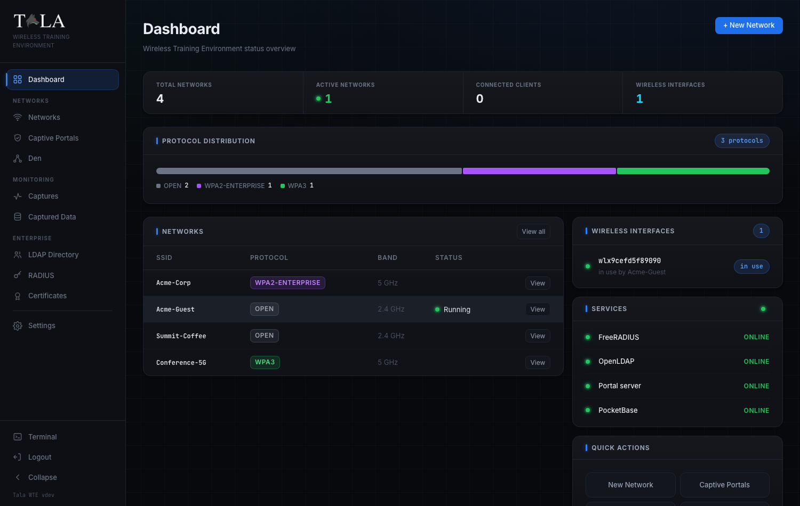

## Background

Tala WTE is the open training and development counterpart to TALA, the VTEM Labs wireless penetration testing platform. Tala WTE is the safe range you learn and rehearse on; TALA is the platform professionals use to run real wireless penetration tests.

### Government variant

A separate, tactical build of TALA serves authorized government, Department of War (DoW), and law enforcement (LEO) operators. It is multi-modal, fusing 802.11, Bluetooth and BLE, cellular, and wideband RF through software-defined radio with GNSS, camera and video, and direction finding, for counter-surveillance, locating and characterizing rogue or surveillance transmitters, pattern-of-life development, and device deconfliction. It runs on specialized collection hardware in man-portable and vehicle-mounted form factors, is export-controlled, and is available only to authorized parties.

TALA and its government variant are delivered through the VTEM Labs ARROW program; see [Commercial licensing and demos](#commercial-licensing-and-demos).

## Screenshots

| Networks | Network detail and live log |
| --- | --- |
| 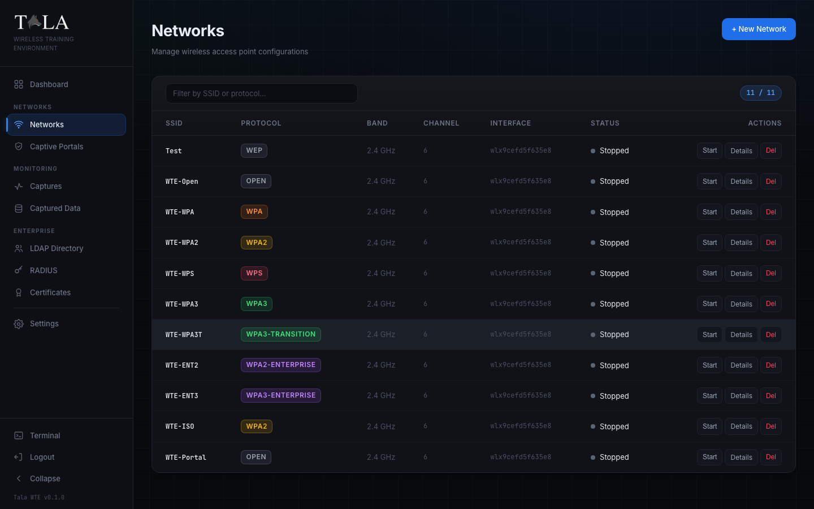 | 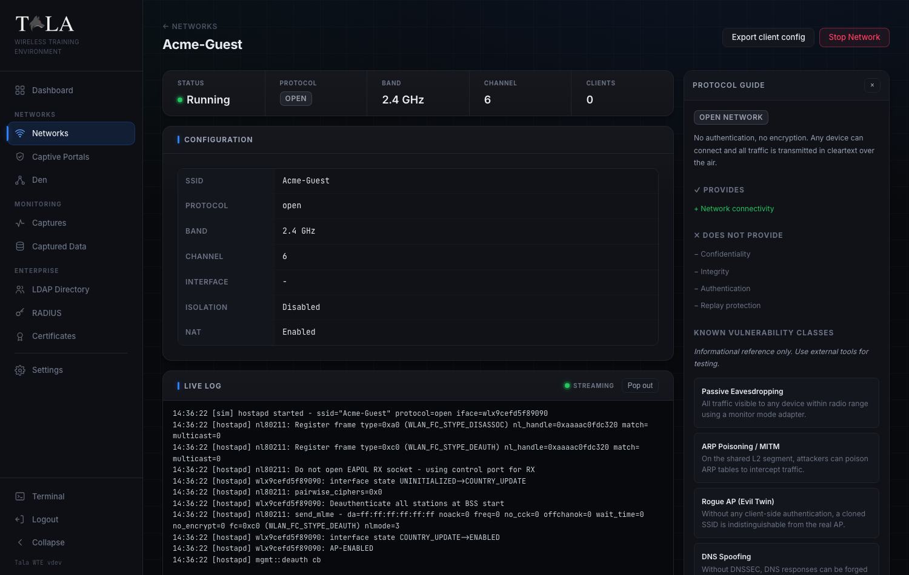 |

| Captive portals | Captured credentials |
| --- | --- |
| 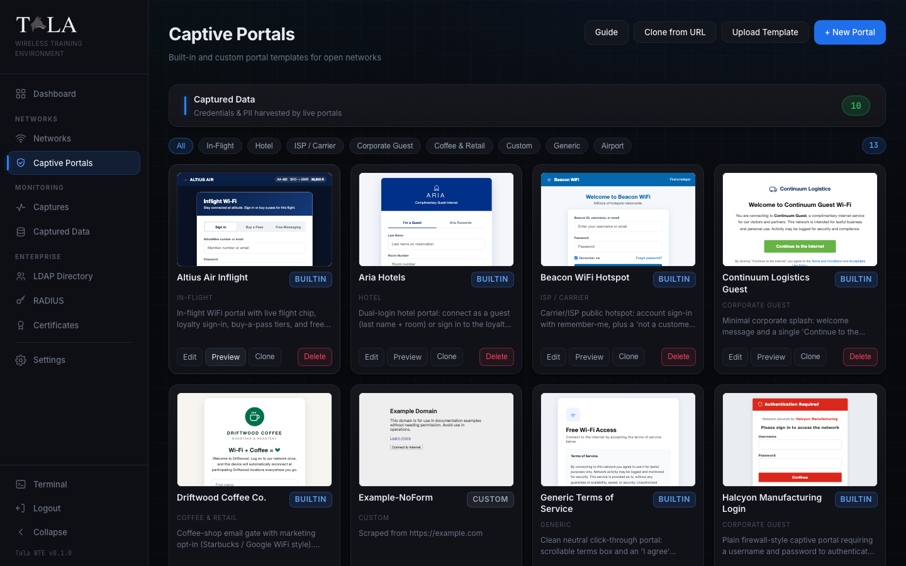 | 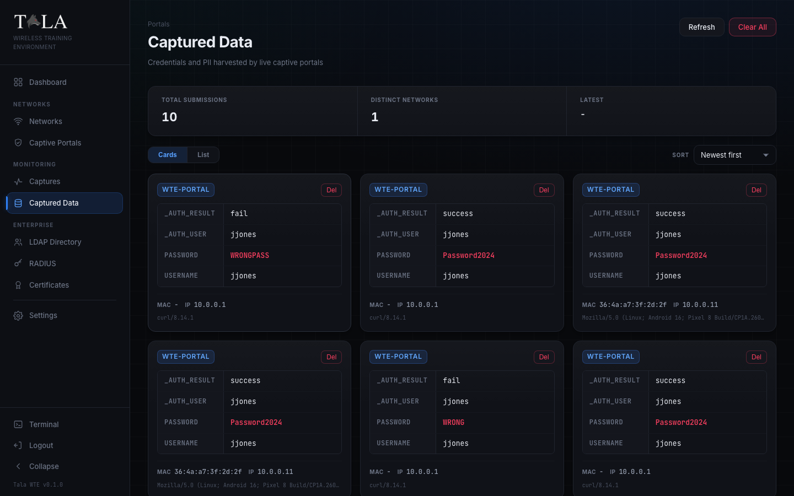 |

| LDAP directory | RADIUS |
| --- | --- |
| 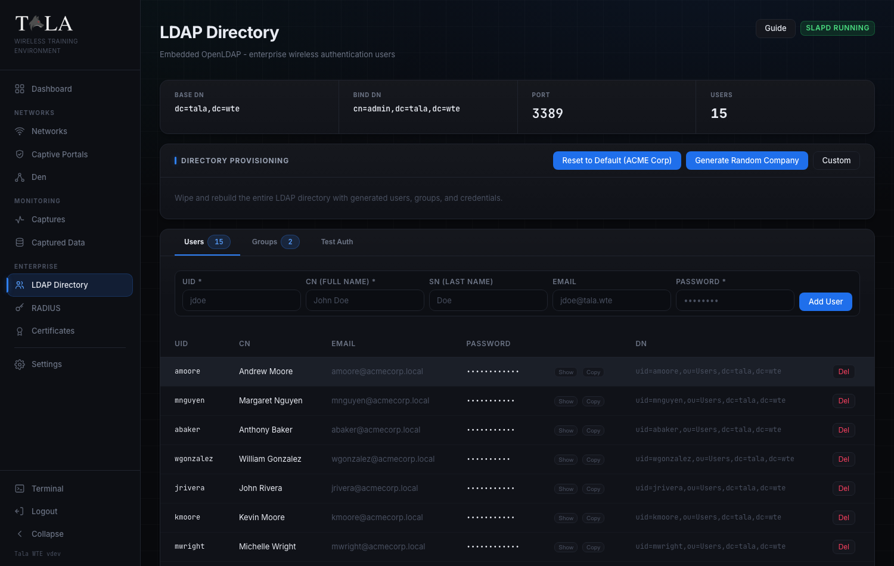 | 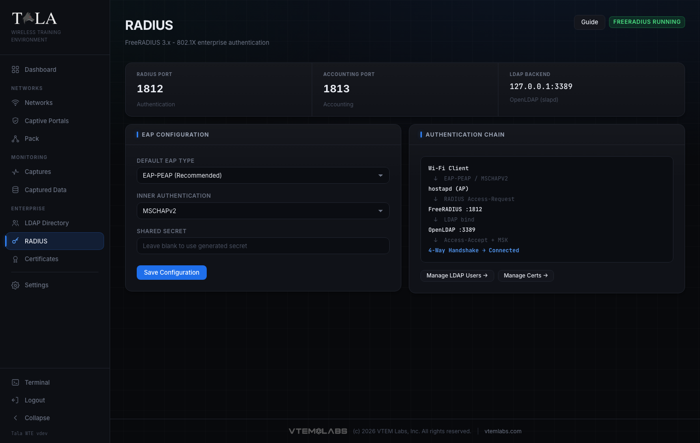 |

## Features

### Wireless networks

Create and broadcast access points across the full range of security protocols, from open and legacy through WPA3 and 802.1X Enterprise. Each network is a real hostapd access point that connecting clients can join and that tools can be pointed at.

| Network type | Authentication | Cipher | Key or credential | Captive portal | Demonstrates |
| --- | --- | --- | --- | :---: | --- |
| Open | None | None | None | Yes | Rogue access points, evil-twin attacks, and captive-portal credential harvesting |
| WEP | Shared key | RC4, 40 or 104-bit | ASCII or hex, auto-fitted to a valid length | No | IV and keystream recovery with FMS, KoreK, and PTW |
| WPA (TKIP) | Pre-shared key | TKIP over RC4 | Passphrase | No | Legacy TKIP weaknesses and EAPOL handshake capture |
| WPA2-Personal | Pre-shared key | CCMP / AES | Passphrase | No | 4-way handshake capture, offline dictionary attacks, and PMKID |
| WPA2 with WPS | Pre-shared key plus WPS | CCMP / AES | Passphrase, WPS enabled | No | WPS PIN brute force and Pixie Dust |
| WPA3-Personal | SAE | CCMP / AES | Passphrase | No | SAE handshake behavior and the Dragonblood class of issues |
| WPA3-Transition | SAE with PSK fallback | CCMP / AES | Passphrase | No | Downgrade from WPA3 to WPA2 pre-shared key |
| WPA2-Enterprise | 802.1X / EAP | CCMP / AES | Directory account, LDAP via RADIUS | No | EAP flows, rogue RADIUS, and enterprise evil-twin credential theft |
| WPA3-Enterprise | 802.1X / EAP | GCMP-256 / CCMP | Directory account, LDAP via RADIUS | No | Hardened enterprise authentication and certificate-based EAP |

Every network also exposes a set of options that tie into the scenario you are building:

| Option | Applies to | Default | Effect |
| --- | --- | --- | --- |
| Client isolation | All networks | Off | Blocks station-to-station traffic at the access point so connected clients cannot see or reach each other. Enable it to show segmentation, or leave it off to demonstrate lateral movement between victims on the same network. |
| Internet passthrough (NAT) | All networks | On | NATs client traffic out the uplink interface so clients reach the internet and pass operating-system connectivity checks. Turn it off to keep the network walled for closed exercises. |
| Captive portal | Open networks | Off | Redirects client web traffic to a portal page until the client submits, capturing everything entered along with the device MAC, IP, and browser. |
| Credential validation | Open networks with a portal | Off | Validates portal logins against the embedded LDAP directory before granting access, so the portal behaves like a real credentialed hotspot and records which captured credentials were valid. |
| Band and channel | All networks | 2.4 GHz | Selectable across 2.4 GHz, 5 GHz, and 6 GHz, constrained to the bands the chosen adapter can actually host as an access point. |
| Regulatory domain | Global, set in Settings | US | Sets the country hostapd advertises and applies it live, governing which channels are legal and whether 5 GHz and 6 GHz access points are allowed. |

Each protocol page includes a built-in guide that explains what the protocol provides, what it does not, its known vulnerability classes, and the external tools used to exercise it. Every running network streams a live log and shows its connected clients.

### Captive portals

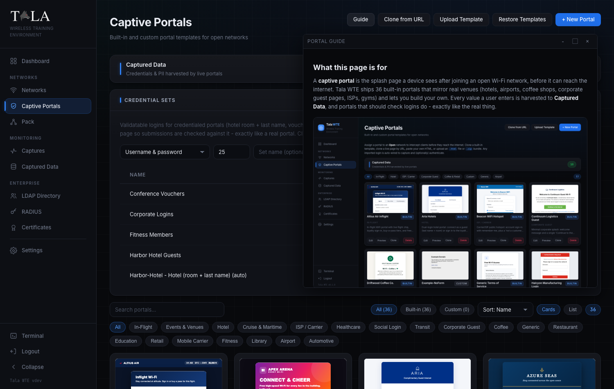

- A library of realistic built-in templates: coffee shops, hotels, corporate guest pages, airports, in-flight, and ISP hotspots.
- Four ways to add a portal: clone a built-in template, start from scratch, clone a live page by URL, or upload an `.html` file or a `.zip` bundle.
- A split editor with HTML source and a live preview.
- Automatic capture wiring. Any imported login form is pointed at the capture endpoint and its username and password fields are detected, with no hand editing.
- Optional credential validation. A portal can authenticate submitted credentials against the embedded directory before granting access, behaving like a real credentialed hotspot.
- Generic Terms of Service, Acceptable Use Policy, and Privacy Policy pages served by the portal, so the splash feels complete to a connecting client.
- An in-app guide that walks through creating, editing, cloning, uploading, and assigning portals.

### Captured data

Every value a client submits to a portal is recorded with the device MAC address, IP, and browser, and streamed to the console in real time. The view can be sorted and switched between detailed cards and a dense table.

### Packet captures

Start passive captures at the wireless (802.11 monitor) or network (IP) layer on any interface, with one-click BPF filter presets or a custom filter, and download the resulting pcap. A built-in analyzer reads the capture in place and reports the protocol mix, top talkers, DNS queries, HTTP requests, and any cleartext credentials it finds, so the payoff of capturing on a weak network is visible without leaving the app.

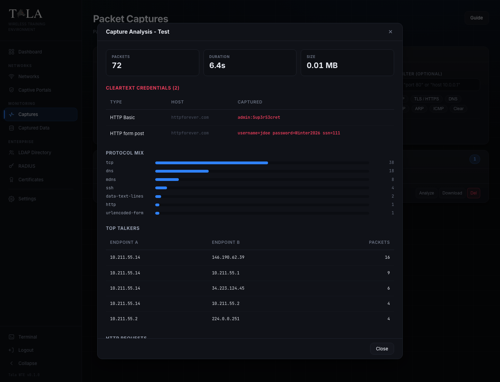

### Enterprise authentication

- An embedded OpenLDAP directory with user and group management, a realistic password mix, and a built-in authentication test.
- FreeRADIUS configured for EAP, wired so that hostapd routes 802.1X to RADIUS and RADIUS validates against LDAP.
- A certificate authority for issuing the server and client certificates that EAP-TLS requires.

### Embedded terminal

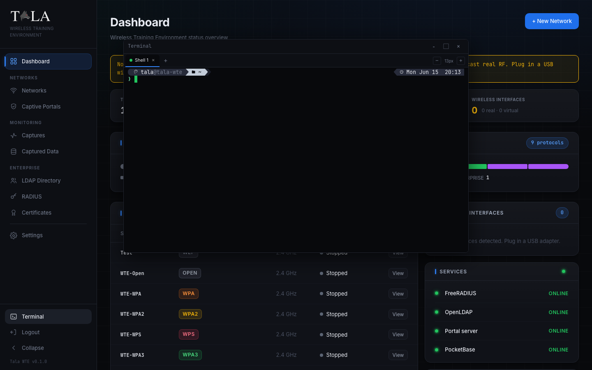

A full terminal is built into the console as a draggable, resizable, tabbed window, so the host shell is always one click away without leaving the browser.

### Settings

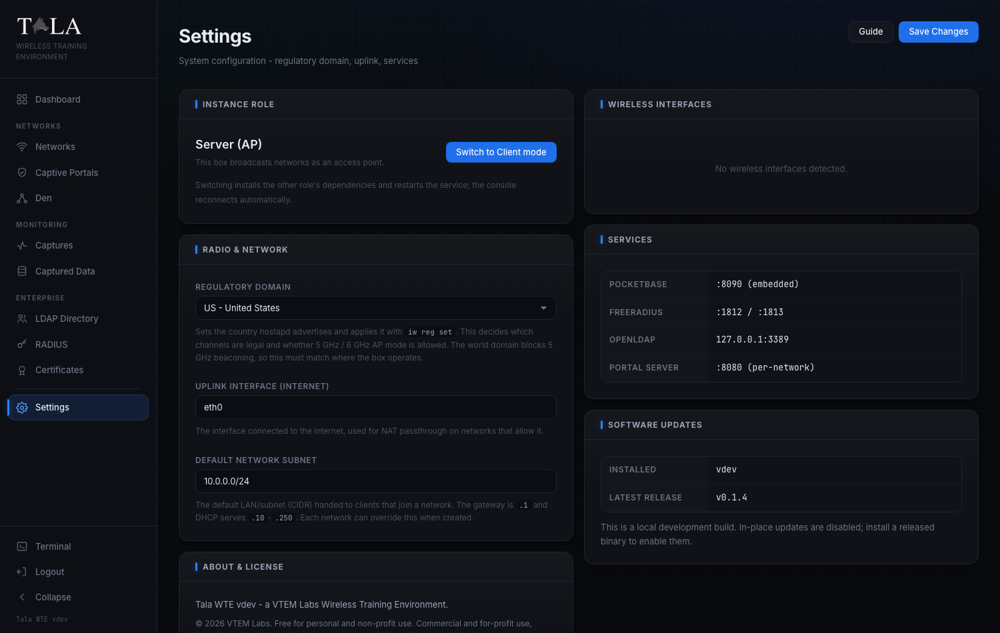

Configure the regulatory domain and uplink interface, review the running services, and read the license, all from one page.

## Architecture

Tala WTE is a single Go binary that embeds:

- A web console built with SvelteKit and served as static assets.
- PocketBase for the database, realtime updates, and superuser authentication.
- A captive portal engine that manages dnsmasq, iptables redirection, a per network HTTP server, and a MAC allowlist.
- The embedded OpenLDAP and FreeRADIUS integration for enterprise authentication.

Access points are brought up with hostapd. Per network isolation is provided through Linux network namespaces and iptables. The result is a realistic multi network environment from a single command.

## Software stack

| Layer | Technologies |
| --- | --- |
| Backend | Go 1.25, PocketBase 0.36 (embedded database, realtime, and superuser auth), Go standard `net/http` |
| Frontend | SvelteKit 2 with Svelte 5 (runes), TypeScript 5, Vite 6, `adapter-static` |
| Packaging | A single Go binary, with the web console, license, and embedded terminal baked in via `go:embed` |
| Access points | hostapd, iw (regulatory domain and radio control) |
| Network services | dnsmasq (DHCP and captive DNS), iptables and iproute2 (NAT and per-network Linux namespaces) |
| Enterprise auth | FreeRADIUS (802.1X / EAP), OpenLDAP (directory), and a built-in certificate authority |
| Capture and analysis | tshark, tcpdump, and capinfos (Wireshark CLI suite) |
| Embedded terminal | e-terminal |
| Build and tooling | Make, pnpm, and cross-compilation for `linux/amd64` and `linux/arm64` |

## Requirements

- A clean Linux host (arm64 or x86_64).
- A Wi-Fi adapter that supports AP mode for the bands you intend to host.
- Root privileges, required to manage interfaces, hostapd, namespaces, and firewall rules.

## Wireless adapters

Tala WTE broadcasts access points in standard AP (master) mode. It does not use monitor mode or packet injection, so the chipset sensitivities that constrain attack tools do not apply here: **any wireless adapter whose driver supports AP mode for the band you want to host will work.** You are standing up the target networks, not attacking them, so an ordinary adapter is enough.

The adapters below are recognized out of the box and surface their manufacturer, model, chipset, and hostable bands in the interface picker. This is a convenience, not a compatibility list. Unlisted adapters work just as well; they are shown by their driver name, and the server validates the band when a network starts.

| Adapter | Chipset | Bands | Standard |
| --- | --- | --- | --- |
| ALFA AWUS036AXM (also Panda AXE3000) | MT7921AU | 2.4 / 5 / 6 GHz | Wi-Fi 6E (a/b/g/n/ac/ax) |
| ALFA AWUS036ACH | RTL8812AU | 2.4 / 5 GHz | Wi-Fi 5 (a/b/g/n/ac) |
| ALFA AWUS036ACM (also Panda PAU0D) | MT7612U | 2.4 / 5 GHz | Wi-Fi 5 (a/b/g/n/ac) |
| ALFA AWUS051NH | RT3572 | 2.4 / 5 GHz | Wi-Fi 4 (a/b/g/n) |
| Panda PAU09 | RT5572 | 2.4 / 5 GHz | Wi-Fi 4 (a/b/g/n) |
| ALFA AWUS036NH | RT3070 | 2.4 GHz | Wi-Fi 4 (b/g/n) |

The interface picker only offers the bands an adapter can actually host as an AP (for example, a tri-band card that cannot beacon a 6 GHz AP will not list 6 GHz), and falls back to a hostable band if you pick one the radio cannot broadcast.

## Tested platforms

Install Tala WTE on a clean Linux host. The installer detects the distribution and installs every dependency (hostapd, dnsmasq, FreeRADIUS, OpenLDAP, tshark, and the rest) automatically, so no manual setup is required. A lightweight Debian or Ubuntu server gives the best performance. Kali Linux works if you really want it, but it is not recommended; a clean Debian or Ubuntu is the better choice.

| Distribution | Version | Status |
| --- | --- | --- |
| Debian | 13 (Trixie) | Tested, recommended |
| Ubuntu | 24.04 LTS | Tested, recommended |
| Ubuntu | 26.04 LTS | Tested |
| Ubuntu | 22.04 LTS | Tested |
| Kali Linux | 2026.1 | Tested, not recommended |

Tested on both arm64 and x86_64. Other current apt-based Debian and Ubuntu derivatives are expected to work, since the installer targets the apt family. The installer resolves dependencies per system: it skips packages an OS or version has dropped or renamed, falls back to per-package installs so one bad package never aborts the rest, and verifies every core capability is present before reporting success.

## Installation

Download the binary for your architecture from the [latest release](https://github.com/vtemlabs/tala-wte/releases) (`tala-wte-linux-amd64` or `tala-wte-linux-arm64`), or build it yourself, then install it as a service:

```
sudo ./tala-wte-linux-arm64 install
```

The installer checks dependencies, copies the binary into `/var/lib/tala-wte`, writes and enables a `tala-wte.service` systemd unit, starts it, and prints the URL to open. The database under `/var/lib/tala-wte` is preserved across reinstalls.

To remove the service:

```
sudo tala-wte uninstall
```

Add `--purge` to also remove the database.

## Updates

Tala WTE checks GitHub for newer releases and surfaces them in the console under Settings -> Software Updates (a dot also appears on the Settings nav item when an update is available). One click downloads the architecture-matched binary, verifies it against the release checksums, swaps it in place, and restarts the service; the console reconnects on its own.

Cutting a release is a single command from a clean checkout:

```
./scripts/bump-version.sh patch        # or minor / major / 0.3.0
./scripts/bump-version.sh 0.3.0 beta   # prerelease channel
```

This tags the commit and pushes it, which triggers the release workflow (`.github/workflows/release.yml`) to build the `linux/amd64` and `linux/arm64` binaries, generate `checksums.txt`, and publish a GitHub Release. The version is stamped into each binary from the tag, so the in-app updater can compare against it. Pass `--dry-run` to preview or `--no-push` to tag locally without releasing.

## First run

Open the printed URL, which is served over HTTPS on port 8443:

```
https://<host>:8443/
```

On a fresh install the console shows a setup screen. Tala WTE never auto-provisions an administrator and never prints credentials to a terminal. You create the one administrator account in the browser, and you must acknowledge the license before the account can be created. The license is viewable in full from that screen.

Once the account exists, the setup screen becomes a normal sign-in.

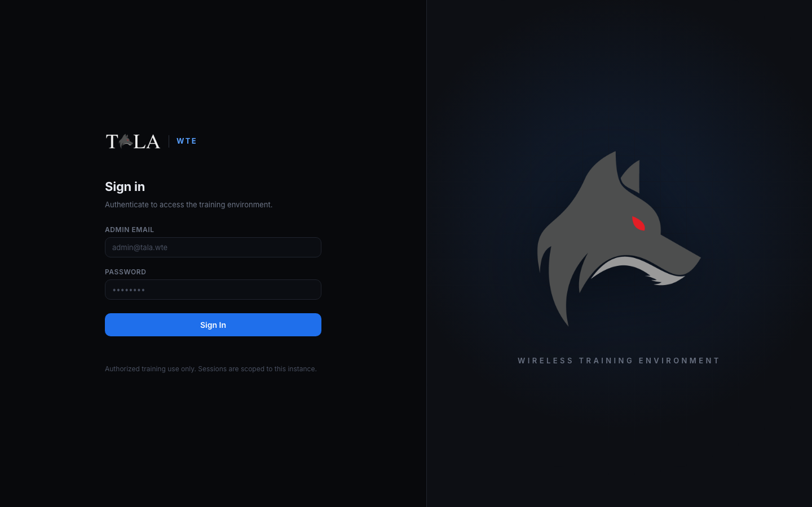

## Usage

1. Sign in to the console.
2. Open Networks and create an access point. Choose a protocol, band, channel, and interface, then start it.
3. For an Open network, attach a captive portal and optionally enable credential validation.
4. Watch the live log as clients connect, and review harvested credentials under Captured Data.
5. For enterprise networks, manage directory users under LDAP, confirm the EAP configuration under RADIUS, and issue certificates under Certificates.

## License

Tala WTE is free for personal and non-profit use.

It may not be used for commercial or for-profit purposes, including paid training, paid Capture-the-Flag projects, or use by, for, or on behalf of any for-profit school, institution, company, or organization, and it may not be rebranded or claimed as another party's work, without prior written authorization and a license from VTEM Labs. Standing up a for-profit wireless penetration testing course or similar offering and using this platform, or any variant or copy of it, as the infrastructure or training material is expressly prohibited without a paid license.

See [LICENSE](LICENSE) for the full terms.

### Commercial licensing and demos

**Tala WTE** is free for personal and non-profit use. Commercial and for-profit use of Tala WTE, including paid training, paid CTF, and use by, for, or on behalf of any for-profit school, institution, company, or organization, requires written authorization and a license from VTEM Labs: [vtemlabs.com/contact](https://vtemlabs.com/contact).

**TALA**, the commercial wireless penetration testing platform, is delivered through the VTEM Labs ARROW program. To evaluate it, request a demonstration via the [ARROW Platform](https://arrow.vtemlabs.com/). Government, DoW, and LEO inquiries about the tactical variant are welcome.

<div align="center">


Copyright (c) 2026 VTEM Labs. All rights reserved.

</div>
