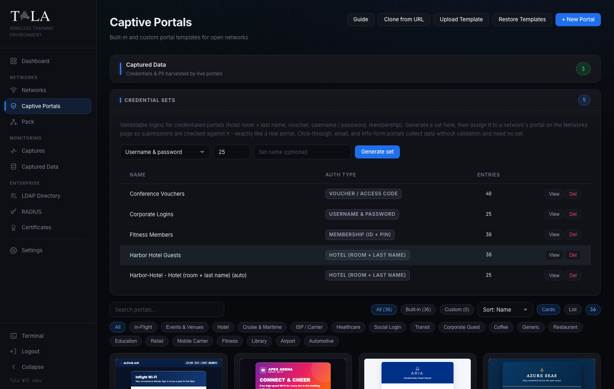

# Captive Portals

A captive portal is the splash page a device sees right after it joins an open Wi-Fi network, before any traffic reaches the internet. Tala WTE ships dozens of built-in portals that mirror real venues (hotels, airports, coffee shops, corporate guest pages, ISPs, gyms, transit, cruise lines, and more), lets you build or import your own, and harvests every value a user enters into Captured Data. Portals that should check a login actually do, exactly like the real thing.

Use this page to pick or build a portal, generate the credential sets that validating portals check against, and review what live portals captured. Captive portals attach only to Open networks; you assign one on the Networks form, not from a card here. For the network side see [[Networks]]. For a deeper treatment of validatable logins see [[Credential-Sets]].

## How a captive portal works here

When a client joins an Open network that has the Captive Portal Sandbox enabled, its traffic is intercepted and the portal page is served until the client satisfies the portal. On submit, the first form on the page is wired to the capture endpoint automatically (you never hand-edit form actions), so every submission lands in Captured Data. If the portal's auth type validates, the submission is checked against the assigned credential set (or the directory) before access is granted.

---

## Step 1: Open the Captive Portals page

From the left sidebar choose Captive Portals. The page opens with a header, a Captured Data shortcut, the Credential Sets panel, and the portal gallery below.

The header carries five actions, left to right:

- Guide - opens the in-app help for this page.
- Clone from URL - scrape a real sign-in page into an editable portal (Step 8).
- Upload Template - import a self-contained `.html` or a `.zip` bundle (Step 9).
- Restore Templates - re-seed any built-ins you deleted and reset edited ones to original (Step 11).
- + New Portal - open the New Captive Portal editor for a portal built from scratch or a template (Step 10).

---

## Step 2: Browse and filter the gallery

The gallery is a searchable grid of portal cards. Each card shows a live thumbnail of the portal, its name, a `builtin` or `custom` source badge, its category, and a one-line description.

The control row above the grid lets you narrow the list:

- Search portals... - filters by name and description as you type.
- Source chips - All, Built-in, Custom (each shows a live count). Your choice persists across refreshes. Pick Built-in when you want a ready-made venue page; pick Custom to see only portals you created or imported.
- Sort dropdown (card view only) - Sort: Name, Sort: Category, or Sort: Source.
- Cards / List toggle - switch between the thumbnail grid and a compact table. Your choice is remembered.
- The count pill at the end shows how many portals match the current filters.

Below the controls is a row of category chips (All, Coffee, Restaurant, Retail, Hotel, Corporate Guest, Airport, In-Flight, Transit, ISP / Carrier, Mobile Carrier, Education, Healthcare, Library, Events & Venues, Cruise & Maritime, Fitness, Automotive, Social Login, Generic, Custom). Click one to show only that category; click All to clear it.

In both card and list view, hovering a portal pops a live mobile-sized preview on the right of the screen, so you can judge how the page looks on a phone before you commit to it. (The hover preview is a desktop affordance and is hidden on small screens.)

> SCREENSHOT NEEDED: The portal gallery switched to List view, showing the sortable Name / Category / Source columns and the per-row Customize/Edit, Preview, Clone, Delete actions, with the floating mobile hover preview visible on the right.

---

## Step 3: Understand the per-card actions

Each card carries its own action buttons. They differ slightly for built-in versus custom portals:

- Customize (built-in only) - built-in templates are read-only, so this opens an editable copy instead of editing the original in place. See Step 6.
- Edit (custom only) - open your portal in the editor to change it in place. See Step 6.
- Preview - open the live portal page in a new browser tab exactly as a connecting client would see it.
- Clone - duplicate the portal as a new "(copy)" you can edit. This is the fastest way to start from a built-in. Clone is hidden for uploaded `.zip` bundle portals (those cannot be cloned in place).
- Delete - remove the portal. You are asked to confirm. Deleting a built-in is safe: Restore Templates (Step 11) brings it back.

When to use which: choose Customize/Clone on a built-in when you want the real-venue look as a starting point and then tweak branding or fields. Choose + New Portal or Upload Template when you have your own HTML. Choose Clone from URL when you want to reproduce a specific public sign-in page you can reach.

---

## Step 4: Learn the eight auth types

Every portal conforms to exactly one auth type. The auth type decides what fields the portal shows, what gets captured, and whether submissions are validated against a credential set. Three auth types only collect data; five validate.

| Auth type (exact label) | Collects | Validates? | When to use it |
|---|---|---|---|
| Click-through | Accept terms (checkbox) | no | a Connect splash or terms-acceptance page |
| Email capture | email | no | a marketing-style email gate (coffee shop, retail) |
| Information form | first name, last name, email, phone, company | no | guest registration or lead capture |
| Username & password | username + password | yes | corporate or AD-style login pages |
| Email & password | email + password | yes | ISP or webmail-style sign-in |
| Hotel (room + last name) | last name + room number | yes | hotel or cruise Wi-Fi |
| Voucher / access code | a single access code | yes | conference, event, or transit ticket |
| Membership (ID + PIN) | member ID + PIN | yes | gym or loyalty hotspot |

The five validating types are Username & password, Email & password, Hotel (room + last name), Voucher / access code, and Membership (ID + PIN). A validating portal needs a credential set to check logins against (Step 5); a non-validating portal (Click-through, Email capture, Information form) collects data with no validation and needs no set. A built-in's auth type is pre-set and shown read-only; a custom portal's auth type is a dropdown you set in the editor (Step 6).

---

## Step 5: Generate a credential set (validating portals only)

The Credential Sets panel sits between the Captured Data shortcut and the gallery. A credential set is the list of valid logins a validating portal checks submissions against, so a correct entry is accepted and anything else is denied, exactly like a real portal.

To generate a set:

1. Pick an auth type in the dropdown. It lists only the validating types (Username & password, Email & password, Hotel (room + last name), Voucher / access code, Membership (ID + PIN)).
2. Set how many entries to generate. The default is 25; the field accepts 1 to 1000. Generate a few extra so a deployed pack member always has a valid identity to use.
3. Optionally type a Set name (optional). Leave it blank to get an auto-named set, or name it (for example "Conference Vouchers") so it is easy to pick on the Networks form.
4. Click Generate set. The new set appears in the table.

The table lists each set's Name, Auth type (as a badge), and Entries count, with two row actions:

- View - open a read-only table of the generated logins (the exact usernames, passwords, room numbers, codes, or PINs), so you can hand a tester a working credential or confirm a pack member's submission.
- Del - delete the set after a confirm prompt.

If you have no sets yet, the panel reads "No credential sets yet. Generate one above."

Judgment: you do not always have to pre-build a set. Starting a validating portal on a network with no set selected captures and grants on submit, and starting one with the auto-generate behavior produces a set for you (see [[Credential-Sets]]). Pre-generate a set here when you want a known, named list of valid logins for a lesson.

---

## Step 6: Customize a built-in or edit a custom portal

Click Customize on a built-in card (or Edit on a custom card) to open the editor. A built-in opens as a read-only template that you save into an editable copy; a custom portal opens for editing in place.

The editor header, left to right:

- A Portals breadcrumb back to the gallery.
- The portal name, editable inline.
- A Saved badge that flashes after a successful save of a custom portal.
- For a built-in: a read-only template badge plus a neutral badge showing the auth type (read-only).
- For a custom portal: an Auth type dropdown where you set the type yourself.
- Open Preview - open the live portal in a new tab.
- Back - return to the gallery.
- Save Changes (custom) or Save as Copy (built-in).

Below the header, "Fields this portal captures on submit" lists the form field names parsed straight from the HTML (for example `username`, `password`, `room_number`), so you can see exactly what the portal will harvest before you deploy it. The `redirect` field, if present, is excluded.

The body is a split view: HTML Source on the left and a Live Preview on the right with Desktop and Mobile buttons to check both layouts. Edit the HTML directly; the preview updates as you type.

Saving rules:

- Editing a custom portal and clicking Save Changes saves it in place.
- Editing a built-in and clicking Save as Copy creates a new "(copy)" custom portal (the original built-in is never modified). You are taken to the new copy.

> SCREENSHOT NEEDED: The editor with the auth-type dropdown OPEN on a custom portal, showing all eight auth-type options (Click-through, Email capture, Information form, Username & password, Email & password, Hotel (room + last name), Voucher / access code, Membership (ID + PIN)).

---

## Step 7: Editing an uploaded .zip bundle

A portal imported as a `.zip` bundle is served from disk with its own assets (images, CSS, JS) and cannot be HTML-edited in the browser. Open it and you see a note that it is a multi-file bundle, with only the name editable above and a Live Preview that renders the live bundle. To change its contents, re-upload an updated `.zip` (Step 9). Bundle portals do not show the Clone action on their card.

> SCREENSHOT NEEDED: The editor opened on a .zip bundle portal, showing the amber multi-file bundle note (the fs: path), the editable name field, and the full-width Live Preview panel with no HTML Source editor.

---

## Step 8: Clone a portal from a live URL

Click Clone from URL in the header to reproduce a real sign-in page as an editable portal.

> SCREENSHOT NEEDED: The Clone Portal from URL modal, showing the Page URL field with its description ("Fetches the page, inlines its CSS & images so it renders offline, drops external scripts, and wires its login to capture+authenticate. Private/internal addresses are blocked."), the optional Portal Name field, and the Clone and Cancel buttons.

1. In Page URL, paste the full address of the sign-in page (for example `https://example.com/login`). It must start with `http://` or `https://`.
2. Optionally set a Portal Name; if you leave it blank the portal is named after the site host.
3. Click Clone. The scraper fetches the page, inlines its CSS and images so it renders offline, drops external scripts, and wires its login to capture and authenticate. You are taken to the new portal in the editor.

Note: private and internal addresses are blocked, so this works against reachable public pages, not internal hosts.

---

## Step 9: Upload a template

Click Upload Template in the header to import a portal you already have on disk.

> SCREENSHOT NEEDED: The Upload Portal Template modal, showing the Portal Name field, the Template File chooser with its accepted-format note ("Single self-contained .html, or a .zip bundle with an index.html at its root plus assets"), and the Upload and Cancel buttons.

1. Type a Portal Name (for example "Acme Guest Wi-Fi").
2. Choose a Template File. Accepted formats are a single self-contained `.html` (or `.htm`), or a `.zip` bundle with an `index.html` at its root plus its assets (images, css, js). If you pick a file before naming the portal, the name is pre-filled from the filename.
3. Click Upload. You are taken to the new portal in the editor.

When to pick which: a single `.html` is simplest and stays fully editable in the browser. A `.zip` bundle is for multi-file pages (separate stylesheets, scripts, image folders); it renders faithfully but is not HTML-editable in place (Step 7).

---

## Step 10: Build a portal from scratch

Click + New Portal in the header to open the New Captive Portal editor.

> SCREENSHOT NEEDED: The New Captive Portal page, showing the Portal Name field, the Start From Template dropdown with its Load button, the HTML Source textarea with the Insert Starter HTML button, the Live Preview pane, and the Save Portal and Cancel buttons.

1. Enter a Portal Name (for example "Coffee Shop Portal").
2. Optionally choose a starting point under Start From Template. The dropdown lists Blank plus every built-in template; pick one and click Load to drop its HTML into the editor (this also fills the name if you left it blank). Leave it on Blank to start empty.
3. Edit the HTML Source on the left. If you started Blank and want a working scaffold, click Insert Starter HTML to drop in a minimal Click-through page you can build on. The Live Preview on the right renders as you type.
4. Click Save Portal. You are taken to the editor for the new portal, where you can set its auth type (Step 6). Cancel returns to the gallery without saving.

---

## Step 11: Restore the built-in templates

Click Restore Templates in the header at any time to repair the built-in library. It re-seeds any built-ins you deleted and resets any built-ins you edited back to their original. A toast reports how many were restored and how many reset, or that they are already up to date. Your custom and imported portals are untouched.

---

## Step 12: Assign the portal to an Open network

You attach a portal on the Networks form, not from a card here. See [[Networks]] for the full network workflow.

1. Create or edit a network and set its security protocol to Open. (The portal options appear only for an Open network.)
2. Turn on Captive Portal Sandbox. Its description reads "Intercept unauthenticated traffic and serve a portal page."
3. Choose your portal under Portal Module. Bundle portals are marked "(bundle)" in the list. A live Preview appears below, with a Pop out button to open it full size.
4. If the chosen portal validates, a Credential set selector appears, labeled with the auth type in parentheses (for example "Credential set (username password validation)"):
   - Its first option is "No set - capture only" - record submissions without validating them.
   - Below that, pick any matching credential set to check logins against, so correct entries are accepted and others denied.
   - If no matching set exists yet, the form shows a line with a "Generate a ... credential set" link to the Captive Portals page instead; until a set exists, the portal captures and grants on submit.
5. Optionally turn on Require Login (Directory / LDAP) to validate the submitted username and password against the directory before granting access, like a corporate or ISP hotspot. Failed logins are denied and recorded. See [[LDAP-Directory]].
6. Start the network. Connecting clients are intercepted and shown the portal until they satisfy it.

For credentialed lessons you usually do not have to pre-build anything: starting a validating portal with no set auto-generates one, and a deployed pack member passes the portal on its own. See [[Credential-Sets]] and [[The-Pack]].

---

## Step 13: Review captured submissions

Click the Captured Data shortcut at the top of the Captive Portals page (or use Captured Data in the sidebar) to see everything live portals harvested. The shortcut's count pill turns green once there is at least one submission.

The page header offers Refresh (reload the table) and, once there is data, Clear All (delete every submission after a confirm prompt). A stat strip across the top shows Total Submissions, Distinct Networks, and Latest (the most recent timestamp).

The table streams new submissions in live as clients submit portals. Its columns:

> SCREENSHOT NEEDED: A close-up of the captured rows showing the columns Network, Captured, Username, Password (in red), Result, Source, MAC, and IP, with at least one validating-portal row (green success / red failure badge) and one pack member badge.

- Network - the SSID the submission came from (sortable).
- Captured - the timestamp (sortable; defaults newest first).
- Username - the primary identity from the submission, normalized from whatever field the portal used (username, user, email, login) (sortable).
- Password - the captured secret, highlighted in red. This column also surfaces other secret-like fields (PIN, code, card, CVV).
- Result - for a validating portal, a green success badge or a red failure badge; a dash for non-validating portals (sortable).
- Source - distinguishes training noise from a live capture:
  - pack member - the submission came from a pack member's traffic generator (a simulated client). Hover the badge to see the member hostname.
  - target - a real client filled out the portal.
- MAC and IP - the client's hardware and network address.
- A per-row Del button removes a single submission.

Click any sortable column header (Network, Captured, Username, Result) to sort by it; click again to flip the direction. Your sort choice persists across refreshes.

If nothing has been captured yet, the page shows an empty state explaining the flow: start an Open network with a portal that has form fields, connect a client, and submit the form, and captured credentials and PII will stream in here in real time.

---

## Related guides

- [[Networks]] - create the Open network and turn on the Captive Portal Sandbox.
- [[Credential-Sets]] - generate and manage the validatable logins a portal checks against.
- [[LDAP-Directory]] - back Require Login (Directory / LDAP) with a directory.
- [[The-Pack]] - deploy pack members whose traffic generators submit portals automatically.
- [[Packet-Captures]] - capture and analyze the wireless traffic around these networks.
