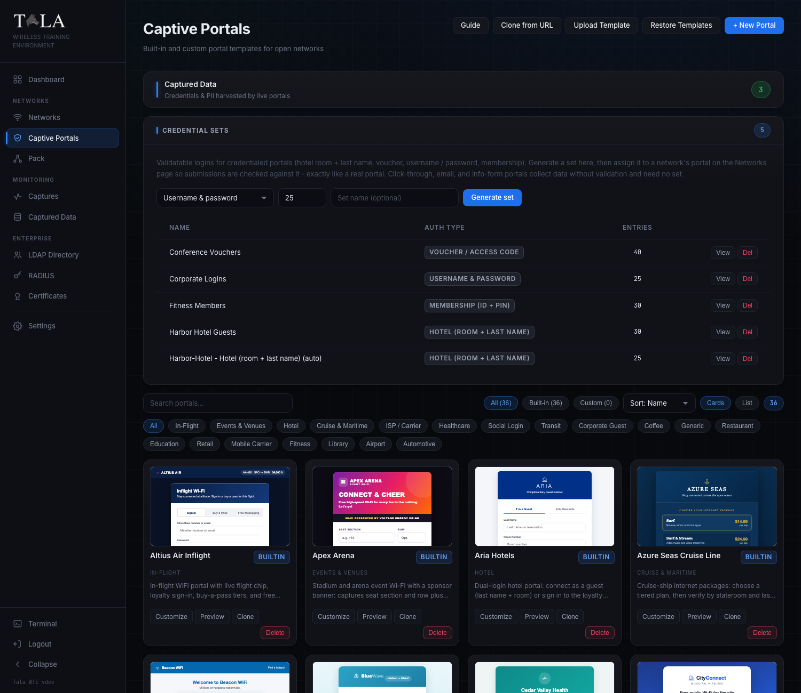
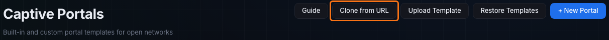
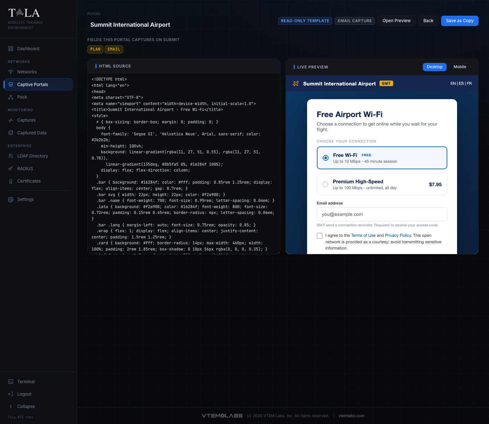

A captive portal is the splash page a device sees after it joins an open Wi-Fi network, before it can reach the internet. Tala WTE ships 36 built-in portals that mirror real venues (hotels, airports, coffee shops, corporate guest pages, ISPs, gyms, and more) and lets you build your own. Every value a user enters is harvested to Captured Data, and portals that should check logins do, exactly like the real thing.

Captive portals attach only to Open networks. For the network side see [[Networks]]; for validatable logins see [[Credential-Sets]].

## What a captive portal does here

When a client connects to an Open network with the Captive Portal Sandbox enabled, its traffic is intercepted and the portal page is served until the client satisfies the portal. On submit, the first form is wired to the capture endpoint automatically (you never hand-edit form actions), so every submission lands in Captured Data. If the portal's auth type validates, the submission is checked against an assigned credential set before access is granted.

## The portal library

The Captive Portals page is a searchable gallery of portal cards.

- Source filter chips: All, Built-in, Custom (your choice persists). Built-in cards carry a "builtin" badge; your own carry a "custom" badge.
- Search box, a Sort dropdown (Name, Category, Source), and a Cards / List view toggle (your choice is remembered). In card and list view, hovering a portal shows a live mobile preview.
- Category chips (Coffee, Hotel, Airport, Corporate Guest, ISP / Carrier, Cruise & Maritime, Fitness, and more) filter the gallery.
- Per-card actions: built-in cards show Customize, Preview, Clone, and Delete; your own cards show Edit (instead of Customize), Preview, Clone, and Delete. Clone is hidden for uploaded `.zip` bundle portals.
- Restore Templates (top of page) re-seeds any built-ins you deleted and resets edited ones back to original.

You assign a portal to a network on the Networks form, not from a card.

## Built-in vs custom

- Built-in templates ship with the app, each already set to the right auth type. You cannot edit a built-in in place: Customize clones it into an editable copy first, so the originals stay pristine.
- Custom templates are ones you create or import. Four ways to add one:
  - Clone - duplicate a built-in (or any portal) as a "(copy)" you can edit. Fastest start.
  - Clone from URL - the "Clone from URL" button scrapes a real sign-in page, inlines its CSS and images so it renders offline, drops external scripts, and wires its login to capture. Private and internal addresses are blocked.
  - Upload Template - the "Upload Template" button takes a single self-contained `.html` file, or a `.zip` bundle with an `index.html` at its root plus assets (images, css, js).
  - New - the "+ New Portal" button opens the New Captive Portal editor.

## Auth types

Every portal conforms to exactly one auth type. The auth type decides what fields the portal shows, whether submissions are validated, and what gets captured. Three auth types only collect; five validate against a credential set (see [[Credential-Sets]]).

| Auth type | Collects | Validates? | When to use it |
|---|---|---|---|
| Click-through | accept terms | no | a "Connect" splash or terms-acceptance page |
| Email capture | email | no | a marketing gate (coffee shop, retail) |
| Information form | first name, last name, email, phone, company | no | guest registration or lead capture |
| Username & password | username + password | yes | corporate / AD-style login pages |
| Email & password | email + password | yes | ISP or webmail-style sign-in |
| Hotel (room + last name) | last name + room number | yes | hotel or cruise Wi-Fi |
| Voucher / access code | a code | yes | conference, event, or transit ticket |
| Membership (ID + PIN) | member ID + PIN | yes | gym or loyalty hotspot |

The validating types are: Username & password, Email & password, Hotel, Voucher, and Membership. A custom portal's auth type is set in the editor; built-ins are pre-typed and shown read-only.

## The editor

Open a custom portal with Edit (or Customize a built-in to fork an editable copy). The "+ New Portal" editor is the same layout for a fresh portal, with a "Start From Template" picker (Load applies it) and an "Insert Starter HTML" button for a blank scaffold.

- HTML Source on the left, a live Desktop / Mobile preview on the right.
- "Fields this portal captures on submit" lists the form field names parsed from the HTML, so you can see exactly what it will harvest.
- Auth type - for a custom portal this is a dropdown you set; for a built-in it is shown as a read-only badge.
- Save Changes saves a custom portal in place. Saving a built-in instead creates a "(copy)" custom portal (built-ins are read-only).
- A `.zip` bundle portal cannot be HTML-edited; you edit only its name and re-upload an updated `.zip` to change its contents. Its preview renders the live bundle.

## Capturing submissions: Captured Data

Every portal submission lands in Captured Data, reachable from the "Captured Data" link at the top of the Captive Portals page. The table shows Network, Captured (timestamp), Username, Password (highlighted in red), Result, Source, MAC, and IP. A stat strip shows Total Submissions, Distinct Networks, and the Latest timestamp. New submissions stream in live; you can Refresh, Del a row, or Clear All.

The Source column tells training noise from a live capture:

- pack member - the submission came from a pack member's traffic generator (a simulated client). Hover to see the member hostname.
- target - a real client filled the portal.

For a validating portal, the Result column shows success or a failed/denied badge.

## Assigning a portal to a network

1. Create or edit a network and set Security Protocol to Open.
2. Enable the Captive Portal Sandbox and choose your portal under Portal Module. A live preview appears.
3. If the chosen portal validates, a "Credential set" selector appears, labeled with the auth type (for example "Credential set (hotel validation)"). Its first option is "No set - capture only" (record submissions without validating). If no matching set exists yet, the form shows a "Generate a ... credential set" link instead. See [[Credential-Sets]].
4. Optionally turn on "Require Login (Directory / LDAP)" to validate submitted username and password against the directory, like a corporate or ISP hotspot. Failed logins are denied and recorded.
5. Start the network. Connecting clients are intercepted until they satisfy the portal.

For credentialed lessons you usually do not have to pre-build anything: starting a validating portal with no set auto-generates one, and a deployed pack member passes the portal on its own (see [[Credential-Sets]]).
