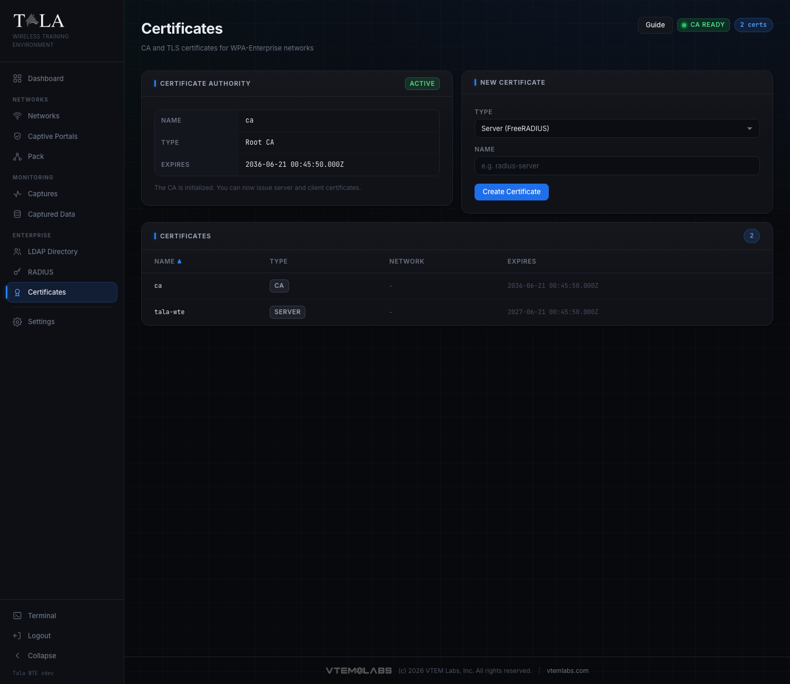
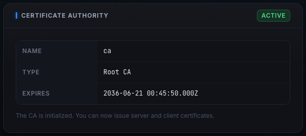
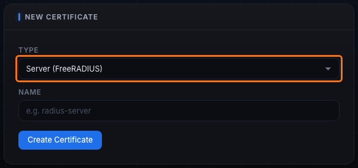
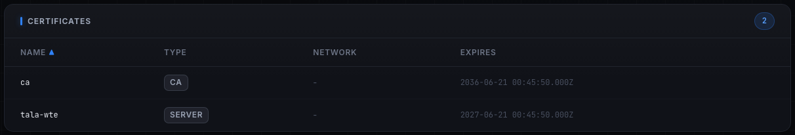

WPA-Enterprise needs TLS, and TLS needs certificates. The Certificates page runs a small certificate authority: initialize a root CA, then issue the server certificate FreeRADIUS presents during EAP and, for EAP-TLS, per-user client certificates.

The page is reached from the sidebar (Certificates). The header shows a "CA Ready" or "No CA" badge and a count of certificates. The page has three areas: the Certificate Authority panel, the New Certificate panel, and the Certificates table.

## Initialize the CA

If no CA exists, the Certificate Authority panel shows a "Required" badge and an Initialize CA button. Click it to create a 10-year root CA with subject `O=Tala WTE, CN=Tala WTE CA` (a 4096-bit RSA key). Once it exists, the panel switches to an "Active" badge and shows the CA's name, type (Root CA), and expiry, with the note "The CA is initialized. You can now issue server and client certificates." The CA must exist before you can issue any other certificate, because it signs them.

## Issue a certificate

The New Certificate panel has a Type selector with two options.

### Server (FreeRADIUS)

The certificate FreeRADIUS presents during the EAP TLS exchange. Enter a Name (for example `radius-server`) and click Create Certificate. This is required for any enterprise network: without a server cert the EAP tunnel cannot form. The cert is signed by your CA and valid for one year.

### Client (EAP-TLS)

A per-user certificate for certificate-based authentication. Enter the user's UID (for example `jdoe`) and click Create Certificate. The cert is signed by your CA with the common name `<uid>-client` (so `jdoe` produces a CN of `jdoe-client`) and valid for one year. Issue these only when the lesson is EAP-TLS; a password-based PEAP lab does not need them. See [[RADIUS-802.1X]] for choosing EAP-TLS.

## The certificates table

The Certificates table lists every certificate with its Name, Type (ca, server, or client), Network (the associated network, or a dash), and Expires date. Sort by clicking any column header (click again to flip the direction).

The table is mirrored from what is actually on disk in the PKI directory: Tala WTE reads the certificate files, parses their real expiry, and reconciles the list, so the page always reflects reality rather than a stale record.

## You usually do not do this by hand

For an enterprise network you rarely need to visit this page. On the network's Start, the preflight gate offers Auto-provision & Start (see [[Networks]]), which creates the CA and the `radius-server` server certificate automatically (and installs them into FreeRADIUS), alongside provisioning the directory and configuring RADIUS. You only come here to issue client certificates for an EAP-TLS lesson, or to inspect what has been issued.

## Tips

- The order is CA, then server cert, then optional client certs. For a password-based PEAP lab you only need the CA and a server cert.
- Let Auto-provision & Start create the CA and server cert for you on the first enterprise network; it is the same result with one click.
- Issue client certificates only when the lesson is EAP-TLS, one per user, with the user's UID.
