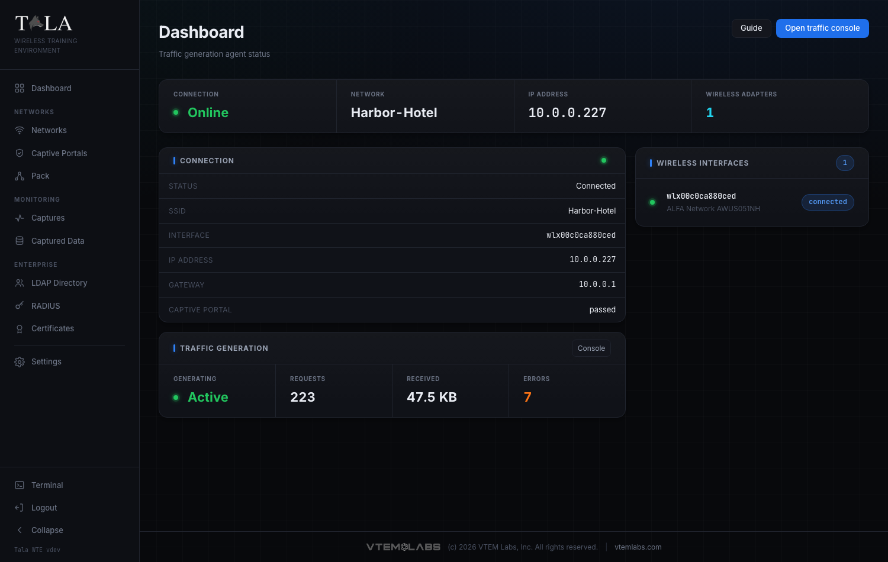

# Client Mode

A Tala WTE box runs in one of two roles. In **Server (AP)** mode it broadcasts Wi-Fi networks for students to attack. In **Client** mode it flips around and behaves like a believable Wi-Fi user: it joins a target network, gets past a captive portal, and generates realistic traffic so there is something on the air to capture and analyze.

Client mode is the other half of a lab. One box broadcasts (the access point); another joins it and acts like a real person browsing, resolving names, logging in, and pinging the LAN. Without a client there is nothing to sniff, no handshakes to crack, and no credentials to harvest.

## When to use Client mode

- **One demo box you drive by hand.** Switch a single box to Client, connect it to a target access point, and run the generators yourself from its console. This is the path this guide walks.
- **A room full of clients.** Do not flip boxes one at a time. Leave them in Client mode and drive them centrally from a leader, which runs the same traffic engine from one console. See [[The-Pack]].

This guide covers switching the role, reading the Client dashboard, confirming your adapter, and where to go to connect and generate traffic. The hands-on connect-and-generate workflow lives in its own guide because there is a lot to it: see [[Traffic-Console]].

---

## Step 1: Switch the box to the Client role

The role swap lives on the [[Settings]] page, in the **Instance Role** panel (the first panel on the page).

The panel shows the box's current role at the top:

- **Server (AP)** with the note "This box broadcasts networks as an access point."
- **Client** with the note "This box joins a network and generates traffic."

On a Server box the button on the right reads **Switch to Client mode**. (On a Client box the same button reads **Switch to Server mode** so you can flip back.) Below the button is a one-line reminder: "Switching installs the other role's dependencies and restarts the service; the console reconnects automatically."

Click **Switch to Client mode**.

## Step 2: Confirm the swap

A browser confirmation appears:

> Switch this instance to Client mode?
>
> The service installs Client dependencies and restarts. The console disconnects and reloads when it is back; this can take a minute.

Choose **OK** to proceed (or **Cancel** to stay put). The button changes to **Switching...** and a toast reads "Switching to Client mode; the console will reconnect."

What happens next:

- The box installs the Client role's dependencies and restarts the service.
- Your console disconnects, then reloads on its own once the box is back. **This can take a minute** -- do not refresh frantically or power-cycle the box; let it finish.
- When it returns, the Instance Role panel shows **Client**, the sidebar changes to the Client navigation, and a new **Pack Agent Key** panel appears just below Instance Role.

> SCREENSHOT NEEDED: The Instance Role panel mid-swap with the button reading "Switching..." and the toast "Switching to Client mode; the console will reconnect" visible.

Judgment: only switch when the box is idle. A Server box that is broadcasting will stop being an access point the moment it swaps, dropping any associated students. Plan the swap between sessions.

## Step 3: (Optional) Note the Pack Agent Key

Once the box is in Client mode, the **Pack Agent Key** panel appears under Instance Role on the Settings page.

- The key is the control token a pack leader uses to drive this client remotely.
- **Copy key** puts it on the clipboard; **Regenerate** issues a fresh one (which invalidates the old key, so any leader already using it must be re-paired).

Skip this if you are driving the box by hand. You only need the key when you plan to enroll this client into a pack leader. The enrollment workflow is in [[The-Pack]].

---

## Step 4: Open the Client Dashboard

In Client mode the home page becomes the **Dashboard** (subtitle "Traffic generation agent status").

This page is **read-only status**. You do not connect to a network or start traffic here. Everything operational happens on the Traffic Console, reached from the header:

- **Guide** -- opens the in-app help for this page.
- **Open traffic console** -- the primary button; takes you to the Traffic Console where you connect and run generators.

The dashboard refreshes its status every few seconds on its own, so you can leave it open as a live readout while traffic runs.

## Step 5: Read the status strip

A strip across the top of the dashboard shows four cells at a glance:

- **Connection** -- **Online** (green, with a live dot) when associated to a network, **Offline** (dim) otherwise.
- **Network** -- the SSID the box is on, or `-` when not connected.
- **IP Address** -- the address the network handed out, or `-`.
- **Wireless Adapters** -- the count of detected adapters. The number is **cyan** when one or more are present and **yellow** when none are, so a yellow zero is your cue that the box has no radio yet.

## Step 6: Read the Connection panel

Below the strip, on the left, the **Connection** panel lists the live link detail. A dot next to the title is green/active when connected and dim/inactive when offline.

- **Status** -- Connected or Offline.
- **SSID** -- the network name, or `-`.
- **Interface** -- the wireless interface in use (for example `wlan0`), or `-`.
- **IP address** -- the leased address, or `-`.
- **Gateway** -- the network's gateway, or `-`.
- **Captive portal** -- the portal state: `none` (no portal involved), an in-progress state while it works through one, `passed` (cleared the portal), or `failed` (could not). If this reads `failed`, the box associated but could not get out past the splash page; check the portal credentials you supplied on the Traffic Console.

## Step 7: Read the Traffic Generation panel

Under the Connection panel, the **Traffic Generation** panel mirrors the live traffic counters and has a **Console** shortcut in its header that jumps straight to the Traffic Console.

- **Generating** -- **Active** (green, with a live dot) while traffic is running, **Idle** otherwise.
- **Requests** -- count of requests issued so far.
- **Received** -- bytes pulled down, formatted (B / KB / MB / GB).
- **Errors** -- error count; turns orange when it is nonzero. A climbing error count usually means the link dropped or a target is unreachable.

These are the same counters shown on the Traffic Console's Live Stats panel; the dashboard surfaces them so you can monitor a running client without leaving the home page.

## Step 8: Confirm the wireless adapter

The right column lists every detected adapter under **Wireless Interfaces**, with a count pill in the header.

Each row shows:

- A green status dot.
- The interface name (for example `wlan0`), in monospace.
- The manufacturer and device model when known, or the driver name as a fallback.
- A pill on the right: **connected** when this is the adapter the box is currently associated through, otherwise the chipset (for example `mt7921u`) when it is known.

A client with no radio cannot join anything, so this panel is the first thing to check before you head to the Traffic Console.

## Step 9: Handle the no-adapter and no-driver states

There are two states that block a connection. Resolve them before you try to connect.

**No adapter at all.** The Wireless Interfaces panel reads:

> No wireless adapter detected. Plug in a USB adapter to join a network.

Plug in a supported USB wireless adapter, then wait a few seconds for the dashboard to pick it up (the **Wireless Adapters** count goes from a yellow `0` to a cyan count).

> SCREENSHOT NEEDED: The Client dashboard with the Wireless Interfaces empty state showing "No wireless adapter detected. Plug in a USB adapter to join a network." and the Wireless Adapters strip cell showing a yellow 0.

**Adapter present but no driver.** A yellow warning banner appears at the top of the dashboard:

> Wireless adapter(s) detected without driver support: <name>. Install the driver before it can connect.

The adapter is plugged in but its driver is not installed, so it cannot associate. Install the driver, then return to the dashboard. For supported adapters and driver notes, see [[Settings]].

> SCREENSHOT NEEDED: The Client dashboard with the yellow "Wireless adapter(s) detected without driver support... Install the driver before it can connect." banner across the top.

---

## Step 10: Connect and generate traffic

Once the dashboard shows an adapter and you are ready, click **Open traffic console** in the header (the primary button shown in Step 4).

On the Traffic Console you will:

1. Import a network profile (the `.json` you exported from a network's detail page on the Server box).
2. **Connect** to the saved network.
3. Choose which generators to run (web, DNS, ping, downloads, credential logins, domain chatter), set the target scope, and **Start traffic**.
4. Optionally enable handshake-capture cycling so students can grab a fresh WPA handshake on a schedule.

The dashboard then reflects the live connection and traffic stats from Steps 5 through 7. The complete, field-by-field walkthrough of the console, including the traffic toggles, targets and credentials, and handshake cycling, is in [[Traffic-Console]].

---

## Switching back to Server (AP) mode

To turn the box back into an access point, return to [[Settings]] -> **Instance Role** and click **Switch to Server mode**. The same confirmation appears, the service reinstalls the Server dependencies and restarts, and the console reloads when it is back. The box stops generating traffic the moment it leaves Client mode, so stop any running generators first if you want a clean handoff.

## Related pages

- [[Traffic-Console]] -- import a config, connect, choose generators, and drive traffic
- [[The-Pack]] -- enroll this client into a leader and drive many members from one console
- [[Settings]] -- the role swap and the Pack Agent Key
- [[Settings]] -- supported USB adapters and driver setup
- [[Networks]] -- create the access point and export the client config the console imports
