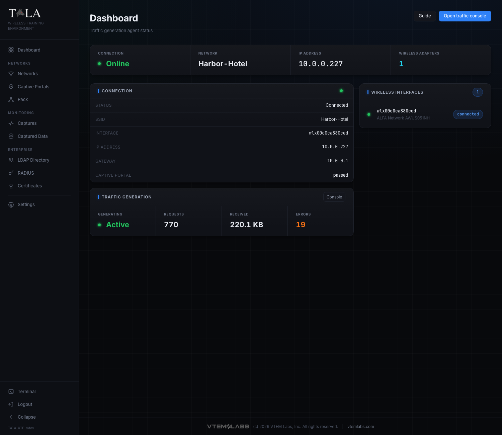
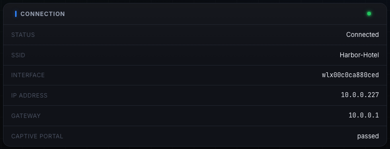
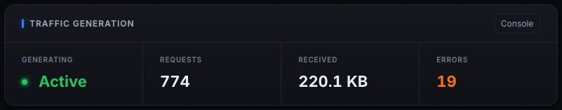
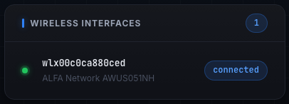

A Tala WTE box can run in one of two roles. In **Server (AP)** mode it broadcasts Wi-Fi networks. In **Client** mode it becomes a believable Wi-Fi client: it joins a target network, gets past a captive portal, and generates realistic traffic so there is something to capture and analyze. Client mode is the other half of a lab, one box broadcasts and another behaves like a real user.

## When to use Client mode

Use Client mode when you want a single demo box you connect to a target access point by hand and drive directly. For a room full of clients you usually do not flip boxes one at a time, you drive them centrally from a leader. See [[The-Pack]] for that, it runs the same traffic engine from one console.

## Switching a box to Client mode

The role swap lives on the [[Settings]] page under **Instance Role**. The panel shows the current role (**Server (AP)** or **Client**) and a single button to swap. On a Server box the button reads **Switch to Client mode**; clicking it confirms, installs the Client role's dependencies, and restarts the service. The console disconnects and reloads on its own when the box is back, which can take a minute. To go back, the same panel shows **Switch to Server mode**.

## The Client Dashboard

In Client mode the box stops being an access point and the home page becomes the **Dashboard** (subtitle "Traffic generation agent status"). This page is **read-only status**. You do not connect or start traffic here, you do that on the Traffic Console (the **Open traffic console** button in the header, see [[Traffic-Console]]).

### The stat strip

A strip across the top shows four cells:

- **Connection** - **Online** (green) when associated to a network, **Offline** otherwise.
- **Network** - the SSID the box is on, or `-` when not connected.
- **IP Address** - the address the network handed out, or `-`.
- **Wireless Adapters** - the count of detected adapters (cyan when one or more are present, yellow when none).

### Connection panel

Below the strip, a **Connection** panel lists the live link detail: **Status** (Connected / Offline), **SSID**, **Interface**, **IP address**, **Gateway**, and **Captive portal** state (`none`, `passed`, `failed`, or an in-progress state).

### Traffic Generation panel

A **Traffic Generation** panel mirrors the live traffic stats with a **Console** shortcut to the Traffic Console. It shows **Generating** (**Active** in green while traffic is running, **Idle** otherwise), **Requests** (count), **Received** (bytes), and **Errors** (orange when nonzero).

### Wireless Interfaces panel

The right column lists each detected adapter with its name, manufacturer/model (or driver), and chipset; the adapter currently in use shows a **connected** pill.

## The no-adapter empty state

If no adapter is present, the Wireless Interfaces panel reads "No wireless adapter detected. Plug in a USB adapter to join a network." A client with no radio cannot join anything, so plug in a supported USB adapter first.

If an adapter is present but its driver is not installed, a yellow warning appears at the top: "Wireless adapter(s) detected without driver support... Install the driver before it can connect." Install the driver before trying to connect.

## Connecting and generating traffic

Everything operational happens on the Traffic Console. There you import a network profile (the `.json` you exported from a network's detail page on the Server), **Connect**, and run the generators. The Dashboard then reflects the live connection and traffic stats. See [[Traffic-Console]] for the full walkthrough.

## Related pages

- [[Traffic-Console]] - import a config, connect, and drive traffic
- [[The-Pack]] - drive many client members from one leader
- [[Settings]] - the role swap and the Pack Agent Key
