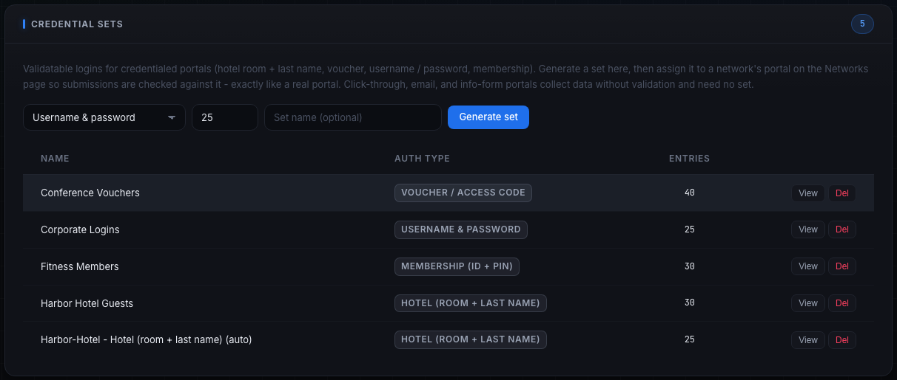
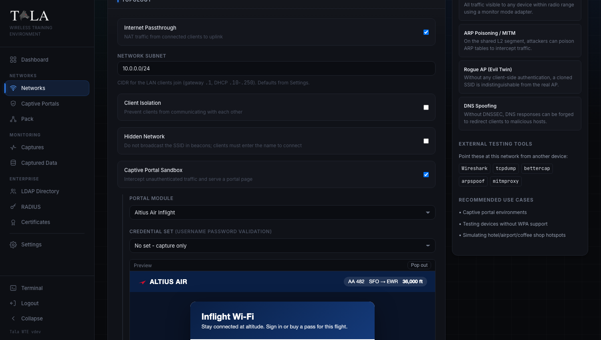

# Credential Sets

A credential set is a list of valid logins for one captive-portal auth type. Assign a set to a network's portal and every submission is checked against it: a matching login grants access, a wrong one is rejected and re-prompted, exactly like a real hotel front desk or corporate login screen. Sets exist so the validating portal types are actually validatable, not just data collectors.

**When to use a set:** when you want a portal to behave like the real thing. Most guests fail, the right room number plus last name (or the right voucher, member ID, username, and so on) gets through, and Captured Data fills with both the rejected attempts and the one that worked.

**When you do not need one:** if you only care about harvesting whatever people type. The validating portal still captures and grants access on submit until a set is assigned.

**Where they live:** the Credential Sets panel on the Captive Portals page.

Related pages:

- [[Captive-Portals]] - the portal side (choosing and building the portal page).
- [[Networks]] - the network side (where a set is wired to a portal, and where the Require Login / Directory / LDAP toggle lives).
- [[Certificates]] - the directory and enterprise login background behind directory-backed validation.

## When a credential set applies

A set is only used by the five validating auth types. The three collect-only types do not validate and need no set; they grant access on submit and simply record what was entered.

Validating types (use a set):

- Username & password
- Email & password
- Hotel (room + last name)
- Voucher / access code
- Membership (ID + PIN)

Collect-only types (no set):

- Click-through (accept terms, no credentials)
- Email capture (collect an email, no validation)
- Information form (name, email, phone, company, no validation)

Each portal template already declares which auth type it is, so the type is decided by the portal you pick, not by you. The credential set just has to match that type.

---

## Workflow A: Generate a set by hand

Generate a set yourself when you want a named, reusable set (for example a shared "Conference Vouchers" set used across several events), when you want a specific entry count, or when you want to read out a known-good login to test a portal manually. If you do not need any of that, skip to Workflow C: in most cases the leader generates a set for you automatically when the network starts.

## Step 1: Open the Credential Sets panel

Go to the Captive Portals page from the left sidebar. The Credential Sets panel sits near the top of the page, above the portal gallery. The count pill on the right shows how many sets exist.

The panel's description line restates the rule: validatable logins for credentialed portals (hotel room + last name, voucher, username / password, membership); generate a set here, then assign it to a network's portal on the Networks page; click-through, email, and info-form portals collect data without validation and need no set.

## Step 2: Pick the auth type

Use the first dropdown (the one that reads "Username & password" by default) to choose the auth type. Only the five validating types appear in this list; the three collect-only types are intentionally absent because they never use a set.

Pick the type that matches the portal you intend to assign the set to:

- Username & password - generic login portals (corporate guest, ISP).
- Email & password - portals that log in by email instead of username.
- Hotel (room + last name) - hotel and cruise Wi-Fi portals.
- Voucher / access code - single-code portals (events, paid passes).
- Membership (ID + PIN) - loyalty / rewards / fitness portals.

If you choose the wrong type, the set will not be offered when you go to assign it (the Networks form only lists sets whose type matches the chosen portal), so match it now.

## Step 3: Set the entry count

The number field is prefilled at 25. Any value from 1 to 1000 is accepted; values below 1 are treated as 25 and values above 1000 are capped at 1000.

Pick a count to suit the exercise:

- A small count (for example 5 to 10) when you want a tight, easy-to-eyeball set for a demo.
- The default 25 for a normal hands-off lab.
- A larger count (hundreds) when many distinct logins should succeed, for example a big event where every attendee voucher is valid.

Entries are de-duplicated as they are generated, so for very small key spaces (a 4-digit PIN, a short voucher alphabet) the saved set can contain slightly fewer rows than you asked for; that is expected.

## Step 4: Name the set (optional)

Type a name in the "Set name (optional)" field, for example "Harbor Hotel Guests" or "Conference Vouchers". A clear name makes the set easy to find in the assignment dropdown later.

Leave it blank to accept the default, which is the auth type's label followed by " set" (for example "Voucher / access code set"). Naming is worth it when you will have several sets of the same type and need to tell them apart.

## Step 5: Generate

Click "Generate set". Tala WTE creates that many believable, validatable, de-duplicated entries and saves the set. The button reads "Generating..." while it works and a toast confirms "Credential set generated". The new set appears immediately in the table below.

What gets generated per type:

- Hotel - a guest last name plus a room number (floor 1 to 8, room 01 to 40).
- Voucher / access code - an 8-character access code with a hyphen in the middle, drawn from an unambiguous alphabet (no look-alike characters such as 0/O or 1/I).
- Membership - a member ID like `M1234567` plus a 4-digit PIN.
- Username & password - a username (first initial plus last name, for example `jsmith`) plus a generated password.
- Email & password - an email like `jsmith@example.com` plus a generated password.

Generated passwords mix upper, lower, digits, and a symbol, again from an unambiguous alphabet so they are easy to read off the View screen and type by hand.

---

## Workflow B: Read or remove a set

## Step 1: Find the set in the table

Each row in the Credential Sets table shows the set's Name, its Auth type (as a badge that reads the type's label, for example HOTEL (ROOM + LAST NAME) or VOUCHER / ACCESS CODE), and the Entries count. The two row actions are View and Del.

The "(auto)" suffix on a name (for example "Harbor-Hotel - Hotel (room + last name) (auto)") marks a set the leader generated automatically when a network started. See Workflow C.

## Step 2: View the entries

Click "View" to open a read-only table of every entry in the set. The dialog title is the set name followed by its auth type in parentheses. The columns are the credential fields for that type (for example `last_name` and `room_number` for a hotel set, or `username` and `password` for a login set), and each row is one valid login.

Use View to read out a known-good login when you want to test a portal by hand: open the set, copy one row's values, then submit them on the live portal and confirm you are let through. Press Close or Escape, or click outside the dialog, to dismiss it.

> SCREENSHOT NEEDED: The View dialog open over the Captive Portals page, showing a credential set's full entry table (for example a hotel set with last_name and room_number columns and several rows), with the dialog title showing the set name and its auth type in parentheses.

## Step 3: Delete a set

Click "Del" to remove a set. A browser confirmation asks `Delete credential set "<name>"?`; confirm to delete or cancel to keep it.

Be deliberate: deleting a set does not detach it from any network it is assigned to. A network that pointed at the deleted set will no longer find it, and its validating portal will fall back to capture-and-grant-on-submit (no validation) until you assign a new set on the Networks page. If you want to keep validation, generate and assign a replacement before or right after deleting.

---

## Workflow C: Auto-generation on start (the hands-off path)

You usually do not have to generate anything by hand. When a validating portal network starts and no credential set is assigned to it, the leader automatically generates a 25-entry set, names it `<SSID> - <auth type label> (auto)`, and assigns it to that network in the same step. A deployed pack member then receives a working credential from that set and passes the portal on its own, so a hotel or login SSID "just works" out of the box and Captured Data fills with believable logins without any manual setup.

What is and is not touched:

- A validating network with no set assigned: a 25-entry set is auto-generated and assigned the first time it starts.
- A validating network that already has a set assigned (by you or by a previous start): left untouched; your set stays in place.
- Any non-validating portal (click-through, email capture, information form): left untouched; these never use a set.

Because the auto set is assigned to the network record, it only happens once per network; restarting the same network reuses the set it already has. If you want a different set, assign one explicitly on the Networks form (Workflow D), which overrides the auto behavior because the network will then already have a set.

Note on directory login: auto-generation applies to every validating type, including username & password. Because the auto set is assigned before the portal validator is built, a username & password portal validates against that static set, not the directory, even with Require Login (Directory / LDAP) turned on. To validate against the directory instead, you must clear the assigned set after the network is running (see Workflow D, Step 5).

---

## Workflow D: Assign a set on the Networks form

This is where a set is actually wired to a portal so submissions get validated. Do this when you want a specific named set on a network, when you want to deliberately run capture-only, or when you want directory-backed login instead of a static set.

## Step 1: Open the network form with an Open portal

Create a new network or edit an existing one. Set Security Protocol to Open, then turn on the Captive Portal Sandbox toggle (its description reads "Intercept unauthenticated traffic and serve a portal page"). Credential sets only apply to Open networks running a portal; the controls below do not appear for any other protocol.

## Step 2: Choose the portal under Portal Module

Pick a portal in the Portal Module dropdown. The portal you choose decides the auth type, and therefore whether a credential set even applies. A live preview of the selected portal renders below the dropdown (with a Pop out button for a larger view).

## Step 3: Set the Credential set selector

If the chosen portal validates, a "Credential set" control appears directly under Portal Module, labeled with the auth type in parentheses, for example "Credential set (username password validation)" or "Credential set (hotel validation)". The label tells you which type of set is required. If the chosen portal is collect-only, no credential control appears at all, which is correct: there is nothing to validate.

The control takes one of two shapes, depending on whether a matching set already exists.

**Shape 1: matching sets exist (a dropdown is shown).** Its first option is "No set - capture only"; below that are the sets whose auth type matches the portal. Only matching-type sets are listed, so you cannot, for example, assign a hotel set to a voucher portal.

- Choose a named set to validate every submission against it: a matching login is let in, a wrong one is rejected and re-prompted.
- Choose "No set - capture only" to record submissions without checking them. The portal still grants access on submit; this is the deliberate "harvest everything, block no one" mode.

A caution about "No set - capture only": selecting it stores an empty set on the network, which is the same state that triggers auto-generation when the network starts (Workflow C). So a validating portal you set to "No set - capture only" will still receive an auto-generated set the first time it starts, and from then on it validates against that set. If you genuinely want capture-only on a validating portal, the reliable way is to clear the assigned set again after the network is running. The simplest "harvest everything, block no one" portal is to pick a collect-only portal type in the first place (click-through, email capture, or information form), which never validates.

**Shape 2: no matching set exists yet (no dropdown).** Instead of a dropdown, the form shows a short note: "This portal validates credentials." followed by a link, "Generate a `<type>` credential set", that takes you to the Captive Portals page. Until you create a matching set, the portal captures and grants on submit. Follow the link, run Workflow A for that type, then come back and the dropdown will list your new set.

## Step 4: Save the network

Save the form. The selected set's ID is stored on the network only when the protocol is Open, the Captive Portal Sandbox is on, and the chosen portal validates; otherwise no set is stored. From here, when the network starts, the portal engine loads that set's entries and validates each submission against them.

## Step 5 (optional): Require Login (Directory / LDAP)

Below the portal preview there is a separate toggle, "Require Login (Directory / LDAP)", described as: "Validate submitted username and password against the directory before granting access, like a corporate or ISP hotspot. Failed logins are denied and recorded."

When to use it: turn this on when a portal has no auth type of its own (for example an older uploaded or scraped template) and you want it to behave as a username & password login. The toggle forces that portal to the username & password type. The directory it validates against is the same set of users you manage under LDAP Directory.

How it interacts with credential sets (important): the directory is only consulted for a username & password portal that has no credential set assigned when it starts. But a validating portal with no set assigned auto-generates and assigns a static set on start (Workflow C), and once a set is assigned the static set is what gets checked. In practice that means:

- For a portal that already declares the username & password type, leave Require Login off and assign a credential set (or accept the auto-generated one). The directory path is pre-empted by auto-generation.
- For a hotel, voucher, or membership portal, the directory does not apply at all; use a credential set. The directory only ever covers username & password.

If you specifically want directory validation to win, you cannot rely on simply leaving the set unassigned, because auto-generation fills it in on start. Clear the set after the network is running, or use a credential set instead.

---

## How validation actually works (field aliases)

A credential set is stored against canonical field names (`room_number`, `last_name`, `code`, `username`, `password`, `member_id`, `pin`, `email`), but real portal templates name their form fields differently. Tala WTE resolves submitted field names through a table of aliases, so one set validates across template variants without you editing anything. For example:

- `room_number` also matches `room`, `stateroom`, `unit`.
- `last_name` also matches `lastname`, `surname`.
- `code` also matches `voucher`, `access_code`, `survey_code`, `ticket_number`, `bed_code`, `promo_code`.
- `username` also matches `account`, `login`, `user`, `userid`.
- `member_id` also matches `rewards_number`, `loyalty_id`, `card_number`, `membership_id`, `account_number`.
- `password` also matches `passcode`, `passphrase`.
- `email` also matches `email_address`.

So a single Hotel set works whether the template's field is named `room_number` or `stateroom`, and a single Voucher set works whether the field is `code` or `ticket_number`. This is why a generated set can be reused across many portal templates of the same type.

When a submission is checked, every key field for that auth type must match:

- Non-secret fields (room number, last name, username, member ID, code, email) match case-insensitively and ignore surrounding whitespace.
- Secret fields (`password`, `pin`) must match exactly.
- An empty submitted key field never matches, so a blank login always fails.

A submission is accepted if it matches any one entry in the assigned set.

---

## Tips and judgment

- For a hands-off credentialed lab, do nothing: start the validating-portal network and deploy a pack member. The auto-generated set (Workflow C) plus the member's matching submission populate Captured Data on their own.
- To test a portal manually, generate or open a set, use View to read one valid login, and submit it on the live portal. Confirm the right login passes and a deliberately wrong one is rejected and re-prompted.
- Name sets you intend to reuse (Workflow A, Step 4). Auto sets carry the "(auto)" suffix and the SSID, so they are easy to tell apart from sets you curated.
- Keep the type in mind: the set's auth type must match the portal's auth type or it will not even be offered on the Networks form. If a set you expect is missing from the dropdown, check that its type matches the chosen portal.
- Deleting a set does not unassign it. Replace it on the Networks page if you want validation to continue (Workflow B, Step 3).

See also: [[Captive-Portals]] for building and choosing the portal page, [[Networks]] for the full network form, and [[Certificates]] for the directory and enterprise login path.
