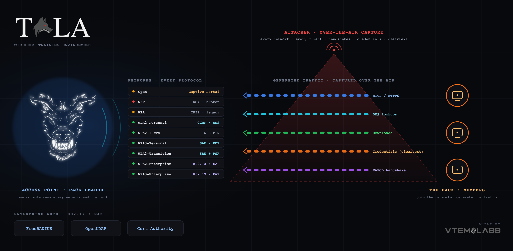

<strong>Full documentation lives at <a href="https://tala-wte.vtemlabs.com">tala-wte.vtemlabs.com</a></strong> the complete field manual, attack catalog, toolkit, and wireless reference. This wiki is the operational quick reference; the docs site is the full deep dive.

Tala WTE (Wireless Training Environment) turns a single Linux host with a Wi-Fi adapter into a complete, self-contained wireless lab. You stand up real access points across every Wi-Fi security protocol, captive portals, and a full enterprise 802.1X stack, then learn and practice wireless penetration testing against them. Everything ships in one Go binary, driven from a clean web console.

This wiki covers everything from bare system requirements through troubleshooting. For the complete field manual, attack catalog, and wireless reference, read the full documentation at [tala-wte.vtemlabs.com](https://tala-wte.vtemlabs.com). If you are new, start with the [[Quick-Start]].

> Tala WTE is a vulnerable-by-design training range. It deliberately runs insecure networks and weak credentials for you to practice against, so it is not hardened. Run it only on an isolated lab network, never on a production or internet-facing network. See [[Security-and-License]].

## Getting started

- [[Quick-Start]] - from zero to your first network and captured credentials.
- [[System-Requirements]] - hardware, Wi-Fi adapters, operating systems, dependencies.
- [[Installation]] - install, first-boot setup, accessing the console.
- [[Updating]] - the in-app updater and updating a whole pack.
- [[CLI-Reference]] - the `tala-wte` subcommands.

## Building the lab

- [[Networks]] - broadcast access points across every protocol (Open through WPA3-Enterprise).
- [[Captive-Portals]] - 36 built-in portals plus your own; harvest what users enter.
- [[Credential-Sets]] - validatable logins that make captive-portal checks real.
- [[Packet-Captures]] - record live traffic and analyze it in the browser.

## Enterprise authentication

- [[LDAP-Directory]] - the embedded directory behind enterprise Wi-Fi.
- [[RADIUS-802.1X]] - the 802.1X gatekeeper (FreeRADIUS).
- [[Certificates]] - the CA behind EAP and WPA-Enterprise.

## Clients and orchestration

- [[Client-Mode]] - run a box as a traffic-generating client.
- [[Traffic-Console]] - join a network and generate realistic, capturable traffic.
- [[The-Pack]] - drive a whole pack of client members from one leader.
- [[Settings]] - instance role, regulatory domain, uplink, updates.

## Reference

- [[Architecture]] - how it works under the hood.
- [[API-Reference]] - the HTTP API the console uses.
- [[Troubleshooting]] - symptom, cause, fix.
- [[FAQ]] - quick answers to common questions.
- [[Security-and-License]] - the vulnerable-by-design warning and license terms.
