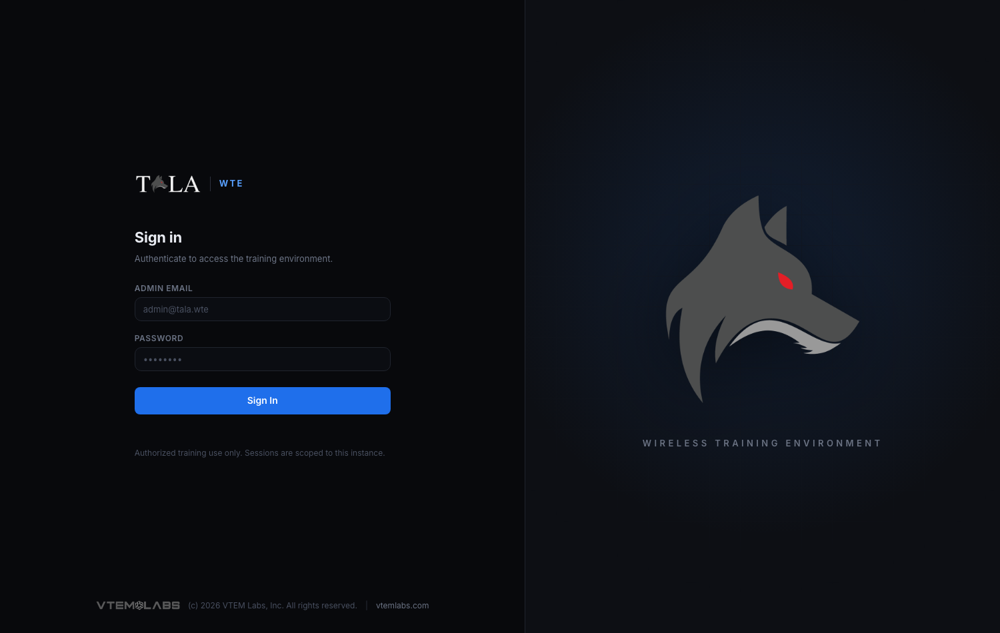

Installing Tala WTE is one command: drop the binary on a clean Linux host and run `sudo ./tala-wte install`. The installer handles dependencies, the systemd service, and everything else; you create the one administrator account afterward in the browser.

Check [[System-Requirements]] first, then see [[Quick-Start]] for the shortest path to a running network and [[CLI-Reference]] for the full subcommand list.

## Get the binary

Two ways:

- Download from the latest GitHub release: `tala-wte-linux-amd64` or `tala-wte-linux-arm64`, matched to your host's CPU architecture (see [[System-Requirements]]).
- Build it yourself with the Makefile. `make linux` cross-compiles both Linux targets into `dist/` (`make linux-amd64` or `make linux-arm64` for just one). Each build embeds the SvelteKit console, the license, and the terminal, so the output is a single self-contained binary.

Copy the binary to the host (for example into the operator's home directory) and make it executable.

## Install as a service (AP / server role)

```
sudo ./tala-wte-linux-arm64 install
```

This is the standard install: the box becomes an access point that broadcasts your target networks. It takes no flags and is idempotent. What it does, in order (verified against `cmd/server/install.go`):

1. Verifies and installs system dependencies (heavy on the first run, a no-op afterward). See [[System-Requirements]] for the package list.
2. Installs USB wireless recovery units and heals any USB Wi-Fi adapter wedged on first probe, so it surfaces without a reboot.
3. Warns about any connected adapter that has no driver support.
4. Copies the running binary to `/var/lib/tala-wte/tala-wte-linux-<arch>` (atomic temp-file-and-rename, so re-running over the live service binary is safe).
5. Sets up the in-browser terminal for the operator account (the user who ran sudo, or the first regular user).
6. Writes `/etc/systemd/system/tala-wte.service`, runs `systemctl daemon-reload`, then enables and starts the unit.
7. Waits for systemd to report the unit active, then waits for `:8443` to answer.
8. Prints the console URL and how to retrieve the one-time setup token.

It never creates an account. Admin setup happens in the browser (see First boot below).

The systemd unit runs `ExecStart=<binary> serve` as `root`, with `Restart=on-failure`, ordered after `network-online.target` and the USB-rescan / Wi-Fi-recover units.

## Install as a client role

```
sudo ./tala-wte-linux-arm64 install-client
```

Use this when the box should join another Tala WTE access point and generate traffic instead of broadcasting. Same binary, same data dir, and the same `tala-wte.service` unit, but the unit sets `TALA_MODE=client` so the console shows the client view. It installs a lighter client dependency set (`wpasupplicant`, `iw`, `isc-dhcp-client`, `iputils-ping`, `ca-certificates`, `wireless-regdb`), heals wedged adapters, then writes and starts the unit.

You can also flip an already-installed box between roles later from [[Settings]] without reinstalling; `install-client` is just the way to provision a host directly into the client role. See [[The-Pack]] for driving a fleet of client members from one leader.

## Reinstall and upgrade

`install` is also the upgrade path. The database under `/var/lib/tala-wte` is preserved across reinstalls, so you can re-run `sudo ./tala-wte install` any time to upgrade the binary or repair the systemd unit without losing networks, portals, captures, or your admin account. For routine updates, prefer the in-app updater (see [[Updating]]) rather than hand-installing.

## Uninstall

```
sudo tala-wte uninstall
```

Stops and disables the service and removes the unit file, but preserves `/var/lib/tala-wte` (the database and all captures) so a later reinstall picks up where you left off.

```
sudo tala-wte uninstall --purge
```

Also deletes `/var/lib/tala-wte` (the database and all captures) and wipes the terminal session logs and recorder binaries. There is no undo.

## First boot



Open the printed URL over HTTPS:

```
https://<host>:8443/
```

Port 80 redirects to 8443. The certificate is self-signed, so your browser will warn about it on the first visit; accept it to continue (the console is meant for an isolated lab, not the public internet).

On a fresh install the console shows a setup wizard, not a login. Tala WTE never auto-provisions an administrator and never prints credentials. The wizard asks for:

- An admin email and a password (minimum 10 characters).
- The license acknowledgment (enforced server-side; the full license is viewable from that screen).
- A one-time setup token.

The setup token gates the wizard so a stranger on the network cannot claim the admin account during the window between install and first login. It is logged at first boot; retrieve it from the host's journal:

```
journalctl -u tala-wte | grep 'SETUP TOKEN'
```

Enter the token in the wizard to create the account. The token is one-shot: once the admin exists, it is consumed, the setup screen becomes the normal sign-in, and the wizard hard-refuses to create a second admin.
