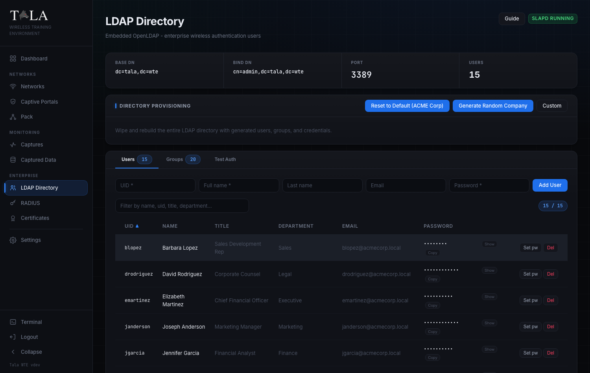
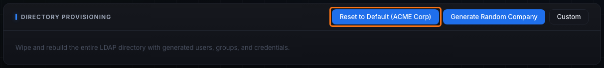
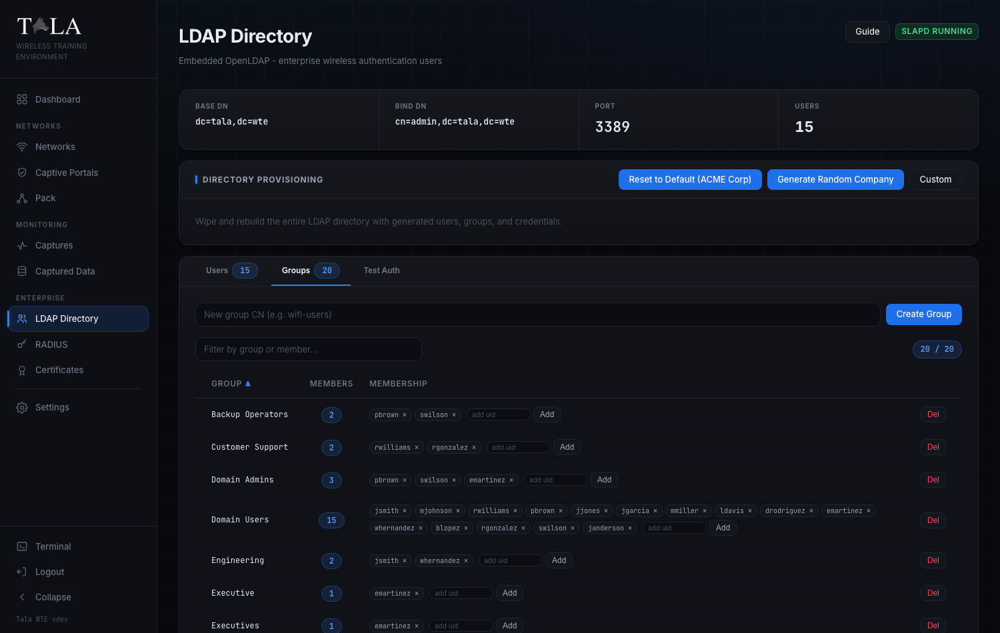
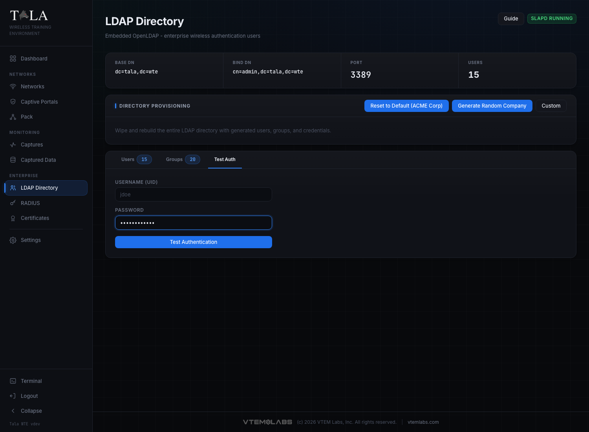

# LDAP Directory

Tala WTE runs a real OpenLDAP (slapd) directory that acts as your fake company. It is the user store RADIUS checks for WPA-Enterprise logins, and it can also back captive-portal "Require Login" validation. Populate it once and your enterprise and portal labs have believable people to authenticate as.

Use this page when you need to:

- Stand up a believable corporate user base before launching a WPA2/WPA3-Enterprise network (see [[Networks]] and [[RADIUS-802.1X]]).
- Provide directory logins for a captive portal set to "Require Login (Directory / LDAP)" (see [[Captive-Portals]]).
- Grab a known-good username and password to configure a test client.
- Confirm a credential actually authenticates before you build a network around it.

The page is reached from the sidebar under ENTERPRISE as **LDAP Directory**.

---

## The page at a glance

The header shows the title **LDAP Directory** with the subtitle "Embedded OpenLDAP - enterprise wireless authentication users". On the right are two header controls:

- **Guide** - opens the in-app guide modal for this page.
- A status badge that reads **slapd running** (green) or **slapd stopped** (red), reflecting whether the directory daemon is up. Most actions on this page require it to be running.

Directly below the header is a stat strip with the directory's fixed coordinates:

| Field | Value | Meaning |
|---|---|---|
| **Base DN** | `dc=tala,dc=wte` | The root of the directory tree. |
| **Bind DN** | `cn=admin,dc=tala,dc=wte` | The admin account the app binds as for every write. |
| **Port** | `3389` | slapd listens on `ldap://127.0.0.1:3389`. |
| **Users** | a live number | Count of accounts under `ou=Users`. |

These coordinates are baked in; you do not set them. The admin bind password is generated and persisted on disk the first time it is needed (or taken from the `TALA_LDAP_ADMIN_PASSWORD` environment variable). You never type it by hand. Users live under `ou=Users,dc=tala,dc=wte` as `inetOrgPerson` entries; groups live under `ou=Groups,dc=tala,dc=wte` as `groupOfNames` entries.

Below the stat strip is the **Directory Provisioning** panel, then a tabbed panel with three tabs: **Users**, **Groups**, and **Test Auth**.

> Note: an empty database is bootstrapped automatically with the ACME Corp baseline (15 users, 2 groups) the first time slapd starts, so the directory is never empty when you first arrive.

---

## Step 1: Provision a company

Everything begins with provisioning. A provision wipes the entire directory and rebuilds it from scratch with generated users, groups, and credentials, then shows you the results. The panel is titled **Directory Provisioning** and its body reads "Wipe and rebuild the entire LDAP directory with generated users, groups, and credentials."

There are three buttons in the panel header. Pick the one that matches what your lab needs.

### Option A: Generate Random Company

Click **Generate Random Company** for the fastest realistic start. It picks one of a set of believable company names (for example "Vanguard Industries", "Meridian Systems", "Citadel Infosec") with a matching `.local` domain, creates 10 to 20 users spread across real departments (Engineering, Sales, Information Technology, Finance, Marketing, HR, and so on) with real job titles, and gives each user a realistic password mix:

- roughly 40 percent weak (the `Password1!`, `Welcome123` kind),
- 30 percent semi-personal (a first name plus a year),
- 30 percent strong random.

Choose this when you want a directory that feels like a real domain and gives cracking exercises something to chew on. The deliberately mixed (not all-strong) passwords are the point.

### Option B: Reset to Default (ACME Corp)

Click **Reset to Default (ACME Corp)** to rebuild a fixed, repeatable baseline: company "ACME Corp", domain `acmecorp.local`, 15 users, with the same realistic (mixed, not all-strong) password distribution. Choose this when you want a known directory that is identical across runs, or to return to a clean baseline after experimenting. This is the same baseline the enterprise preflight uses when it auto-provisions LDAP for you (see [[RADIUS-802.1X]]).

### Option C: Custom

Click **Custom** to toggle open an inline form for a directory you define yourself.

> SCREENSHOT NEEDED: The Directory Provisioning panel with the Custom form expanded, showing the Company Name field, Email Domain field, Users number input, the Provision button, and the "All Strong Random Passwords" toggle below them.

Fill in:

- **Company Name** (required) - the org name, for example "Contoso Ltd".
- **Email Domain** (required) - the mail domain, for example "contoso.local".
- **Users** - a count from 1 to 50 (the input is clamped to this range).
- **All Strong Random Passwords** toggle:
  - **Off (recommended, the default)** - every user gets the realistic corporate mix described above (~40% weak, ~30% semi-personal, ~30% strong random). Pick this when the lesson involves cracking or guessing passwords, because you want some weak accounts in the set.
  - **On** - every user gets a unique 12-character random password. Pick this when you want authentication to always succeed and do not care about cracking, for example when you only need the directory to back a working enterprise login.

Click **Provision** to wipe and rebuild. The button is disabled until both Company Name and Email Domain have values.

### Confirm and read the results

Every provisioning action first asks you to confirm, since it wipes the current directory:

- Random: "This will wipe the current directory and generate a random company with users. Continue?"
- Default: "This will wipe the current directory and create the default ACME Corp directory. Continue?"
- Custom: "This will wipe the current directory and create N users for COMPANY. Continue?"

While it runs, the buttons read **Provisioning...**. When it finishes, a results block appears headed "Provisioned: COMPANY (N users)" with a scrollable table of the generated accounts: **UID**, **Name**, **Email**, and **Password** (shown in plaintext here so you can copy any credential you want for a test client).

> SCREENSHOT NEEDED: The post-provision results block showing the "Provisioned: ..." header and the table of generated UID / Name / Email / Password rows.

---

## Step 2: Manage users

Open the **Users** tab. It shows a count pill next to the tab label and lists every account in the directory.

The table columns are:

- **UID** (`uid`) - the login name.
- **Name** (`cn`) - the full name.
- **Title** - job title (a dash if not set).
- **Department** - department (a dash if not set).
- **Email** (`mail`) - the address (a dash if not set).
- **Password** - see below.
- An actions column on the right.

### Filter and sort

Above the table is a filter field placeholder "Filter by name, uid, title, department..." plus a count pill showing "shown / total". Typing filters across uid, name, email, title, and department at once. Click any of the **UID**, **Name**, **Title**, or **Department** headers to sort by that column; click the same header again to flip the direction (an up or down arrow marks the active sort).

### Read or copy a password

The **Password** column handles two cases:

- A plaintext password (the generated kind) shows as dots with **Show** and **Copy** buttons. **Show** reveals it inline (and turns into **Hide**); **Copy** puts it on the clipboard and pops a "Password copied to clipboard" toast. This is how you grab a working credential for a test client.
- A hashed value (stored with a `{SSHA}`-style prefix) cannot be recovered, so it reads **(hashed)** with no reveal or copy.

### Add a user

Use the inline row at the top of the tab. Fields, left to right: **UID** (required), **Full name** (required), **Last name** (optional), **Email** (optional), **Password** (required). Click **Add User**. The button stays disabled until UID, Full name, and Password are filled.

### Per-row actions

- **Set pw** - prompts "Set a new password for UID:" and applies what you enter. Use it to make a weak account strong, or to set a known credential on an account so you can log in from a test client. An empty value is rejected with a "Password cannot be empty" error.
- **Del** - removes the user after a "Delete user UID?" confirm.

---

## Step 3: Manage groups

Open the **Groups** tab (it also shows a count pill). Groups model the org structure a trainee would expect to enumerate.

A generated company populates groups realistically:

- **Domain Users** (everyone) and **Domain Admins** (IT staff plus executives, capped).
- One group per populated department (Engineering, Sales, Information Technology, Finance, and so on).
- Operator groups derived from IT (Help Desk, Backup Operators, File Server Admins) and an Executives group.
- Access groups (VPN Users, Remote Desktop Users) as realistic subsets of the company.
- **wifi-users** (everyone) and **wifi-admins** (admins) - the Wi-Fi groups the RADIUS path expects.

The table columns are:

- **Group** - the group CN.
- **Members** - a count pill.
- **Membership** - the member chips and the add control.
- An actions column.

### Filter and sort

Above the table is a filter field placeholder "Filter by group or member..." plus a "shown / total" count pill. Filtering matches both group name and member uid, so you can type a username to find which groups a given user belongs to. Click the **Group** header to sort by name, or the **Members** header to sort by count; click again to flip the direction.

### Manage membership inline

Each current member appears as a clickable chip showing the uid with a small x. Click a chip to remove that user from the group immediately. To add a member, type a uid into the **add uid** field in the row and click **Add** (or press Enter). An empty group shows "empty" until you add someone.

### Create and delete groups

- Create a group with the inline field at the top of the tab, placeholder "New group CN (e.g. wifi-users)", then click **Create Group**.
- **Del** in a group's row removes it after a "Delete group "CN"?" confirm.

Group membership is what you reference when you scope access in a lesson.

---

## Step 4: Test a credential before you build on it

Open the **Test Auth** tab to confirm a username and password actually authenticate before you wire them into an enterprise network or portal.

Fill in:

- **Username (UID)** - the bare login name, for example `jdoe`.
- **Password** - the user's password.

Click **Test Authentication** (the button is disabled until both fields have values, and reads "Testing..." while it works). Tala WTE performs a real LDAP bind as `uid=<user>,ou=Users,dc=tala,dc=wte` and reports the outcome:

- **Authentication Successful** (green) - shows the bound DN underneath so you can confirm exactly which entry matched.
- **Authentication Failed** (red) - shows the reason (for example a bad password, or "LDAP server unreachable - check that slapd is running" when the daemon is down).

> SCREENSHOT NEEDED: The Test Auth tab showing a successful result panel (the green "Authentication Successful" header with the bound DN), and ideally a second capture of the red "Authentication Failed" state.

Tip: an email-style entry is reduced to its local part before binding, so `jsmith@acmecorp.local` is tried as `jsmith`. This is the quickest way to verify the EAP Identity and Password you plan to put on an enterprise network are real.

---

## How the directory backs enterprise Wi-Fi

The whole point of this directory is to give your wireless labs real identities to authenticate against.

- **WPA2/WPA3-Enterprise (802.1X) networks.** RADIUS validates each client's directory login against this directory. The **EAP Identity** and **EAP Password** you set on an enterprise network must be a real user here. Verify the pair on **Test Auth** first, then build the network. See [[RADIUS-802.1X]] for the full authentication chain and the EAP methods involved, [[Certificates]] for the CA and server certificate the enterprise handshake also requires, and [[Networks]] for creating the enterprise SSID itself.
- **Captive-portal "Require Login (Directory / LDAP)".** When enabled on an Open network's captive portal, portal logins are validated against this same directory, just like a corporate hotspot. See [[Captive-Portals]].

---

## Tips and judgment

- Provision the directory **before** starting a WPA-Enterprise network or a "Require Login" portal; both authenticate against it.
- Leave the mixed-password setting on (All Strong Random Passwords **off**) for realistic cracking labs; flip it **on** when you want authentication to always succeed.
- Use **Show** / **Copy** in the Users tab (or the post-provision results table) to grab a known-good credential, then plug it into a test client or into a network's EAP Identity / EAP Password.
- If Test Auth or any action fails with an "LDAP server unreachable" message, check the **slapd** badge in the header; the daemon must be running.
- An empty database is bootstrapped automatically with the ACME Corp baseline (15 users, 2 groups) the first time slapd starts, so the directory is never empty when you arrive.

## Related guides

- [[RADIUS-802.1X]] - the RADIUS / FreeRADIUS authentication chain that checks credentials against this directory.
- [[Certificates]] - the CA and server certificate the enterprise EAP handshake needs.
- [[Networks]] - creating WPA2/WPA3-Enterprise networks that use these identities.
- [[Captive-Portals]] - credentialed portals that validate logins against this directory.
