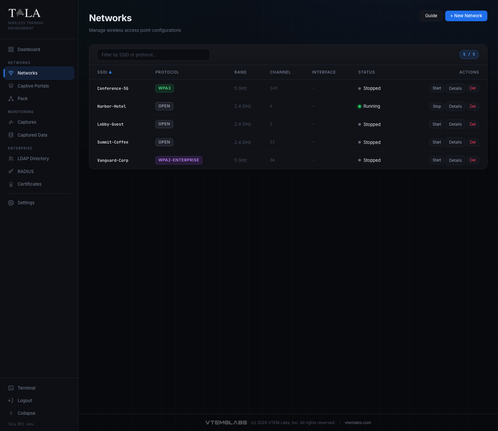
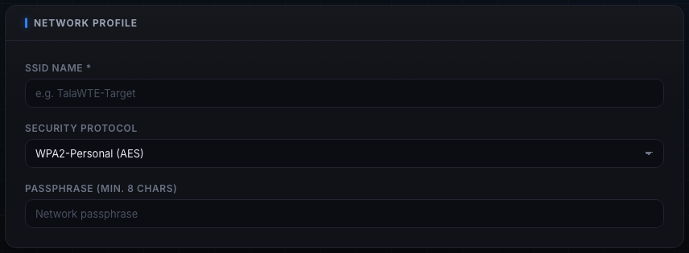
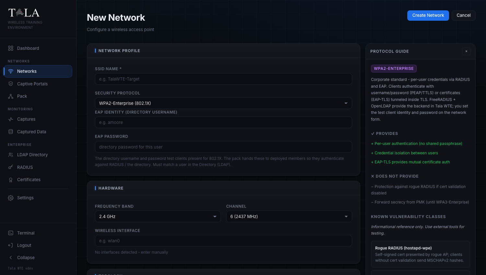
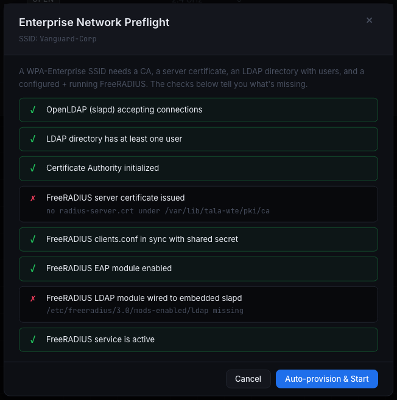
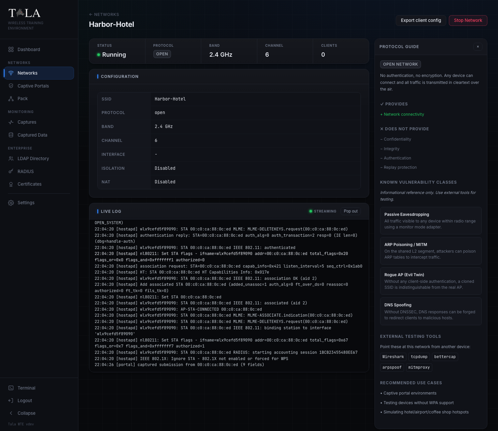

The Networks page is where you stand up the Wi-Fi access points students attack, capture, and analyze. One Tala WTE box can broadcast several real, on-the-air APs at once: a believable corporate SSID, an open coffee-shop hotspot with a captive portal, a WPA3 guest network. Each is a live access point that a real phone or laptop will join.

The table on the Networks page lists every network with its SSID, protocol, band, channel, the adapter it claimed, and a status dot (stopped / running / error). Filter by SSID or protocol, sort any column, and use the per-row actions: Start / Stop, Details, and Del. Click "+ New Network" to build one.

For the rest of the captive-portal workflow see [[Captive-Portals]], for validatable logins see [[Credential-Sets]], and to record traffic off a running network see [[Packet-Captures]].

## The create form

The "+ New Network" form has three panels: Network Profile, Hardware, and Topology. A live Protocol Guide panel sits beside the form and updates as you change the protocol (see below).

### Network Profile

- SSID Name (required) - the broadcast name, up to 32 bytes.
- Security Protocol - the dropdown described in the next section. This is the most important choice; it decides what the lab teaches.
- Passphrase / WEP Key - shown when the protocol needs one. For WPA/WPA2/WPS/WPA3 it is 8 to 63 characters. For WEP it is the WEP Key field (see WEP below).
- EAP Identity (directory username) and EAP Password - shown only for the two Enterprise protocols. These are a real directory (LDAP) user that test clients and deployed pack members present for 802.1X.

### Hardware

- Frequency Band - 2.4 GHz, 5 GHz, or 6 GHz (Wi-Fi 6E). Bands the selected adapter cannot host as an AP are disabled in the dropdown and labeled "not supported by this adapter". If the adapter can host an AP on fewer than three bands, a note lists which it can host.
- Channel - the channel list changes per band. 5 GHz DFS channels are marked "DFS". Changing the band resets the channel to the band default (channel 6 on 2.4 GHz, 36 on 5 GHz, 1 on 6 GHz).
- Wireless Interface - the adapter that will broadcast. Adapters already claimed by a running network are listed under "In use by running networks" so you can run a concurrent network on a free one. Any capability limits for the selected adapter (for example "No WPA3-SAE (legacy chipset)") are flagged in yellow.

### Topology

- Internet Passthrough (on by default) - NATs connected-client traffic out to your uplink so the network has real internet. Turn it off for an isolated, local-only range with no internet egress.
- Network Subnet - the CIDR clients join, default `10.0.0.0/24`. The gateway is `.1` and DHCP serves `.10` to `.250`. The default comes from Settings; each network can override it.
- Client Isolation - prevents clients from communicating with each other, the way a public hotspot does. Leave it off when a lab needs client-to-client traffic.
- Hidden Network - does not broadcast the SSID in beacons; clients must type the name to connect. Good for a "find the hidden SSID" exercise. It is obscurity, not security.
- Captive Portal Sandbox - appears only when the protocol is Open. Covered under [[Captive-Portals]].

## Security protocols and when to use each

These are the exact options in the Security Protocol dropdown, in order. Pick the one that matches the lesson.

- Open (No Auth) - no encryption, no authentication. Any device connects and all traffic is in cleartext over the air. Pick this for open-hotspot and captive-portal labs (choosing Open is what reveals the Captive Portal Sandbox toggle). Use it to simulate a hotel, airport, or coffee-shop hotspot, or a credential-harvesting portal.
- WEP (Insecure - Legacy) - RC4 with a 24-bit IV, broken since 2001. Use it only to demonstrate why WEP is dead (aircrack-ng / PTW cracking). The key is 5 or 13 ASCII characters, or 10/26 hex; any other input is fitted to a valid 13-character key automatically and the effective key is shown for you to enter on test clients.
- WPA (TKIP - Legacy) - the 2003 transitional standard (TKIP over RC4). Use it for legacy-device compatibility and to demonstrate TKIP weaknesses. Avoid it otherwise.
- WPA2-Personal (AES) - the current mainstream standard (AES-CCMP), and the everyday choice for handshake-capture labs. This is the highest-value protocol for capture-and-crack exercises (four-way handshake and PMKID).
- WPA2 + WPS - WPA2 with Wi-Fi Protected Setup enabled. Pick this to teach the WPS attack surface (Pixie Dust, PIN brute force with reaver/bully).
- WPA3-Personal (SAE) - the modern strong standard. SAE gives forward secrecy and resists offline dictionary attacks; PMF is mandatory. Use it to test WPA3-capable clients or demonstrate SAE/Dragonblood topics.
- WPA3-Transition (SAE+PSK) - runs WPA3-SAE and WPA2-PSK side by side on one SSID for mixed client fleets. Use it for migration scenarios and transition-mode downgrade testing.
- WPA2-Enterprise (802.1X) - the corporate lesson. Each user logs in with a directory identity, validated by RADIUS against the LDAP directory. Use it for corporate-network simulation and PEAP credential-harvest demos. Needs the enterprise stack (see preflight below).
- WPA3-Enterprise (Suite-B) - the strongest wireless standard, adding Suite-B-192 crypto (GCMP-256) and mandatory PMF on top of WPA2-Enterprise. Use it for high-security enterprise simulation and Suite-B compliance testing. Most client devices need Suite-B support to connect.

WPA2-Personal (handshake labs) and Open with a captive portal (credential-harvesting labs) are the two highest-value exercises to start with.

## The Protocol Guide panel

A Protocol Guide panel sits next to the form (and on the network detail page) and updates as you change the Security Protocol. For the selected protocol it shows:

- An overview of the cipher and standard.
- "Provides" - the security properties it does give.
- "Does Not Provide" - the properties it does not.
- "Known Vulnerability Classes" - named attack classes with short descriptions and CVE numbers where relevant. This is an informational reference, not a tool.
- "External Testing Tools" - the tools you would point at this network from another device.
- "Recommended Use Cases" - what the protocol is good for in a lab.

On the detail page the panel can be collapsed and re-expanded.

## Starting and stopping a network

From either the table row (Start / Stop) or the detail page (Start Network / Stop Network):

- A personal, open, or legacy network comes up immediately.
- Auto-claim a free adapter: if the adapter you saved with is gone, Tala WTE automatically claims a free one, falling back to a band the new adapter supports, so a replugged or swapped USB card just works.
- RadioSwap confirm (detail page): when the saved adapter is missing and you start from the detail page, a "Wireless adapter changed" dialog names the missing adapter, proposes a specific available one (with a band-change warning if needed), and asks you to confirm with "Use <interface>" rather than picking silently.

### WPA-Enterprise preflight and Auto-provision & Start

Starting either Enterprise protocol opens the Enterprise Network Preflight dialog. An Enterprise SSID needs a CA, a server certificate, an LDAP directory with users, and a configured, running FreeRADIUS. The dialog checks each and shows what is missing.

- If everything passes, the button is "Start Network".
- If anything is missing, the button is "Auto-provision & Start". One click bootstraps the whole enterprise stack (CA, server cert, RADIUS config, directory users), shows an auto-provision report and the provisioned test credentials, then starts the network.

The EAP Identity and EAP Password you set on the form must be a real user in the directory (LDAP). The pack hands these to deployed members so they authenticate against RADIUS for real.

## The detail page

Open a network with Details. The page shows:

- A status strip: Status (with the colored dot), Protocol badge, Band, Channel, and live Clients count.
- A Configuration panel: SSID, protocol, band, channel, interface, isolation, and NAT state.
- Connected Clients - a live table of MAC, IP, and Signal (dBm) for each associated client, polled while the network runs.
- Live Log - a streaming terminal of association, DHCP, portal, and error activity, with a "Pop out" button to detach it into a resizable window.
- Export client config - downloads a `.json` profile you import on a Tala WTE client, or hand to the Pack, so it can join this exact network.
