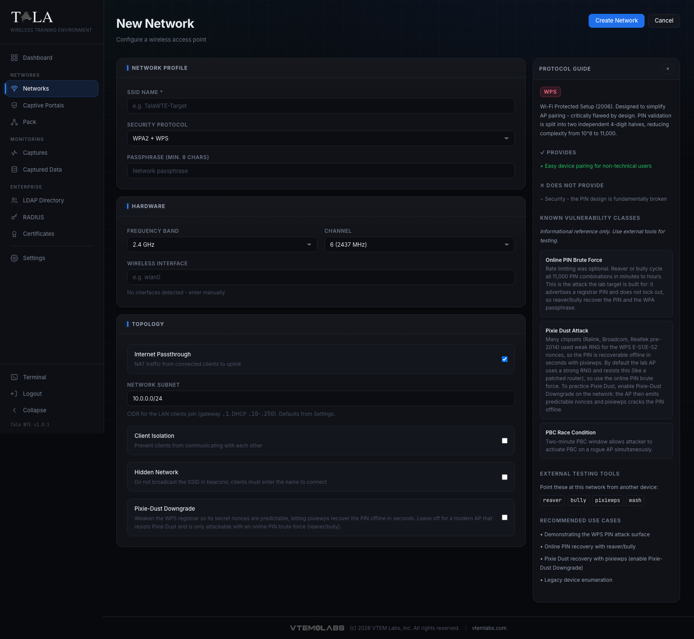
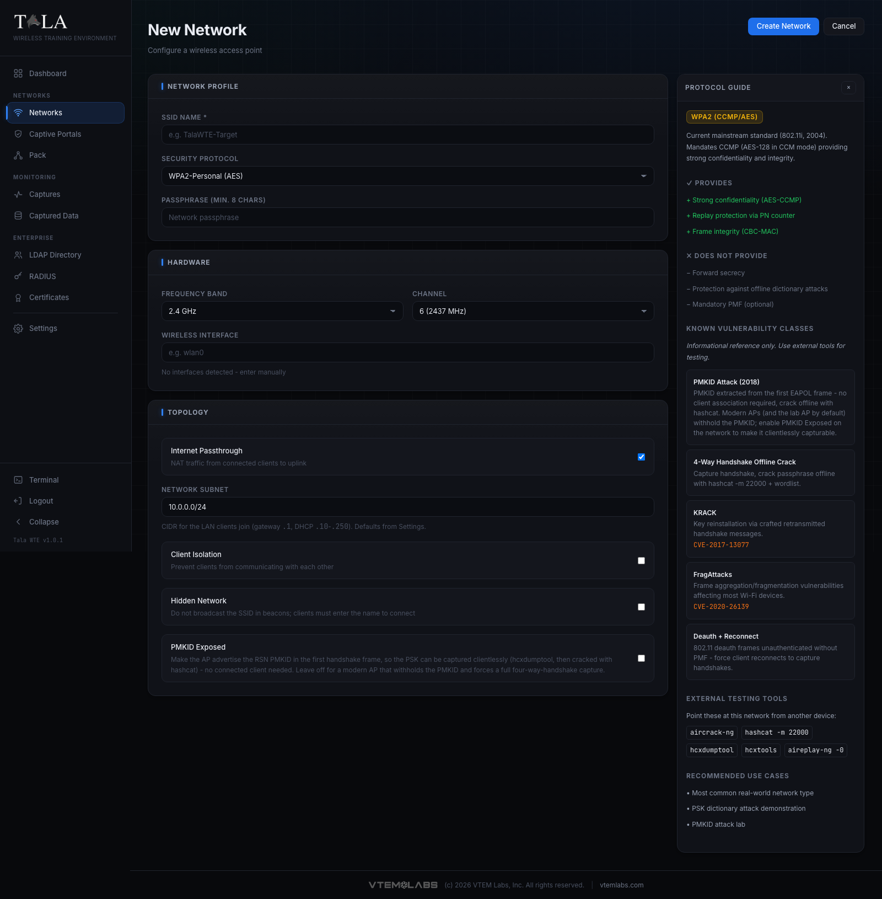

# Networks

The Networks page is where you stand up the Wi-Fi access points that students attack, capture, and analyze. Each network is a live, on-the-air access point that a real phone or laptop will join. One Tala WTE box can broadcast several of them at once (a believable corporate SSID on one adapter, an open coffee-shop hotspot with a captive portal on another) as long as each network claims a free wireless interface.

Use this page when you need to:

- Build a target network of a specific security type (Open, OWE / Enhanced Open, WEP, WPA, WPA2, WPA2 + 802.11r, WPS, WPA3, WPA3-Transition, WPA2-Enterprise, or WPA3-Enterprise).
- Toggle the exact weakness a lesson teaches (Pixie-Dust Downgrade, PMKID Exposed, Hidden, Client Isolation).
- Start or stop a network, watch who connects, and read the live log.
- Export a client profile so a Tala WTE client or a deployed Pack member can join the exact network.

Related guides: captive portals are covered in [[Captive-Portals]], validatable logins in [[Credential-Sets]], the enterprise backend in [[Certificates]], [[LDAP-Directory]], and [[RADIUS-802.1X]], recording traffic off a running network in [[Packet-Captures]], and pushing a network to remote members in [[The-Pack]].

---

## The Networks list

The landing page is a single table of every configured network. Each row shows:

- **SSID** - the broadcast name (a link to the detail page).
- **Protocol** - a colored badge, for example `WPA2`, `OPEN`, `WPS`, `WPA2-ENTERPRISE`.
- **Band** - 2.4, 5, or 6 GHz.
- **Channel** - the numeric channel.
- **Interface** - the adapter the network claimed, or `-` if none.
- **Status** - a colored dot plus text: green `running`, gray `stopped`, red `error`.
- **Actions** - per-row **Start** / **Stop**, **Details**, and **Del**.

Above the table:

- The **filter field** ("Filter by SSID or protocol...") narrows the list as you type; it matches on SSID and protocol.
- The **count pill** on the right reads `shown / total` (for example `3 / 5` when a filter is active).
- Click any sortable column header (SSID, Protocol, Band, Channel, Status) to sort; click again to reverse. An up or down arrow marks the active sort column.

Header buttons:

- **Guide** opens the in-app help for this page.
- **+ New Network** opens the create form.

When no networks exist yet the table is replaced by an empty state with a **Create First Network** button. The list updates live, so a network another operator starts or a Pack member reports appears without a manual refresh.

---

## Building a network end to end

## Step 1: Open the create form

Click **+ New Network** in the header. The form has a header with **Create Network** and **Cancel** buttons, three configuration panels down the left (Network Profile, Hardware, Topology), and a live **Protocol Guide** panel on the right.

If anything is wrong when you submit, a red error banner appears at the top with a dismiss button. The page scrolls to the top so you see it. Validation happens before the network is created, so nothing is saved until every required field is valid.

## Step 2: Fill in the Network Profile panel

This panel sets the identity and security of the AP.

- **SSID Name \*** (required) - the broadcast name, for example `TalaWTE-Target`. It is limited to 32 bytes; the form rejects a longer name with "SSID must be 32 bytes or fewer". An empty name is rejected with "SSID Name is required".
- **Security Protocol** - the dropdown that decides what the lab teaches. This is the single most important choice on the form. Its eleven options and when to pick each are detailed in the next step.
- **Passphrase** / **WEP Key** - this field appears only for protocols that need a key (WEP, WPA, WPA2, WPA2 + 802.11r, WPS, WPA3, WPA3-Transition). Its label and rules change with the protocol; see Step 3.
- **EAP Identity (directory username)** and **EAP Password** - these two fields appear only for the two Enterprise protocols; see Step 3.

## Step 3: Choose the Security Protocol (and fill the fields it reveals)

These are the exact dropdown options, in order, with guidance on when to pick each. The form changes which other fields appear based on this choice. For the theory and attacks behind each protocol see the Field Manual at [/manual/](/manual/).

- **Open (No Auth)** - no encryption or authentication; reveals the **Captive Portal Sandbox** toggle. No passphrase field. ([/manual/open/](/manual/open/))
- **WEP (Insecure - Legacy)** - RC4 with a 24-bit IV, broken since 2001. The field is labeled **WEP Key**: a valid key is 5 or 13 ASCII characters or 10/26 hex; any other input is fitted to a valid 13-character key, shown as the **Effective key** to type on test clients. ([/manual/wep/](/manual/wep/))
- **WPA (TKIP - Legacy)** - the 2003 transitional standard (TKIP over RC4); legacy compatibility only. Needs a passphrase. ([/manual/wpa/](/manual/wpa/))
- **WPA2-Personal (AES)** - the mainstream standard and highest-value capture-and-crack target; reveals the **PMKID Exposed** toggle. Needs a passphrase. ([/manual/wpa2-personal/](/manual/wpa2-personal/))
- **WPA2 + WPS** - WPA2 with Wi-Fi Protected Setup; reveals the **Pixie-Dust Downgrade** toggle. Needs a passphrase. ([/manual/wps/](/manual/wps/))
- **WPA3-Personal (SAE)** - the modern strong standard (forward secrecy, mandatory PMF). Needs a passphrase. ([/manual/wpa3-personal/](/manual/wpa3-personal/))
- **WPA3-Transition (SAE+PSK)** - WPA3-SAE and WPA2-PSK on one SSID for mixed fleets. Needs a passphrase. ([/manual/wpa3-transition/](/manual/wpa3-transition/))
- **WPA2-Enterprise (802.1X)** - per-user directory login validated by RADIUS; reveals the EAP fields and routes Start through the Enterprise Preflight (Step 8). ([/manual/wpa2-enterprise/](/manual/wpa2-enterprise/))
- **WPA3-Enterprise (Suite-B)** - Suite-B-192 crypto (GCMP-256) and mandatory PMF on top of WPA2-Enterprise; most clients need Suite-B support. Also reveals the EAP fields and routes through preflight. ([/manual/wpa3-enterprise/](/manual/wpa3-enterprise/))
- **OWE / Enhanced Open** - passwordless like Open, but each client negotiates a per-session encrypted link (Opportunistic Wireless Encryption, RFC 8110); PMF is mandatory and nothing is authenticated. No passphrase field. ([/manual/owe/](/manual/owe/))
- **WPA2 + 802.11r (Fast Transition)** - WPA2-PSK with fast roaming across a mobility domain; it speeds roaming, not security, and inherits every WPA2 weakness. Needs a passphrase. ([/manual/wpa2-ft/](/manual/wpa2-ft/))

**Passphrase rules** (for the personal protocols): the field is labeled "Passphrase (min. 8 chars)". It must be between 8 and 63 characters; shorter is rejected with "Passphrase must be at least 8 characters" and longer with "Passphrase must be 63 characters or fewer".

**EAP fields** (Enterprise only):

- **EAP Identity (directory username)** - for example `amoore`. Required for enterprise; an empty value is rejected with "EAP identity is required for enterprise networks".
- **EAP Password** - the directory password for that user. The form note explains: these are the directory username and password test clients present for 802.1X, and the Pack hands them to deployed members so they authenticate against RADIUS / the directory. The identity must match a real user in the Directory (LDAP); see [[LDAP-Directory]].

**Judgment:** WPA2-Personal (handshake labs) and Open with a captive portal (credential-harvesting labs) are the two highest-value exercises to start with. Reach for WEP/WPA only to show why legacy crypto is retired, for WPS to teach the PIN attack surface, and for the Enterprise pair when the lesson is corporate 802.1X.

## Step 4: Pick the Hardware (band, channel, interface)

The **Hardware** panel chooses where the AP transmits.

- **Frequency Band** - **2.4 GHz**, **5 GHz**, or **6 GHz (Wi-Fi 6E)**. The form knows what the selected adapter can host: a band the adapter cannot beacon on is disabled and labeled "- not supported by this adapter". If the adapter can host an AP on fewer than three bands, a note under the dropdown lists which it can host (for example "MT7921 can host an AP on: 2.4 GHz, 5 GHz."). If you switch to an adapter that cannot host your chosen band, the form automatically falls back to a supported band and resets the channel.
- **Channel** - the channel list changes per band. On 5 GHz, channels in the DFS range are marked "DFS" (for example "52 (5260 MHz) DFS"); DFS channels can take longer to come up because the radio must listen for radar first, so prefer a non-DFS channel for a quick demo. Changing the band resets the channel to that band's default: channel 6 on 2.4 GHz, 36 on 5 GHz, 1 on 6 GHz.
- **Wireless Interface** - the adapter that will broadcast. The dropdown labels each adapter with its interface plus manufacturer and model (or driver), for example `wlan0 - MediaTek MT7921`. Three context lines can appear under it:
  - **In use by running networks** - lists adapters already claimed by a running network (for example `wlan0 -> Corp-WiFi`), so you can deliberately pick a free adapter and run a concurrent network.
  - **Limits** (yellow) - any capability limit for the selected adapter, for example "No WPA3-SAE (legacy chipset)".
  - If no interfaces are detected at all, the dropdown is replaced by a plain text box ("e.g. wlan0") with the note "No interfaces detected - enter manually". A blank interface is rejected with "Wireless interface is required".

## Step 5: Set the Topology (passthrough, subnet, and the toggles)

The **Topology** panel controls the LAN behind the AP and the per-protocol weakness toggles.

- **Internet Passthrough** (on by default) - NATs connected-client traffic out to your uplink so the network has real internet. Turn it off for an isolated, local-only range with no internet egress (useful when you do not want lab clients reaching the outside world).
- **Network Subnet** - the CIDR clients join, default `10.0.0.0/24`. The gateway is `.1` and DHCP serves `.10` to `.250`. The default comes from Settings; each network can override it here. Change it only when you need to avoid a collision with your existing LAN or run two networks on distinct ranges.
- **Client Isolation** (off by default) - prevents clients from communicating with each other, the way a public hotspot does. Leave it off when a lab needs client-to-client traffic (for example an ARP-poisoning or lateral-movement exercise); turn it on to mimic a real guest hotspot.
- **Hidden Network** (off by default) - does not broadcast the SSID in beacons; clients must type the name to connect. Good for a "find the hidden SSID" exercise. It is obscurity, not security.

The next two toggles are conditional and appear only for the matching protocol.

**Pixie-Dust Downgrade** (only on **WPA2 + WPS**, off by default):

- **Off** - the AP behaves like a modern, patched router: its WPS registrar nonces are unpredictable, so Pixie Dust fails and the only way in is the slower online PIN brute force (reaver/bully). Every WPS network still ships a recoverable PIN, so the online attack always works.
- **On** - the AP's WPS secret nonces (E-S1/E-S2) become predictable, so pixiewps recovers the PIN offline in seconds (the old-chipset flaw).
- **When to use:** turn it on to teach Pixie Dust; leave it off to show why a patched AP defeats Pixie Dust and forces the online PIN attack instead.

**PMKID Exposed** (only on **WPA2-Personal**, off by default):

- **Off** - the AP withholds the PMKID like a modern router, so capturing the PSK needs a full four-way handshake from a connected client.
- **On** - the AP advertises the RSN PMKID in the first handshake frame (EAPOL message 1/4), so the PSK is capturable clientlessly (hcxdumptool, then crack with hashcat 22000) with no client present.
- **When to use:** turn it on to teach the clientless PMKID attack; leave it off to force a handshake capture.

**Captive Portal Sandbox** (only on **Open**, off by default) - intercepts unauthenticated traffic and serves a portal page. Enabling it nests a **Portal Module** dropdown, an optional **Credential set** selector when the chosen portal validates submissions, a live **Preview** with a **Pop out** button, and a **Require Login (Directory / LDAP)** toggle. The full captive-portal workflow, including which portal to pick and how validation works, is documented in [[Captive-Portals]] and [[Credential-Sets]].

## Step 6: Read the Protocol Guide as you build

The **Protocol Guide** panel sits to the right of the form and on the detail page, and it updates instantly as you change the Security Protocol. For the selected protocol it shows:

- A title badge and a one-paragraph **overview** of the cipher and standard.
- **Provides** - the security properties it does give (green, prefixed with `+`).
- **Does Not Provide** - the properties it does not (muted, prefixed with `-`).
- **Known Vulnerability Classes** - named attack classes with short descriptions and CVE numbers where relevant. The panel states plainly that this is an informational reference only and that you use external tools for testing.
- **External Testing Tools** - the tools you would point at this network from another device, shown as code chips.
- **Recommended Use Cases** - what the protocol is good for in a lab.

Use this panel to confirm you picked the right protocol for the lesson before you create the network. On the detail page the same panel can be collapsed with the `x` button and re-expanded with the `?` button.

## Step 7: Create the network

Click **Create Network** in the header (it reads "Creating..." while it saves and is disabled during the save). On success the form navigates straight to the new network's detail page. If the server rejects it, the red error banner shows the reason and nothing is created. **Cancel** returns to the Networks list without saving.

---

## Starting and stopping a network

You can start or stop from two places: the **Start** / **Stop** button in a table row, or the **Start Network** / **Stop Network** button on the detail page header.

- A personal, open, or legacy network comes up immediately. The status dot turns green and the row reads `running`.
- **Stopping** is unconditional from either place; the dot returns to gray `stopped`.
- **Auto-claim a free adapter:** if the adapter you saved the network with is gone, Tala WTE automatically claims a free one and falls back to a band the new adapter supports, so a replugged or swapped USB card just works.

### The RadioSwap confirm (detail page)

When you start from the **detail page** and the saved adapter is missing, instead of picking silently the app opens a **Wireless adapter changed** dialog. It states that the saved adapter (named, in monospace) is not connected, names a specific **Available adapter** with its label and interface, and asks "Use it for this network?". If the proposed adapter cannot host the network's current band, a yellow warning explains why and that the band will change.

- **Use `<interface>`** (the primary button, which names the exact interface, for example "Use wlan1") confirms the swap and starts the network on the proposed adapter, switching the band only if required.
- **Cancel** closes the dialog without starting.

## Step 8: WPA-Enterprise preflight and Auto-provision & Start

Starting either Enterprise protocol opens the **Enterprise Network Preflight** dialog (titled with the target SSID). A WPA-Enterprise SSID needs a CA, a server certificate, an LDAP directory with users, and a configured and running FreeRADIUS. The dialog runs each readiness check and lists them with a green check for pass or a red cross for fail, each with a detail line.

The footer button depends on the result:

- **Everything passes** - the buttons are **Cancel** and **Start Network**. Click Start Network to bring the AP up as configured.
- **Anything is missing** - the buttons are **Cancel** and **Auto-provision & Start**. One click bootstraps the whole enterprise stack, then starts the network.

When you click **Auto-provision & Start**, the dialog moves through "Provisioning dependencies..." then "Starting network...", and on success shows two extra sections:

- **Auto-Provision Report** - one row per step with a status tag of `created`, `skipped`, or `failed`, so you can see exactly what was built.
- **Provisioned Credentials** - a table of **UID**, **Name**, and **Password** for the test users it created. Use these to test 802.1X authentication from a client device.

If a step fails, the phase switches to an error with the message "Auto-provision reported failures - review the steps below" and the footer offers **Close** and **Retry**. The dialog cannot be dismissed while it is provisioning or starting.

Remember that the **EAP Identity** and **EAP Password** you set on the form must be a real user in the directory (LDAP); the Pack hands these to deployed members so they authenticate against RADIUS for real. See [[Certificates]], [[LDAP-Directory]], and [[RADIUS-802.1X]] for the backend pieces the preflight checks.

---

## The detail page

Open any network with **Details** (or by clicking its SSID). The header has a back link to Networks, the SSID as the title, an **Export client config** button, and the **Start Network** / **Stop Network** toggle (colored green when stopped, red when running).

### The status strip

A framed strip across the top shows five live cells:

- **Status** - the colored dot plus text (`running`, `stopped`, or `error`).
- **Protocol** - the protocol badge.
- **Band** - in GHz.
- **Channel** - the numeric channel.
- **Clients** - the live count of associated clients.

While the network runs, the page polls every 5 seconds to keep this strip, the client list, and the log current. If the server becomes unreachable it backs off to every 15 seconds and shows "Lost connection to server - retrying in background", then "Connection restored" when it recovers.

### Configuration

A panel of the saved settings: **SSID**, **Protocol**, **Band**, **Channel**, **Interface**, **Isolation** (Enabled/Disabled), and **NAT** (Enabled/Disabled). Two extra rows appear for the relevant protocols:

- On a **WPS** network, **WPS Attack** reads "Online PIN + Pixie Dust" when Pixie-Dust Downgrade is on, or "Online PIN only" when it is off.
- On a **WPA2** network, **PMKID** reads "Exposed (clientless capture)" when PMKID Exposed is on, or "Withheld" when it is off.

### Connected Clients

When at least one client is associated, a **Connected Clients** panel appears with a count pill and a table of **MAC**, **IP**, and **Signal** (in dBm) for each client, refreshed on the poll. With no clients the panel is hidden.

### Live Log

A streaming terminal of association, DHCP, portal, and error activity. Its header shows a status indicator (green "streaming" when running, gray "idle" otherwise) and a **Pop out** button.

- Before any activity the box reads "No activity yet - start the network and connect a client."
- The log auto-scrolls to the newest line as long as you are already near the bottom, so scrolling up to read history is not interrupted by new output.
- **Pop out** detaches the log into a floating window titled "Live Log - `<SSID>`" that you can **drag** by its title bar and **resize** from its edges and corner. The window has **Minimize**, **Maximize/Restore**, and **Close** buttons, and a small LED that glows green while the log is streaming. On a phone the popped-out window fills the screen.

### Export client config

The **Export client config** button downloads a `.json` profile named `tala-client-<SSID>.json`. Import it on a Tala WTE client (see [[Client-Mode]]) or hand it to the Pack (see [[The-Pack]]) so the device joins this exact network without re-typing the SSID, band, channel, and key.

---

## Deleting a network

Click **Del** on the row (or use the list). A browser confirm ("Delete this network?") guards the action; confirm to remove it. Deleting a network removes its configuration; stop it first if it is running.
