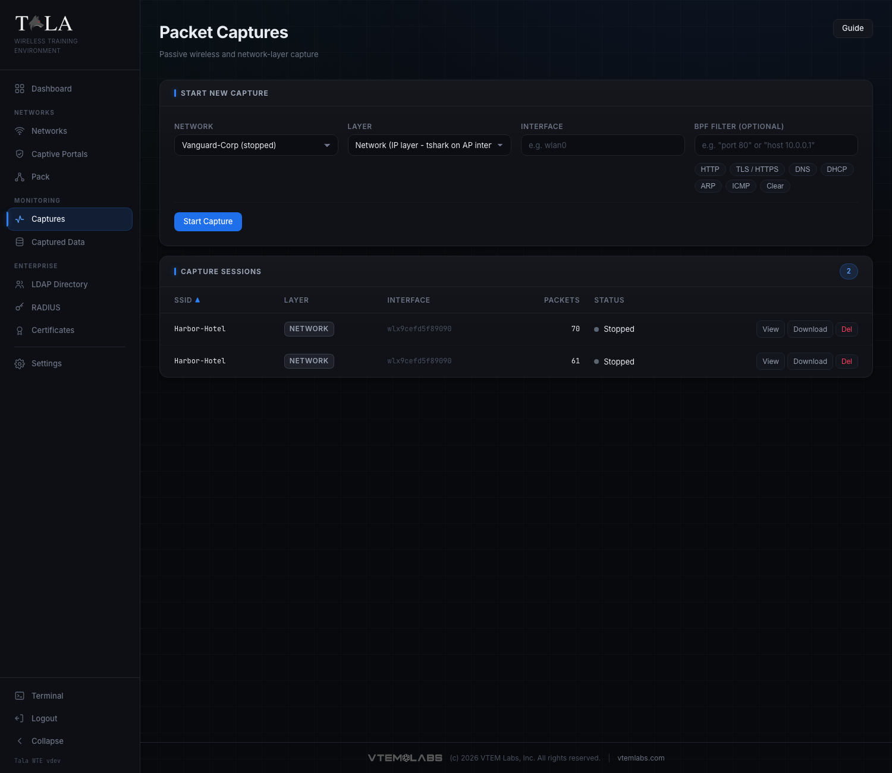
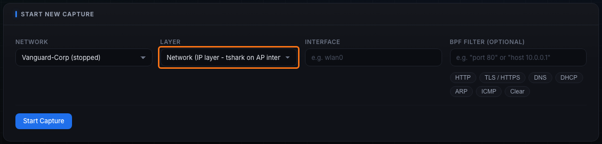
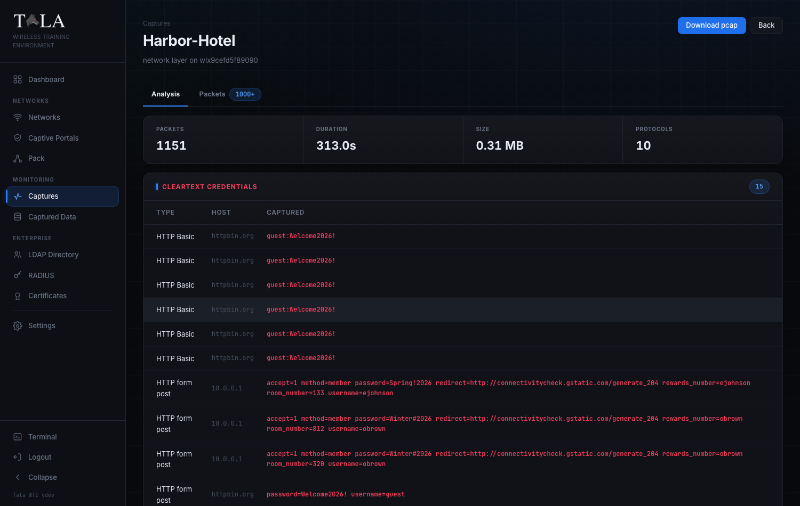

# Packet Captures

Packet Captures records real traffic off a running network and analyzes it for you in the browser: protocol mix, top talkers, DNS and HTTP requests, the HTTPS sites contacted, and cleartext credentials pulled straight off the wire. It is the payoff page, where students see exactly what a sniffer sees.

There are two capture modes, chosen by the Layer field:

- Network (IP layer) - watches the IP traffic of every client on a network you stood up (DNS, HTTP, logins). This is the everyday choice.
- Wireless (802.11) - records raw management and EAPOL frames in monitor mode. Use it for WPA four-way-handshake and beacon-level work.

Captures run against a network you started on the [[Networks]] page, and pair naturally with a captive-portal or credential lab (see [[Captive-Portals]] and [[Credential-Sets]]). To feed a capture with traffic on demand, deploy a member from [[The-Pack]] or drive a real client from [[Client-Mode]].

## Open the page

1. In the sidebar, open MONITORING -> Captures.
2. The page has two stacked panels: Start New Capture at the top, and Capture Sessions below it.
3. The Guide button in the top right opens this same walkthrough in-app.

---

## Step 1: Open the Start New Capture panel

The top panel, Start New Capture, is a four-field form. Every field is described in the next steps. Fill them in left to right, then start the session.

---

## Step 2: Choose the Network

The Network selector lists every network defined on the [[Networks]] page. Each option shows the SSID followed by its current status in parentheses, for example "Vanguard-Corp (stopped)" or "Harbor-Hotel (running)".

Judgment:

- A capture only sees traffic on a network that is actually up. You can start a session against a stopped network, but it will record nothing until that network is running and a client is generating traffic.
- For a useful lab, pick a network that is running and that has, or is about to have, a client or a deployed pack member on it.

---

## Step 3: Choose the Layer

The Layer selector has two options. This is the most important choice on the page because it decides what kind of traffic you record.

- Network (IP layer - tshark on AP interface) - runs the capture on the access point's interface, inside that network's sandbox. It sees the IP traffic of every client on that network: DNS lookups, HTTP requests, TLS/SNI, logins. This is the everyday choice and the one to use for credential-harvesting and traffic-analysis lessons.
- Wireless (802.11 - monitor mode interface) - a monitor-mode capture of raw 802.11 frames: beacons, probe requests, association and deauthentication management frames, and EAPOL key frames. Pick this when the goal is frame-level work or capturing a WPA four-way handshake / PMKID rather than IP traffic.

When to pick which:

- Teaching "anything unencrypted is visible" with a captive portal or HTTP login? Use Network (IP layer).
- Capturing a WPA handshake to crack offline, or studying 802.11 management frames? Use Wireless (802.11). Pair it with a WPA2-Personal network and either the PMKID Exposed option (clientless capture) or reconnect cycling that forces a handshake (see Step 9).

> SCREENSHOT NEEDED: The Layer dropdown on the Start New Capture panel expanded to show both options, "Network (IP layer - tshark on AP interface)" and "Wireless (802.11 - monitor mode interface)".

---

## Step 4: Choose the Interface

The Interface field is the adapter the capture binds to.

- If Tala WTE detected wireless interfaces, this is a dropdown of the available adapters (for example wlan0, wlan1). Pick the adapter that serves the network you chose, or the monitor-capable adapter for a wireless capture.
- If no interfaces were detected, the field becomes a free-text input with the placeholder "e.g. wlan0". Type the interface name by hand.

Judgment: for a Network (IP layer) capture, this should be the AP interface that hosts the selected SSID. For a Wireless (802.11) capture, choose an adapter that supports monitor mode.

---

## Step 5: Apply an optional BPF Filter

The BPF Filter (optional) field narrows the capture at record time using Berkeley Packet Filter syntax, so only matching frames are written to disk. The placeholder shows the format: `"port 80"` or `"host 10.0.0.1"`. Leave it empty to capture everything.

A row of preset chips fills the common filters for you. Clicking a chip writes its expression into the field; the active chip is highlighted.

| Chip | Fills the filter with | Captures |
|---|---|---|
| HTTP | `tcp port 80` | cleartext web traffic |
| TLS / HTTPS | `tcp port 443` | encrypted web (SNI still visible) |
| DNS | `udp port 53` | name lookups |
| DHCP | `udp port 67 or udp port 68` | address assignment |
| ARP | `arp` | layer-2 address resolution |
| ICMP | `icmp` | ping / control messages |
| Clear | (empty) | removes the filter, captures all |

Judgment:

- A filter keeps a capture small and focused, which makes the Analysis tab easier to read for a single lesson. Use HTTP to isolate logins, or DNS to show only the names a client resolved.
- Leave the filter empty when you want the full picture (protocol mix, top talkers across everything) or when you are not yet sure what the client will do.
- Click Clear (or empty the field) to capture all traffic again.

---

## Step 6: Start the capture

Click Start Capture. The button is disabled until both a Network and an Interface are set, and it reads "Starting..." while the session spins up.

The new session appears in the Capture Sessions table below with a status of running and a packet count that climbs as traffic flows. If something goes wrong, an error banner appears at the top of the page with a dismiss (x) button.

> Seeing 0 packets is not a bug. A Network (IP layer) capture only records traffic that actually crosses the AP, so it needs a client doing something. Connect a client, or deploy a pack member with traffic generation, on that network and the count climbs. An idle network with no clients captures nothing.

---

## Step 7: Read the Capture Sessions table

The lower panel, Capture Sessions, lists every capture with a count pill showing the total. While the list is loading it reads "Loading capture sessions...". If there are none it shows "No capture sessions yet" with the hint "Start a capture above to begin recording traffic."

Columns (click any header to sort; an arrow shows the active sort and direction, and clicking the same header again reverses it):

- SSID - the network being recorded (sorted by default, ascending).
- Layer - a badge reading network or wireless.
- Interface - the adapter the capture is bound to.
- Packets - the packet count (right-aligned; shows "-" until counted).
- Status - a colored dot plus the word running or stopped. The dot is active (lit) while running and inactive otherwise.

Row actions change with the session state:

- While running: a single Stop button. Click it to end recording; the row flips to stopped.
- When stopped: View (opens the analysis), Download (saves the pcap), and Del (deletes the session record).

Del asks "Delete this capture record? The pcap file is preserved on disk." Confirming removes the row from the list but leaves the capture file in place, so deleting a record never destroys evidence.

---

## Step 8: Open a capture with View

1. Click View on a stopped session to open the capture viewer.
2. Read the header. It shows a "Captures" breadcrumb back to the list, the SSID as the title, and a subtitle with the layer and interface, plus the filter in quotes if one was set (for example: network layer on wlan0 - filter "tcp port 80").
3. Two header buttons sit on the right: Download pcap (primary) and Back.

A stat strip across the top summarizes the capture:

- Packets - total packets in the file.
- Duration - elapsed time of the capture in seconds (or "-" if unknown).
- Size - the pcap file size in MB.
- Protocols - the number of distinct protocols seen.

Below the strip are two tabs:

- Analysis - open by default; the readable breakdown (Step 9).
- Packets - the raw frame list (Step 10), with a count pill showing how many packets are loaded, suffixed with "+" if the list was truncated.

---

## Step 9: Work the Analysis tab

The Analysis tab turns the pcap into a readable story. While it works it shows "Analyzing capture...". Sections render only when there is data for them, so a small capture shows fewer panels.

- Cleartext credentials (shown in red) - a Type / Host / Captured table of logins recovered from the traffic. Type is "HTTP Basic" (recovered from a Basic auth header) or "HTTP form post" (recovered from a login form, for example `username=jdoe  password=Hunter2!`). This is the core lesson: anything not encrypted is visible on the wire. The captured value is shown in bold red.
- Protocol mix - a horizontal bar chart of what was on the wire, top protocols by packet count (TCP, DNS, HTTP, ARP, DHCP, TLS, EAPOL, and so on). For a Wireless (802.11) capture, EAPOL frames here are the evidence that a four-way handshake was recorded.
- Top talkers - the busiest conversations by packet count, listed as Endpoint A / Endpoint B / Packets.
- HTTP requests - Method, Host, and URI for the web requests seen.
- TLS server names (SNI) - the HTTPS sites contacted, each as a chip with a count, even though the payload itself is encrypted. This is how you show that HTTPS still leaks which sites a client visited.
- DNS queries - the resolved names, each as a chip with a count.
- HTTP user agents - the full User-Agent strings seen, one per line.

States and notes:

- If tshark is not installed, a note reads "tshark is not installed; only summary counts are available." and only the stat-strip counts appear; reinstalling Tala WTE restores the full toolset.
- If there is no analyzable traffic, the tab reads "No analyzable traffic in this capture. It may be empty or contain only link-layer frames."

Handshake detection: this view does not print a dedicated "handshake found" banner. You confirm a WPA four-way handshake by capturing on the Wireless (802.11) layer and then looking for EAPOL in the Protocol mix, or by filtering the Packets tab for `eapol` (Step 10). To generate a handshake on demand, run a WPA2-Personal network and use reconnect cycling on the [[Traffic-Console]] page, which deauthenticates and reassociates a member so a fresh four-way handshake is emitted each cycle. For a clientless capture, turn on PMKID Exposed when you create the network on the [[Networks]] page.

> SCREENSHOT NEEDED: The capture analysis view of a Wireless (802.11) capture, showing EAPOL in the Protocol mix bar chart (evidence of a captured WPA four-way handshake).

---

## Step 10: Inspect individual frames in the Packets tab

1. Click the Packets tab for a frame-by-frame list. A display-filter form sits at the top with the placeholder "Display filter, e.g. http or ip.addr==10.0.0.1 or dns".
2. Type a display filter and click Apply to re-query. Examples: `http`, `dns`, `ip.addr==10.0.0.50`, `eapol` (to isolate WPA handshake frames on a wireless capture).
3. Click Clear (it appears once a filter is set) to empty the filter and reload the full list.
4. Click any row to select it (the row highlights) and load its full decoded protocol tree in a Frame N panel below the table.

The table columns are No., Time (seconds, three decimals), Source, Destination, Protocol (a badge), Len, and Info. The Frame N panel is where you read the bytes of a single EAPOL key frame, a DNS answer, or an HTTP request line by line.

States and notes:

- The list is capped at 1000 packets. When it is truncated, a yellow "showing first N" marker appears next to the form and the tab's count pill shows "N+".
- While the list loads it reads "Loading packets..."; if nothing matches it reads "No packets match."
- While a frame's detail loads it shows "Loading dissection..."; if it cannot be read it shows "Could not load packet detail."

When to use it: use the Packets tab when the summary in Analysis is not enough and you need to point at the exact frame, for example walking students through one EAPOL handshake message or one cleartext login request byte by byte. For the high-level story (protocol mix, credentials, talkers), stay on the Analysis tab.

> SCREENSHOT NEEDED: The Packets tab of the capture viewer, showing the display-filter form, the No./Time/Source/Destination/Protocol/Len/Info table, and a selected frame's decoded protocol tree in the "Frame N" panel below.

---

## Step 11: Download the pcap

Use Download pcap from the viewer header, or Download in the Capture Sessions table, to save the capture file. Open it in your preferred packet analyzer for deeper offline work, or feed a Wireless-layer pcap into an offline cracker to recover the PSK from a captured handshake.

The capture file lives on disk independently of the session record, so you can download it before or after deleting the row with Del.

---

## Where captured logins also show up

The Analysis tab surfaces credentials it can pull out of a pcap. Separately, every login a client submits to a captive portal is harvested to the Captured Data page (sidebar: MONITORING -> Captured Data), regardless of any running capture.

Captured Data is a standalone table with these columns:

- Network - the network the login was submitted on.
- Captured - the timestamp.
- Username - the submitted user identifier.
- Password - the submitted secret (highlighted).
- Result - the validation outcome.
- Source - reads pack member for simulated traffic, or target for a live client, so you can tell training noise from a real capture.
- MAC - the client hardware address.
- IP - the client address.

Two actions sit in the header: Refresh (reload the table) and Clear All (wipe every captured row). See [[Captive-Portals]] and [[Credential-Sets]] for how those logins are validated and generated.

---

## Tips

- Pair a capture with a pack deploy: start the capture, deploy a member from [[The-Pack]] that browses and replays a login, and the credentials appear in the Analysis tab within seconds.
- Use the HTTP or DNS preset to keep a capture small and focused for one lesson.
- Pick the Wireless (802.11) layer for WPA handshakes; force a handshake with reconnect cycling from [[Traffic-Console]], or enable PMKID Exposed on the network for a clientless capture.
- A capture against an idle network records nothing; confirm a client or member is generating traffic before expecting packets.
- Deleting a session with Del only removes the record. Download the pcap first if you want to keep the file out of the app, then delete; the file itself stays on disk either way.
