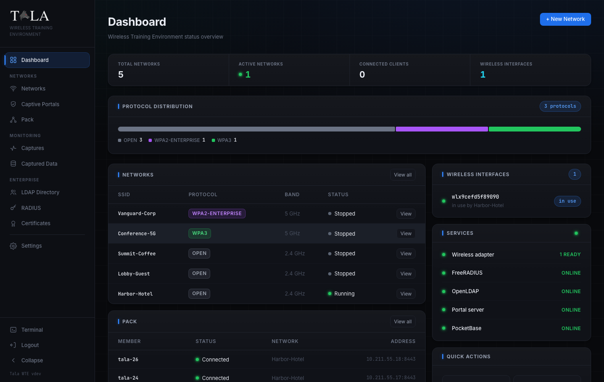
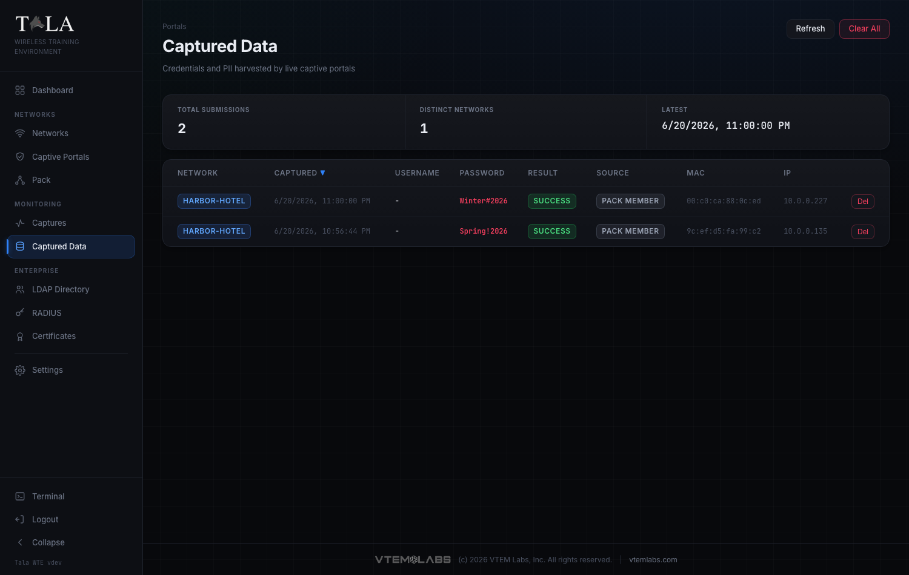

The shortest path from a fresh install to seeing captured data: open the console, create your admin, stand up an Open network with a captive portal, connect a device, and watch what it submits land in Captured Data.

This assumes Tala WTE is already installed (see [[Installation]]) on a host that meets the [[System-Requirements]] and has a Wi-Fi adapter that can host an AP.

## 1. Open the console and finish setup

Browse to `https://<host>:8443/`. The certificate is self-signed, so accept the browser warning.

On a fresh install you get a setup wizard. Enter an admin email, a password (at least 10 characters), acknowledge the license, and create the account.

After setup, the screen becomes the normal sign-in and you land on the dashboard.

## 2. Create an Open network with a captive portal

Go to Networks and click **+ New Network**. Fill in the form:

- Network Profile: give it an SSID (for example `Cafe-Guest`) and set Security Protocol to **Open (No Auth)**. Choosing Open reveals the Captive Portal Sandbox option.
- Captive Portal Sandbox: enable it and pick a Portal Module from the gallery (for example a coffee-shop email-capture or a hotel login page). A live preview appears. If you picked a validating portal (hotel, login, voucher, membership), leave the credential set on its default; one is auto-generated, or choose **No set - capture only** to record entries without validating.
- Hardware: pick a Frequency Band and Channel, and the Wireless Interface that will broadcast. Bands the adapter cannot host as an AP are disabled automatically.
- Topology: the defaults are fine to start (Internet Passthrough on, subnet `10.0.0.0/24`).

Save the network. See [[Networks]] for the full breakdown of every option and [[Captive-Portals]] for the portal library, auth types, and credential sets.

## 3. Start it

Click **Start** on the network's row. An Open network comes up immediately. If the adapter you saved with is gone, Tala WTE claims a free one automatically (and falls back to a band it supports). The status dot turns to running.

Open the network's **Details** page to see live status, connected clients (MAC, IP, signal), and a streaming log.

## 4. Connect a device

On a phone or laptop, join the SSID you created. Because there is a captive portal, the device is intercepted and shown the splash page before it can reach the internet. Enter something into the portal form and submit.

No spare device? Use a Tala WTE client instead: export the network's client config from its Details page (**Export client config**), import it on a client-mode box, and connect, or drive it from [[The-Pack]]. The pack member fills the portal automatically.

## 5. See the captured data

Open Captured Data. Every value submitted to the portal lands here in a table of Network, Captured (timestamp), Username, Password, Result, Source, MAC, and IP. The Source tag reads `target` for a real device or `pack member` for simulated traffic.

That is the core loop. From here:

- Add a packet capture: go to Packet Captures, start a Network-layer capture on the running network, and read the Analysis tab for protocol mix, top talkers, and any cleartext credentials.
- Try a WPA2-Personal network for handshake-capture labs, or a WPA-Enterprise network (use **Auto-provision & Start** to bootstrap the CA, RADIUS, and LDAP in one click).
- Keep the network alive with generated traffic via a client or [[The-Pack]].
