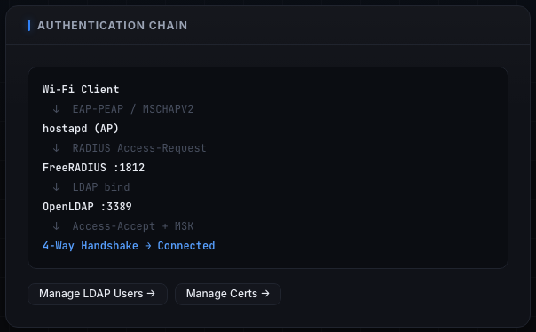

# RADIUS / 802.1X

FreeRADIUS is the gatekeeper for WPA2-Enterprise and WPA3-Enterprise (802.1X) networks. When a Wi-Fi client joins one of those networks, the access point does not check the password itself. Instead it forwards the login to the RADIUS server, and RADIUS checks the user against the embedded LDAP directory. Only on an Access-Accept does the access point let the client finish connecting.

The RADIUS page is where you choose how that handshake works: which EAP method the server offers, what inner authentication it expects, and the shared secret between the access point and RADIUS. It also draws the full authentication chain so you can see exactly where a credential travels.

When to use this page: most of the time you do not. For a standard enterprise lab the defaults (EAP-PEAP with an MSCHAPv2 inner) are correct, and the Auto-provision & Start gate on an enterprise network sets everything up for you end to end (see [[Networks]]). Come here when you want to change the EAP method (for example to teach EAP-TLS client certificates), set a specific known shared secret, or simply show students the moving parts.

This page ties together the other two pieces of the enterprise stack: the [[LDAP-Directory]] (who the users are) and [[Certificates]] (the server certificate the EAP tunnel presents).

---

## Step 1: Open the RADIUS page

In the sidebar, under the ENTERPRISE group, click RADIUS.

The header shows the title RADIUS and the subtitle "FreeRADIUS 3.x - 802.1X enterprise authentication". On the right are a Guide button (opens the in-app guide for this page) and a status badge that reads FreeRADIUS running (green), FreeRADIUS stopped (red), or FreeRADIUS unknown (neutral) depending on whether the service is up.


If the badge reads stopped or unknown, that is usually fine until you actually start an enterprise network. Auto-provision & Start (and saving on this page) will start or restart the service as needed.

---

## Step 2: Read the stat strip (ports and backend)

The strip at the top of the page shows three fixed facts about the running setup. These are read-only; they tell you where everything lives.

- RADIUS Port: 1812 (labeled Authentication). This is the standard 802.1X authentication port the access point sends Access-Requests to.
- Accounting Port: 1813 (labeled Accounting). The standard RADIUS accounting port.
- LDAP Backend: 127.0.0.1:3389 (labeled OpenLDAP (slapd)). RADIUS validates every user against this embedded directory. See [[LDAP-Directory]].

> SCREENSHOT NEEDED: A tight crop of just the stat strip on the RADIUS page showing the three cells RADIUS Port 1812 / Accounting Port 1813 / LDAP Backend 127.0.0.1:3389.

You do not configure these here. They are shown so you know which ports to point an external supplicant or test tool at, and so you can confirm the LDAP backend RADIUS will bind against.

---

## Step 3: Choose the Default EAP Type

The EAP Configuration panel on the left holds the three controls you can actually change. Start with the Default EAP Type dropdown.


This dropdown sets the outer EAP method FreeRADIUS offers to clients. Selecting it and saving reconfigures the running server: Tala WTE rewrites `default_eap_type` in the FreeRADIUS eap module and restarts the service. The same value is applied automatically during Auto-provision & Start on an enterprise network.

The three options:

- EAP-PEAP (Recommended): the username and password travel inside a TLS tunnel that the server protects with its certificate. This is the common enterprise setup and the right default for a "corporate Wi-Fi login" lesson. The client only needs a username and password from the directory; it does not need its own certificate. Pick this for almost every enterprise lab.
- EAP-TLS (Certificate Auth): certificate-based, with no password at all. Each user authenticates with a client certificate you issue on the [[Certificates]] page. Pick this only when the lesson is specifically about client-certificate authentication, because it requires issuing a client cert per user first. If you select this without having issued client certs, logins will fail.
- EAP-TTLS: another tunneled method, similar to PEAP. Like PEAP it carries an inner authentication, and it is the method that allows a PAP inner exchange. Pick this when you specifically want to demonstrate TTLS, or when you need the PAP inner described in the next step.

Judgment: default to EAP-PEAP. Switch to EAP-TLS only for a client-certificate lesson (and provision the client certs first). Switch to EAP-TTLS only when the exercise is about TTLS itself or about a PAP inner.

---

## Step 4: Choose the Inner Authentication

The Inner Authentication dropdown sets the method used inside a tunneled EAP type (PEAP or TTLS). It has no effect on EAP-TLS, which uses a client certificate rather than an inner password exchange.

The two options:

- MSCHAPv2: the default, and what PEAP uses. Use this for the standard enterprise lab. The server validates the MSCHAPv2 exchange against the directory.
- PAP: a plaintext-inside-the-tunnel inner, available with TTLS. The password is protected only by the outer TLS tunnel, not by a challenge-response. Use it only when the lesson specifically calls for a PAP inner (for example, to show a supplicant configured for TTLS/PAP).

Either inner method is validated against the embedded LDAP directory, so the user you authenticate with must exist there first.

> SCREENSHOT NEEDED: The Inner Authentication dropdown on the RADIUS page expanded to show both options, MSCHAPv2 and PAP.

Judgment: leave MSCHAPv2 for any PEAP lab. Choose PAP only alongside EAP-TTLS when you intend to demonstrate the PAP inner.

---

## Step 5: Set (or leave blank) the Shared Secret

The Shared Secret field is the secret shared between the access point and the RADIUS server. Its placeholder reads "Leave blank to use generated secret".

- Leave it blank for the built-in, self-contained setup. Tala WTE creates and persists a random 32-character secret on first use (stored on the box) and the access point and RADIUS both use it automatically. This is what you want in almost every case.
- Enter a value only when you need a specific, known secret, for example to match an external supplicant or test tool you are pointing at port 1812, or to demonstrate a deliberately weak secret. When you set a value and save, Tala WTE writes it into the FreeRADIUS `clients.conf` and reloads the service.

The field is masked (shown as dots) because it is a credential. Leaving it blank does not clear an existing generated secret; it simply means "keep using the generated one".

> SCREENSHOT NEEDED: The Shared Secret field on the RADIUS page with its placeholder text "Leave blank to use generated secret" visible.

---

## Step 6: Save the configuration

Click Save Configuration. While it is applying, the button shows Saving... and is disabled; on success a toast confirms "RADIUS configuration saved".

Saving does real work on the server, not just a UI update. It:

- persists your EAP Type, Inner Authentication, and Shared Secret choices,
- rewrites `default_eap_type` in the FreeRADIUS eap module to match your Default EAP Type,
- writes the shared secret into `clients.conf` if you entered one,
- and restarts (or reloads) FreeRADIUS so the changes take effect.

Because the service restarts, briefly expect the status badge to settle back to FreeRADIUS running. If saving fails, a red toast reports the error; re-check your selections and try again.

> SCREENSHOT NEEDED: The RADIUS page immediately after a successful save, showing the green "RADIUS configuration saved" toast.

---

## Step 7: Understand the certificate chain RADIUS presents

For any tunneled method (EAP-PEAP and EAP-TTLS), the server protects the inner exchange with a TLS tunnel, and that tunnel is secured by the FreeRADIUS server certificate. For EAP-TLS, both sides present certificates.

These certificates come from the [[Certificates]] page and are wired in for you during Auto-provision & Start:

- A Certificate Authority (CA) is created if one does not already exist; it signs the server certificate.
- A FreeRADIUS server certificate is issued by that CA. This is the certificate clients see when they validate the EAP tunnel.
- The CA certificate plus the server certificate and key are installed into the FreeRADIUS certs directory, and the eap module is pointed at them (replacing the distribution's default self-signed paths).
- For EAP-TLS, you additionally issue a client certificate per user on the [[Certificates]] page; clients present these to authenticate.

So the chain is: the box's CA signs the server cert; the server cert secures the EAP tunnel; and (for EAP-TLS) per-user client certs, signed by the same CA, identify each user. Manage all of these on the [[Certificates]] page.

> SCREENSHOT NEEDED: The Certificates page showing the CA and the issued FreeRADIUS server certificate, to illustrate the chain RADIUS presents.

---

## Step 8: Trace the full authentication chain

The Authentication Chain panel on the right draws the complete path a login travels, so students can see exactly where their credential goes. The diagram updates to reflect the EAP Type and Inner Authentication you have selected.



Reading it top to bottom:

```
Wi-Fi Client
   v  EAP-PEAP / MSCHAPV2   (or EAP-TLS with a client certificate)
hostapd (AP)
   v  RADIUS Access-Request
FreeRADIUS :1812
   v  LDAP bind
OpenLDAP :3389
   v  Access-Accept + MSK
4-Way Handshake -> Connected
```

In words: the Wi-Fi client speaks EAP to hostapd (the access point). hostapd forwards a RADIUS Access-Request to FreeRADIUS on port 1812. FreeRADIUS binds the user against the LDAP directory on port 3389. On success it returns Access-Accept along with the keying material (MSK). The 4-Way Handshake then completes and the client is Connected.

The first arrow reflects your choices: with a tunneled method it shows the EAP type and the inner (for example EAP-PEAP / MSCHAPV2); with EAP-TLS it shows that a client certificate is used instead of an inner password.

---

## Step 9: Jump to the directory and certificates

At the bottom of the Authentication Chain panel are two shortcuts to the other two pieces of the enterprise stack:

- Manage LDAP Users -> opens the LDAP directory page, where you create and test the user accounts RADIUS validates against. See [[LDAP-Directory]].
- Manage Certs -> opens the Certificates page, where the CA, the server certificate, and any client certificates live. See [[Certificates]].

> SCREENSHOT NEEDED: A crop of the two buttons "Manage LDAP Users ->" and "Manage Certs ->" at the bottom of the Authentication Chain panel.

A login can only succeed if all three are in place: a valid user in LDAP, a valid server certificate for the tunnel, and (for EAP-TLS) a client certificate. Use these shortcuts to move between them while building a lab.

---

## Step 10: Let Auto-provision & Start do it for you

For a basic enterprise lab you rarely need to touch this page at all. When you Start an enterprise network, the preflight gate offers Auto-provision & Start (see [[Networks]]), which sets RADIUS up end to end:

- ensures the CA and the FreeRADIUS server certificate exist,
- provisions the LDAP directory if it is empty,
- wires the FreeRADIUS eap and ldap modules (pointing ldap at 127.0.0.1:3389),
- installs the CA and server cert into the FreeRADIUS certs directory and rewrites the eap cert paths,
- applies your saved EAP type (defaulting to PEAP rather than the distribution default),
- starts OpenLDAP if needed,
- and validates the config and restarts FreeRADIUS.

So the only reasons to visit this page directly are to change the EAP method (for example to teach EAP-TLS) or to set a specific shared secret. Everything else happens automatically.

---

## Tips

- Leave the defaults (EAP-PEAP with an MSCHAPv2 inner) and let Auto-provision & Start do the setup for a standard enterprise lab.
- Use EAP-TLS only when the lesson is about client certificates; issue a client cert per user on the [[Certificates]] page first, or logins will fail.
- Choose the PAP inner only alongside EAP-TTLS, and only when the exercise specifically calls for it.
- Leave the Shared Secret blank to use the generated 32-character secret; set a value only to match an external supplicant or test tool.
- Confirm a directory credential works on the LDAP Test Auth tab before relying on it for an enterprise login. See [[LDAP-Directory]].
- After any change, watch the header badge settle back to FreeRADIUS running to confirm the restart succeeded.
