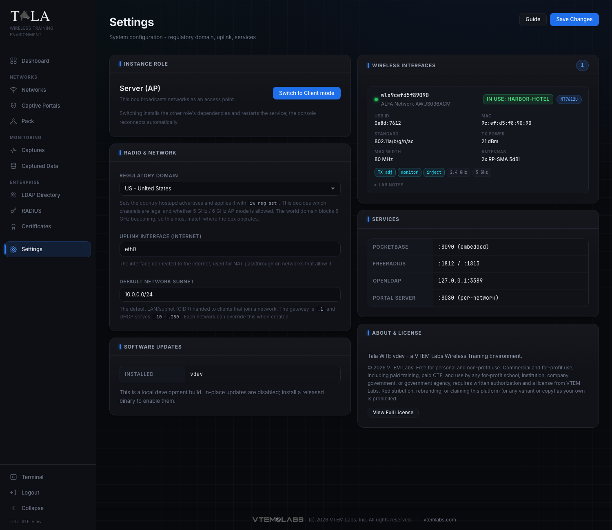
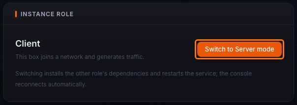
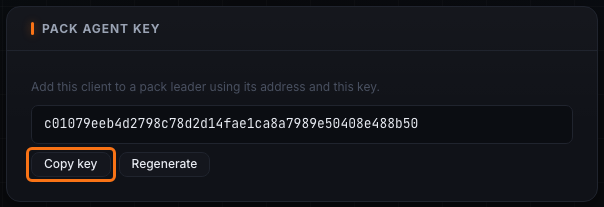
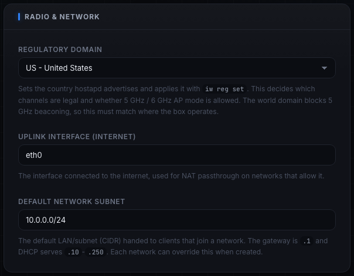

**Settings** is the box-level configuration: whether this instance is an access point or a client, the regulatory domain that governs its radio, the internet uplink, the default subnet, the pack agent key (in Client mode), the wireless adapters it sees, its services, and software updates. Most fields commit with **Save Changes** in the header; the role swap, agent key, heal, and update actions each apply on their own button.

## Instance Role

The **Instance Role** panel shows the current role and a one-button swap:

- **Server (AP)** - this box broadcasts networks as an access point.
- **Client** - this box joins a network and generates traffic (see [[Client-Mode]]).

The button reads **Switch to Client mode** or **Switch to Server mode** depending on the current role. Switching confirms, installs the other role's dependencies, and restarts the service; the console disconnects and reloads automatically when the box is back, which can take a minute. Use Server for a box that hosts Wi-Fi networks, Client for a box that behaves like a user device.

## Pack Agent Key (Client mode only)

This panel appears only in Client mode. It shows the **agent key** a pack leader needs to drive this client. **Copy key** puts it on the clipboard to paste into the leader's Add Member form; **Regenerate** rotates it (any leader on the old key loses access until you re-add the client). See [[The-Pack]] for how the leader uses it.

## Radio and Network

The **Radio & Network** panel holds three settings, applied together with **Save Changes**.

- **Regulatory Domain** - a dropdown of countries. The selection sets the country hostapd advertises and is applied with `iw reg set`. This decides which channels are legal and whether 5 GHz / 6 GHz AP mode is allowed. Set it to where the box actually operates: the world domain blocks 5 GHz beaconing, so a wrong value can stop 5 GHz networks from coming up. A region already stored on the box but not in the built-in list is folded into the dropdown so it still shows.
- **Uplink Interface (Internet)** - the interface used for NAT passthrough on networks that allow it. A configured value that no longer exists is ignored and the real uplink is auto-detected, so swapping a NIC will not silently break client internet.
- **Default Network Subnet** - the CIDR new networks hand out by default. The gateway is `.1` and DHCP serves `.10` to `.250`. Each network can override this when it is created.

## Wireless Interfaces

The **Wireless Interfaces** panel lists every detected adapter as a hardware card, free radios first then ones already in use by a running network (the in-use ones come from a cache the backend takes at start time, since their radio sits inside the network's namespace and is invisible to a normal scan).

Adapters whose chipset is not supported appear in an **unsupported** list with the reason and a **Heal** button. **Heal** runs a USB-reset recovery on a wedged or stuck adapter and refreshes the list, try it before assuming the hardware is dead. See [[Troubleshooting]] for wedged-adapter recovery.

## Services

The **Services** panel shows the running internal services and their ports for reference: **PocketBase** (`:8090`, embedded), **FreeRADIUS** (`:1812` / `:1813`), **OpenLDAP** (`127.0.0.1:3389`), and **Portal Server** (`:8080`, per-network).

## Software Updates

The **Software Updates** panel shows the **Installed** version and, when a release check succeeds, the **Latest release** version. When a newer release is out it shows an **Update available** badge, a one-click **Update to vX.Y.Z** button, and a **Release notes** link to the release page. Updating downloads the verified binary, replaces the running service, and restarts it; the console polls until the new build answers and reloads itself. Development builds disable in-place updates and say so. If the release check fails the panel notes it could not check. See [[Updating]] for the full update flow, including pushing updates across [[The-Pack]].

## About and License

The **About & License** panel shows the Tala WTE version and the VTEM Labs copyright and license summary, with a **View Full License** button that opens the complete license text.

## Tips

- Set the **Regulatory Domain** first, it is the usual reason a 5 GHz network will not broadcast.
- If client internet breaks after swapping NICs you no longer need to fix the uplink by hand, it auto-detects.
- Use **Heal** on an unsupported or wedged adapter before assuming the hardware is dead.

## Related pages

- [[Client-Mode]] - what the box becomes after a role swap to Client
- [[The-Pack]] - the leader/member feature the agent key serves
- [[Updating]] - in-app and pack-wide updates
- [[Troubleshooting]] - wedged adapters, healing, and recovery
