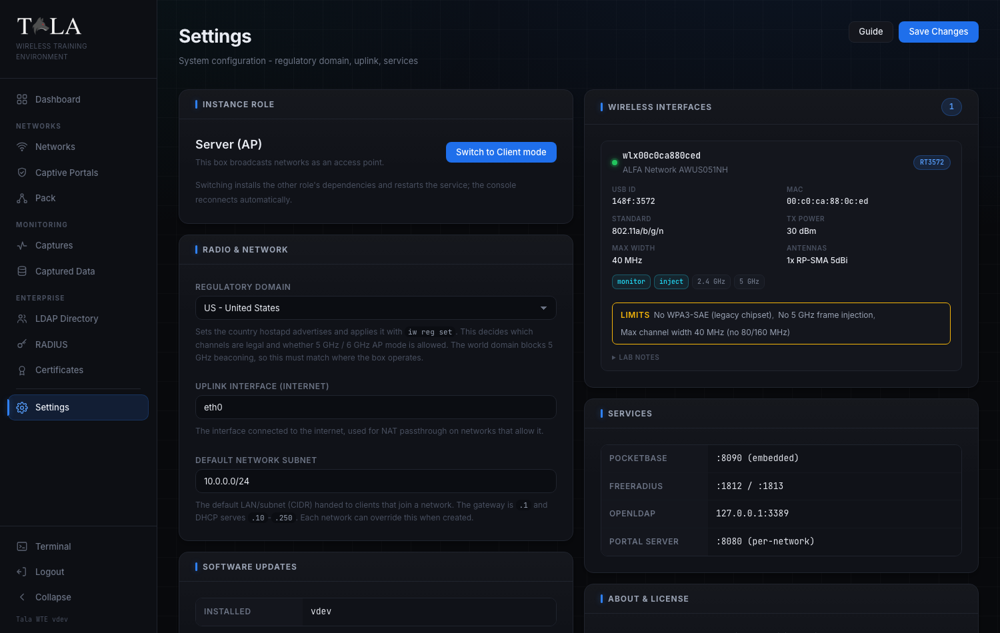

# Settings

**Settings** is the box-level control panel for a single Tala WTE instance. From here you control:

- What the box *is*: an access point that broadcasts networks (**Server (AP)**), or a client that joins one and generates traffic (**Client**).
- The **Regulatory Domain** that governs its radio.
- The internet **Uplink Interface** it uses for NAT passthrough.
- The **Default Network Subnet** new networks hand out.
- The wireless adapters it can see, the internal services it runs, and its software version.
- In Client mode only, the **Pack Agent Key** a pack leader needs to drive this box remotely.

**When to use it:**

- Once when you first stand up a box: set the regulatory domain and confirm your adapters are seen.
- Again whenever you change roles, swap a NIC, add hardware, or want to update.
- Day-to-day network work happens on the [[Networks]] page, not here.

**The one rule that trips people up:** most fields on this page commit only when you press **Save Changes** in the header. The role swap, the agent-key actions, the **Heal** button, and the software update each run on their own button the instant you click them. Step 1 spells out which is which.

You reach Settings from **Settings** at the bottom of the left sidebar.

**Page layout:** two columns.

- **Left column:** **Instance Role**, **Radio & Network**, **Software Updates** (plus **Pack Agent Key** when the box is in Client mode).
- **Right column:** **Wireless Interfaces**, **Services**, **About & License**.
- **Header:** the page title, a **Guide** button, and the **Save Changes** button.

---

## Step 1: Understand Save Changes versus the per-action buttons

Before you touch anything, know how the page commits, because the two behave differently.

**Save Changes (header)** writes the three **Radio & Network** fields together as one save: the **Regulatory Domain**, the **Uplink Interface**, and the **Default Network Subnet**. Nothing in that panel takes effect until you click it. While it is writing, the button reads **Saving...**; on success a green **Saved** badge appears next to it for a few seconds and a "Settings saved" toast pops. If you edit those fields and navigate away without saving, your edits are lost.

**Per-action buttons** each apply on their own, immediately, independent of **Save Changes**:

- **Switch to Client mode / Switch to Server mode** (Instance Role) - restarts the box into the other role.
- **Copy key** and **Regenerate** (Pack Agent Key, Client mode only).
- **Heal** (an unsupported/wedged adapter row under Wireless Interfaces).
- **Update to vX.Y.Z** (Software Updates).

> SCREENSHOT NEEDED: Close-up of the Settings page header showing the Guide button and the Save Changes button, ideally with the green "Saved" badge visible next to them just after a successful save.

The **Guide** button opens the in-app help for this page in a modal; it is the same content as this guide and changes nothing.

---

## Step 2: Set the Instance Role (Server vs Client)

The **Instance Role** panel is the most consequential control on the page. It tells the box whether to behave as an access point or as a client device, and the single button swaps between the two.

The large line is the current role and the grey line beneath it explains what that role does:

- **Server (AP)** - "This box broadcasts networks as an access point." Choose this for the box that hosts your Wi-Fi networks: the one that runs the captive portals, RADIUS, and the SSIDs your targets connect to. This is the normal role and what the [[Networks]] page assumes.
- **Client** - "This box joins a network and generates traffic." Choose this for a box that should behave like an end-user device: associating to an SSID and producing realistic client traffic. A Client box is what a pack leader drives. See [[Client-Mode]] for what the box becomes after the swap.

The button text follows the current role: in Server mode it reads **Switch to Client mode**; in Client mode it reads **Switch to Server mode** (as pictured above).

To swap roles:

1. Click the swap button. A confirmation dialog appears, for example: "Switch this instance to Client mode? The service installs Client dependencies and restarts. The console disconnects and reloads when it is back; this can take a minute."
2. Confirm. The button changes to **Switching...** and a toast confirms the switch has started.
3. The service installs the other role's dependencies and restarts. The console disconnects, then the page polls the box and, once it reports the new role, reloads you back to the home page automatically. This can take up to a minute or two; if it has not switched within four minutes the page tells you to reload manually.

**Judgment:** do not swap roles casually. The restart tears down anything currently running and pulls in a different dependency set. Pick the role that matches the box's job and leave it there. Use one box (or several) as Servers to host networks, and dedicate separate boxes as Clients when you want generated client traffic.

---

## Step 3 (Client mode only): Copy or rotate the Pack Agent Key

The **Pack Agent Key** panel appears *only* when the box is in Client mode. It sits directly under Instance Role. The key is the control token a pack leader uses to authenticate to this client and drive it remotely.

The panel reads "Add this client to a pack leader using its address and this key." Below that is the key itself in a monospace box (it shows "generating..." for a moment on first load while it is fetched), followed by two buttons:

- **Copy key** - copies the key to your clipboard and shows an "Agent key copied" toast. Paste it, together with this box's address, into the leader's Add Member form. See [[The-Pack]] for the leader side.
- **Regenerate** - rotates the key. It first warns: "Regenerate the agent key? Any pack leader using the old key loses access until you re-add this client." Confirm to get a fresh key and an "Agent key regenerated" toast.

**Judgment:** regenerate only when you need to revoke a leader's access (for example the box changed hands, or you suspect the key leaked). Regenerating immediately breaks any leader still holding the old key until you re-add the client there with the new one, so coordinate the rotation with the re-add.

> SCREENSHOT NEEDED: Full Settings page while in Client mode, so the reader sees the Pack Agent Key panel in position directly beneath the Instance Role panel in the left column.

---

## Step 4: Configure Radio & Network

The **Radio & Network** panel holds the three fields that **Save Changes** writes together. Edit any of them, then click **Save Changes** in the header to apply all three at once.

**Regulatory Domain** is a dropdown of countries shown as `code - name` (for example `US - United States`). The selection sets the country `hostapd` advertises and applies it with `iw reg set`. This is what decides which channels are legal and whether 5 GHz / 6 GHz AP mode is allowed at all. The built-in list covers the common regions (US, CA, GB, IE, DE, FR, NL, ES, IT, SE, CH, JP, AU, NZ, BR, ZA, AE). If the box already has a region stored that is not in that list, it is folded into the dropdown so it still shows and you do not lose it.

> **Set this correctly first.** The world regulatory domain blocks 5 GHz beaconing, so a wrong or default value is the single most common reason a 5 GHz network refuses to broadcast. Set it to the country where the box actually operates before you build any 5 GHz network on the [[Networks]] page.

**Uplink Interface (Internet)** is a free-text field (placeholder "e.g. eth0, wlan1") naming the interface connected to the internet. It is used for NAT passthrough on networks that allow it, so client devices on a network can reach the internet. If the value you save no longer exists (you swapped a NIC, say), it is ignored and the real uplink is auto-detected, so a hardware change will not silently kill client internet. Set it explicitly only when the box has multiple candidate uplinks and you need to pin one.

**Default Network Subnet** is the CIDR new networks hand out by default (placeholder `10.0.0.0/24`). The gateway is `.1` and DHCP serves the `.10` through `.250` range. Each network can override this when it is created on the [[Networks]] page, so this is just the starting default. Change it only if `10.0.0.0/24` collides with your real lab/office network or you want a larger pool.

When the fields are right, click **Save Changes**. Watch for the **Saved** badge and the success toast.

---

## Step 5: Review your Wireless Interfaces

The **Wireless Interfaces** panel in the right column lists every adapter the box can see, each rendered as a hardware card. A count pill next to the panel title shows how many adapters are listed. Free radios are listed first, then any already claimed by a running network.

(In the full-page screenshot for this step, note the adapter card whose chipset reports usage limits, shown in a yellow **Limits** band.)

Each hardware card shows, when the chipset reports it:

- A green status dot, the **interface name** (for example `wlan0`), and the **model** (manufacturer plus device model, or the driver name if those are unknown).
- An **in use: <SSID>** green badge when the adapter is currently claimed by a running network. Adapters in use live inside that network's namespace and are invisible to a normal scan, so the backend serves the rich hardware detail it cached at start time; the card stays fully populated even while the radio is busy.
- A **chipset** chip (for example the radio's chipset family).
- A spec grid: **USB ID** (or "system" for a built-in radio), **MAC**, **Standard** (the 802.11 standard), **TX Power** (max in dBm, or "Driver-managed" when the driver controls it), **Max Width** (channel width in MHz), and **Antennas** (count, connector, and gain).
- Capability tags: **TX adj** (TX power is adjustable), **DFS** (supports DFS channels), **monitor** (monitor-mode capable), **inject** (injection capable), plus a tag for each supported band (for example `2.4GHz`, `5GHz`).
- A yellow **Limits** band when the chipset has known usage limits, listing each limit. Read these before you plan a network: a limit here explains why an otherwise-capable adapter will not do what you expect.
- A collapsible **Lab notes** section when the hardware has notes worth keeping; click it to expand.

If an adapter's chipset is not supported, it appears instead in an **unsupported** list with its name, the **reason**, and a **Heal** button:

1. Click **Heal**. The button reads **Healing...** while it runs.
2. **Heal** performs a USB-reset recovery on the wedged or stuck adapter (unbind/rebind at the USB level), then refreshes the list. On success you get an "Adapter recovered" toast; on failure a "Heal failed" toast.

**Judgment:** always try **Heal** before assuming a wedged or unsupported-looking adapter is dead hardware. Certain USB Wi-Fi chipsets get stuck in a bad state and a USB reset brings them back. See [[Troubleshooting]] for the deeper wedged-adapter recovery story.

If the box sees no adapters at all and none are unsupported, the panel shows "No wireless interfaces detected."

> SCREENSHOT NEEDED: Close-up of a single unsupported adapter row under Wireless Interfaces, showing the device name, the reason text, and the Heal button (ideally one frame mid-action reading "Healing...").

---

## Step 6: Know your internal Services

The **Services** panel is reference-only; it lists the internal services this box runs and the ports they listen on. There is nothing to configure here.

> SCREENSHOT NEEDED: The Services panel in the right column showing the PocketBase, FreeRADIUS, OpenLDAP, and Portal Server rows with their listen ports.

| Service | Listens on |
|---|---|
| **PocketBase** | `:8090` (embedded) |
| **FreeRADIUS** | `:1812` / `:1813` |
| **OpenLDAP** | `127.0.0.1:3389` |
| **Portal Server** | `:8080` (per-network) |

Use this when you are debugging connectivity or confirming what should be listening. FreeRADIUS backs enterprise/802.1X authentication (see [[RADIUS-802.1X]]), OpenLDAP backs the directory (see [[LDAP-Directory]]), and the Portal Server serves captive portals per network (see [[Captive-Portals]]).

---

## Step 7: Check for and apply Software Updates

The **Software Updates** panel shows the version this box is running and, when the release check succeeds, the latest release available. The update applies on its own button, not through **Save Changes**.

> SCREENSHOT NEEDED: The Software Updates panel showing an "Update available" badge in the panel header, the Installed and Latest release rows, the update note, and both the "Update to vX.Y.Z" button and the "Release notes" link.

The panel always shows an **Installed** row with the running version. When the check succeeds and a newer build exists, it also shows a **Latest release** row, an **Update available** badge in the panel header, and an explanatory note. Depending on state you will see one of:

- **Update available** - a note that the new version is available, an **Update to vX.Y.Z** button, and (when the release publishes one) a **Release notes** link that opens the release page in a new tab. Updating downloads the verified binary, replaces the running service, and restarts it.
- **Up to date** - "You are running the latest version."
- **Development build** - "This is a local development build. In-place updates are disabled; install a released binary to enable them." In-app updates are intentionally off for dev builds.
- **Check failed** - "Could not check for updates (...)." The release check hits GitHub and is loaded separately from the rest of the page, so a failure here never blocks the other panels.
- **Checking** - "Checking for updates..." while the release check is still in flight.

To update:

1. Click **Update to vX.Y.Z**. A confirmation dialog warns that the service will restart and the console will briefly disconnect.
2. Confirm. The note changes to "Installing vX.Y.Z. The service is restarting and the console will reconnect automatically," and a success toast appears.
3. The backend restarts the service a couple of seconds after responding. The page polls the version endpoint until the new build answers, then reloads itself so you are served the new frontend. If the service has not returned within two minutes, the page tells you to reload manually.

**Judgment:** updating is safe and self-restarting, but it does bounce the service, so do not run it in the middle of a live engagement; pick a quiet moment. For pushing an update across a whole pack rather than this single box, see [[Updating]] and [[The-Pack]].

---

## Step 8: View the About & License panel

The **About & License** panel sits at the bottom of the right column. Nothing here is configurable; it is the authoritative statement of how the platform may be used.

> SCREENSHOT NEEDED: The About & License panel showing the "Tala WTE v... a VTEM Labs Wireless Training Environment" line, the copyright/license summary, and the View Full License button.

It shows:

- **The version line:** "Tala WTE v<version> - a VTEM Labs Wireless Training Environment."
- **The copyright and license summary:** the VTEM Labs copyright notice and a short statement of permitted use.
- **View Full License:** click it to open the complete license text in a modal.

---

## Quick tips

- Set the **Regulatory Domain** first. It is the usual reason a 5 GHz network will not broadcast.
- Remember the split: **Radio & Network** needs **Save Changes**; role swap, agent key, **Heal**, and update each apply on their own button.
- After swapping a NIC you do not need to fix the **Uplink Interface** by hand; an invalid value auto-detects the real uplink.
- Try **Heal** on an unsupported or wedged adapter before assuming the hardware is dead.
- Do not perform a role swap or a software update during a live engagement; both restart the service.

## Related pages

- [[Networks]] - where you build and broadcast the networks Settings configures the radio for
- [[Client-Mode]] - what the box becomes after a role swap to Client
- [[The-Pack]] - the leader/member feature the agent key serves
- [[Updating]] - in-app and pack-wide update flow
- [[Certificates]] - certificate management used by RADIUS/EAP networks
- [[Troubleshooting]] - wedged adapters, healing, and recovery
