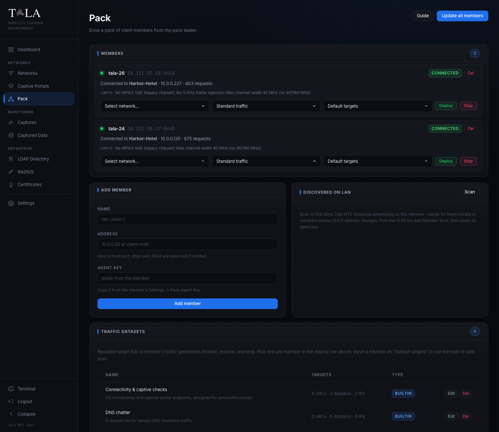
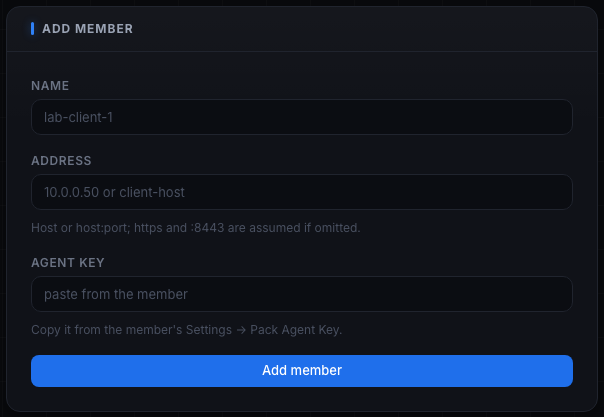
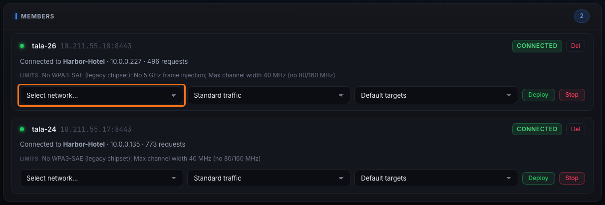

The **Pack** turns one Tala WTE box, a Server (AP) acting as the **pack leader**, into the driver of many client boxes, the **members**. From one console you push a network config to each member, start the traffic you want, get past captive portals, and watch live status, all without logging into any member. It is how you stand up a believable room full of clients on a training network from a single screen. The Pack runs the same traffic engine as the [[Traffic-Console]], just driven centrally instead of box by box.

The leader reaches each member over the member's self-signed HTTPS, authenticating with an agent key (no member login), and pins the member's certificate on first contact so a later certificate swap is rejected.

## Agent keys

Each member authenticates the leader with an **agent key** instead of a login. On the member, open [[Settings]] -> **Pack Agent Key** and **Copy key**; the leader presents that key on every call. The key is created automatically on first use, so it is always there to copy. **Regenerate** on the member rotates it and instantly cuts off any leader still holding the old one (re-add the member with the new key to restore access).

## Registering a member

Two ways, both in the lower panels of the Pack page.

**Add Member** form:

- **Name** - a label like `lab-client-1`.
- **Address** - the member's `host` or `host:port`. The scheme defaults to `https` and the port to `8443` when omitted.
- **Agent key** - pasted from the member's Settings -> Pack Agent Key.

All three are required. **Add member** registers it and the member appears in the Members list.

**Discovered on LAN** panel: click **Scan** and the leader browses the LAN over mDNS for other Tala WTE instances, then lists each with its role and version. This is handy for fresh installs or members whose DHCP address has changed, you do not need to know the address up front. Click **Use** on a result to fill the Add Member form (name and address), then paste the member's agent key and **Add member**. The leader filters itself out of the scan.

## Deploying

In the Members list, each member's deploy row has three selectors and the action buttons:

1. **Network** - which of the leader's networks to push.
2. **Profile** - the traffic profile (below).
3. **Traffic dataset** - where the traffic goes; leave on **Default targets** or pick a saved dataset.

**Deploy** pushes the network's client config to the member, waits in the background for it to associate, then starts the profile's traffic (and reconnect cycling if the profile includes it). Per member you also get **Stop** (disconnect and stop traffic, clearing the assignment) and **Del** (remove the member).

### The three profiles, and when to use each

- **Standard traffic** - web, DNS, and ping over local plus internet. The general-purpose choice to keep a network alive and feed a capture. Pick this for most labs.
- **Full traffic** - every generator, including **credential logins** and **responder bait**, over local plus internet. Pick this only when a capture (or a Responder/Inveigh-style listener) is running to catch the cleartext logins and poisoning bait, otherwise Standard is plenty and Full is just noise.
- **Handshake capture** - **Standard traffic plus reconnect cycling** (it does not add credential logins or downloads), so the member produces a fresh WPA handshake on a schedule (every 2 minutes with up to 15s jitter). Pair it with a packet capture to mass-produce WPA handshakes.

The chosen **traffic dataset** sets the URL/domain/IP target lists the web, DNS, and ping generators use; a member left on Default targets uses the built-in safe pool.

## The auto-pass of typed captive portals

If the deployed network has a captive portal, **the member passes it automatically**, no per-member setup. The leader draws a valid credential from the network's assigned credential set (one is auto-generated if you did not assign one) and pushes it with the connection config. The member fills the real form, a hotel room plus last name, a voucher, an AD login, whatever the portal's auth type calls for, so the portal grants access and harvests a believable login, tagged **pack member** in Captured Data.

## Member status at a glance

Each member card shows a status badge:

- **checking** (neutral) - before the first status comes back.
- **connected** (green) - associated to a network.
- **idle** (neutral) - reachable but not connected.
- **no adapter** (yellow) - reachable but reports zero wireless adapters.
- **unreachable** (red) - the leader cannot reach the member (wrong address, member down, or agent key rejected).
- **radio wedged** (red) - the member is reachable but its wireless driver stopped responding; it needs the adapter power-cycled or replugged, this is a hardware reset, not a software error. The management view stays up even when a radio wedges, so you always see the real state.

A member that is connected but is not assigned to one of your networks also shows an **In use by another pack leader** note, meaning another leader is driving it. The card also lists the member's capability limits and version, and surfaces its last error when idle.

## Traffic Datasets

The **Traffic Datasets** panel manages the reusable target lists members browse, resolve, and ping, the same datasets the [[Traffic-Console]] uses. It is full CRUD:

- The table lists each dataset with a **Targets** summary (N URLs, N domains, N IPs) and a **Type** badge (built-in or custom).
- **Edit** loads a dataset into the form; **Del** removes it.
- The form takes a **Name**, **Description**, and three textareas (**URLs to browse**, **Domains to resolve**, **IPs to ping**, one per line). **Add dataset** creates a custom one, **Update dataset** saves edits.

Built-in sets cover the common cases (connectivity checks, general browsing, local intranet, DNS chatter); add your own for targets you control. Pick a dataset per member in the deploy row.

## Teardown propagation

Stop or delete a network on the leader and every member assigned to it is automatically disconnected and unassigned, members never chase a network that has gone away.

## Update all members

**Update all members** (top right) pushes the latest release to the whole pack. The leader downloads each needed CPU architecture's verified binary once and pushes the matching build to each member over the agent channel, so a member never needs its own internet access. A member that does not report its architecture or lacks the push endpoint falls back to pulling the release itself. See [[Updating]] for the update mechanics.

## Tips

- The fastest believable lab: register two members, deploy both to an Open network with a captive portal using **Standard traffic**, and watch Captured Data and captures fill on their own.
- A **radio wedged** badge means a hardware reset (power-cycle or replug the adapter), see [[Troubleshooting]].
- Use the **Handshake capture** profile plus a packet capture to mass-produce WPA handshakes.

## Related pages

- [[Client-Mode]] - what a member looks like locally
- [[Traffic-Console]] - the per-box version of the same engine
- [[Settings]] - the Pack Agent Key on each member
- [[Updating]] - how the in-app and pack-wide updates work
