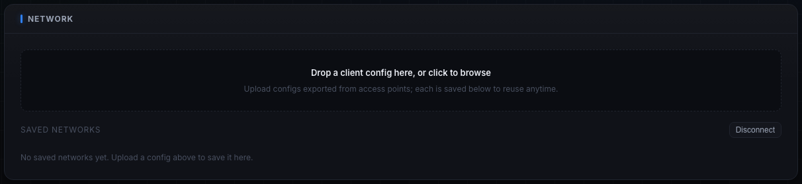
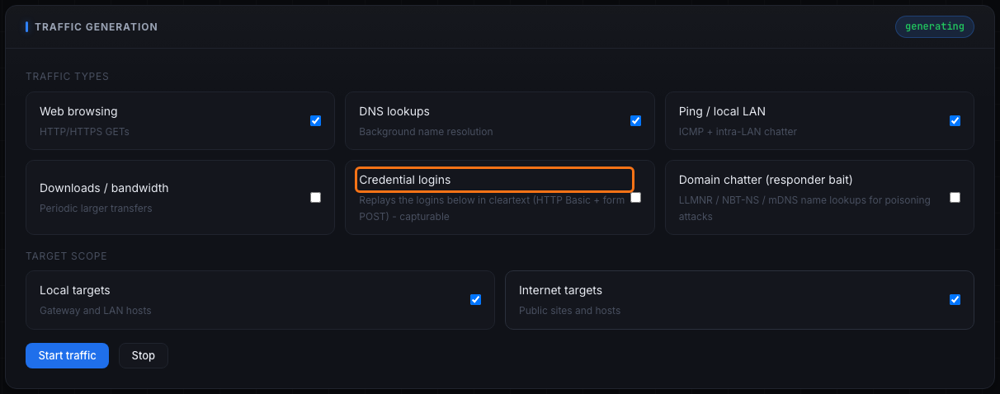
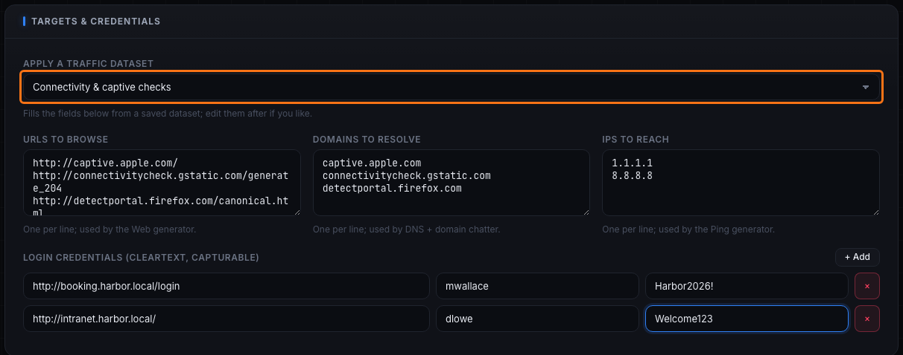
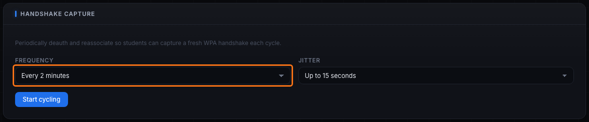
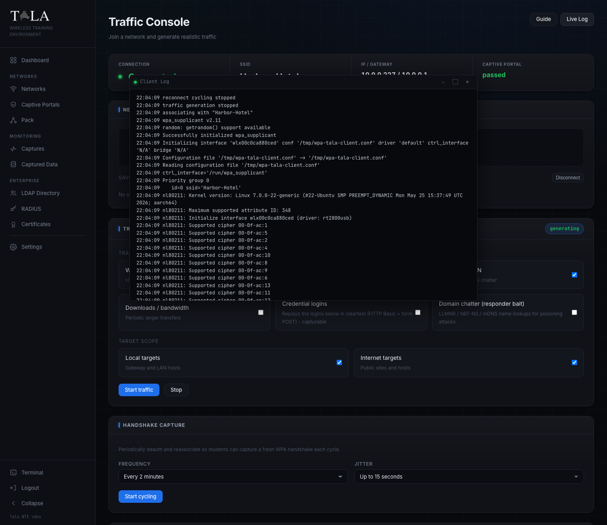

The **Traffic Console** is where a box in [[Client-Mode]] does its work. It makes the client behave like a real device: it joins a saved network, gets past a captive portal, and runs the traffic generators you choose, so a packet capture on the access point records exactly what a live user would send, including cleartext logins to crack. Reach it from the Client Dashboard with **Open traffic console**.

A stat strip at the top mirrors the live state: **Connection** (Connected / Offline), **SSID**, **IP / Gateway**, and **Captive Portal** (`none`, `passed` in green, or `failed` in red).

## Saved networks

On the Server you export a **client config** from a network's detail page (**Export client config**), which is a `.json` profile describing that exact network. In the Traffic Console's **Network** panel, drop that file on the dropzone (or click to browse). The upload is saved to a library so you can switch between networks without re-uploading.

Each saved network shows its SSID and protocol with three actions:

- **Connect** - associates, gets a DHCP lease, and auto-bypasses a captive portal if the config carries one. The row shows **Connected** while it is the active link.
- **Disconnect** - drops the link (the button appears next to "Saved networks" while connected).
- **Del** - removes the saved network from the library.

## Traffic generators

In the **Traffic Generation** panel, tick the generators you want, set the scope, then **Start traffic** (enabled only while connected). There are six generators.

- **Web browsing** - HTTP/HTTPS GETs to your URLs and, with Internet scope on, safe public sites. Use it to keep a network looking alive for any capture.
- **DNS lookups** - background name resolution. Use it alongside web traffic for realistic background noise.
- **Ping / local LAN** - ICMP echo plus intra-LAN chatter. Use it to make the client visible to LAN-host and connectivity captures.
- **Downloads / bandwidth** - periodic larger transfers. Use it for bandwidth and throughput demos where you want bulk on the wire.
- **Credential logins** - replays the logins you list under Targets and Credentials in **cleartext** (HTTP Basic and form POST). This is the one to turn on for capture-and-crack labs, the emitted username/password show up in a packet capture's Analysis tab. Add at least one login below first.
- **Domain chatter (responder bait)** - LLMNR, NBT-NS, and mDNS lookups for names like `wpad`, `fileserver`, and `intranet`, the exact broadcast/multicast bait that Responder-style poisoning attacks feed on. Only worth enabling when a Responder/Inveigh-style listener is running on the wireless side to catch it; on its own it produces noise nothing is listening for.

Quick rule for what to enable: Web/DNS/Ping keep a network looking alive for any capture; Downloads add bulk for bandwidth demos; Credential logins are for capture-and-crack labs; Domain chatter only matters with a poisoning listener present.

### Target scope

Two checkboxes decide where traffic goes:

- **Local targets** - the gateway and LAN hosts. Keep this on to feed captures running on the access point's own network.
- **Internet targets** - public sites and hosts. Turn this on for outbound realism, off for a sealed, local-only exercise.

**Live Stats** lower on the page tracks **Requests**, **Received** (bytes), and **Errors** while traffic runs. **Stop** ends generation while staying connected.

## Targets and credentials

By default the generators hit a built-in safe pool. Point them at hosts you control in the **Targets and Credentials** panel:

- **Apply a traffic dataset** - pick a saved dataset to fill the three target fields in one step. Datasets are the same reusable lists managed on the Pack page (see [[The-Pack]]); after applying you can still edit the fields.
- **URLs to browse** - one per line, fed to the Web generator.
- **Domains to resolve** - one per line, fed to the DNS lookups and domain-chatter generators.
- **IPs to reach** - one per line, fed to the Ping generator.
- **Login credentials** - URL, username, and password rows the client replays. **Add** a row, fill the login target, then enable the **Credential logins** generator. These go out in **cleartext on purpose**, capturing and decrypting them is the whole point of the exercise.

## Handshake capture (reconnect cycling)

The **Handshake Capture** panel runs **reconnect cycling**: the client periodically deauthenticates and reassociates so students can capture a fresh WPA four-way handshake every cycle. Use it at a short interval when you want to mass-produce handshakes against a WPA2/WPA3-Personal network.

- **Frequency** - how often a cycle fires. Presets run from **Every 30 seconds** up to **Every hour**, plus **Custom** (a number with seconds/minutes/hours).
- **Jitter** - a random extra wait added to each cycle so timing is not robotic. Presets from **None** up to **Up to 1 minute**, plus **Custom**.

**Start cycling** begins; the panel header shows the live cycle count. **Update cycling** changes the timing without stopping. **Stop cycling** ends it while staying connected. Cycling requires an active connection.

## Live Log

The **Live Log** button (top right) opens a draggable, resizable window streaming the full client activity log: associating, DHCP, captive-portal steps, which generators started, each reconnect cycle, and every error. Leave it open to watch the client while you work elsewhere.

## Tips

- For a credential-capture lab: add a login under **Login credentials**, enable **Credential logins**, Start traffic, then run an HTTP capture on the access point. The username and password appear in the capture's Analysis tab.
- Use reconnect cycling at 30s to 1m for repeated handshake captures.
- Datasets keep target lists reusable across the Console and [[The-Pack]] deploys.

## Related pages

- [[Client-Mode]] - the read-only Dashboard that fronts this console
- [[The-Pack]] - run the same engine across many members from one screen
