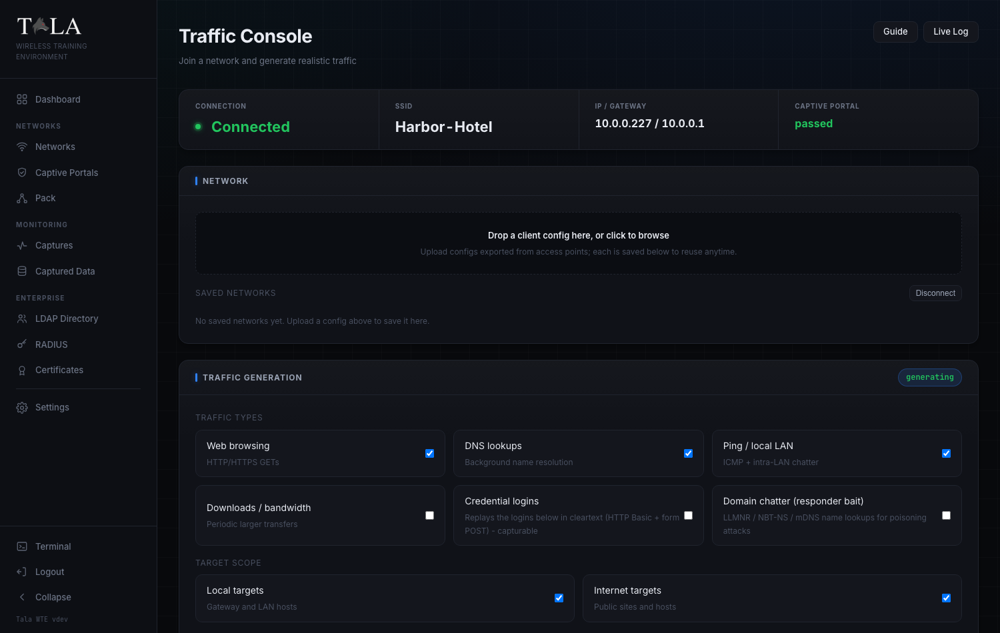

# Traffic Console

The **Traffic Console** is where a box in client mode does its real work. It makes the box behave like an ordinary device on someone else's network: it joins a saved network, gets past a captive portal, and then runs whichever traffic generators you turn on. The point is that a packet capture taken on the access point side records exactly what a live user would put on the wire, right down to cleartext logins you can capture and crack in a lab.

Use this page when you need a network to look alive for a capture, when you want to replay credentials for a capture-and-crack exercise, or when you want to mass-produce WPA handshakes by cycling the connection. To drive the same engine across many boxes at once from a single screen, use [[The-Pack]] instead.

You reach this page from the Client Dashboard with **Open traffic console**, or from the sidebar. The console polls its own status every two seconds, so the stat strips and badges update on their own while you work.

---

## The status strip

At the very top, below the page title **Traffic Console** and its subtitle "Join a network and generate realistic traffic", a stat strip mirrors the live link state. It has four cells:

- **Connection** - shows **Connected** in green (with a live status dot) when the box is associated, or **Offline** when it is not.
- **SSID** - the network the box is currently joined to, or a dash when offline.
- **IP / Gateway** - the DHCP lease and gateway, e.g. `10.0.0.227 / 10.0.0.1`, or a dash.
- **Captive Portal** - the portal handling result: `none` when there is no portal, `passed` in green when the box got through one, or `failed` in red when it could not.

Two buttons sit at the top right of the page for the whole session:

- **Guide** - opens the in-app help for this page.
- **Live Log** - opens the streaming client log window (covered in the last step).

---

## Step 1: Save a network to connect to

On the server side you click **Export client config** on a network's detail page. That hands you a small `.json` profile describing one exact network: its SSID, protocol, passphrase, band, channel, hidden flag, any EAP identity and password, and any captive-portal bypass credentials. See [[Networks]] for how to produce that file and [[Certificates]] if the network uses enterprise EAP.

In the **NETWORK** panel:

1. Drop the `.json` file on the dropzone that reads **"Drop a client config here, or click to browse"**, or click it to open a file picker. The dropzone highlights while you drag a file over it.
2. The upload is parsed and saved to a reusable library. You get a toast like `Saved network "Harbor-Hotel"`, and the network appears under **SAVED NETWORKS** below.

Uploading does not connect; it only stores the profile so you can switch between networks later without re-uploading. If the file is not a valid Tala WTE client config you get an error toast instead and nothing is saved.

If you have not uploaded anything yet, the panel shows "No saved networks yet. Upload a config above to save it here."

---

## Step 2: Connect to a saved network

Each saved network shows its SSID in monospace and its protocol (for example `OPEN`, `WPA2`, or `WPA2-ENTERPRISE`), with two actions per row:

- **Connect** - associates, requests a DHCP lease, and automatically bypasses a captive portal if the config carries portal credentials. While the action is in flight the button reads **Connecting...**. Once this is the active link the row is highlighted, gains a **connected** badge, and the button changes to **Connected** (disabled).
- **Del** - removes that saved network from the library. This does not affect the live connection.

When the box is connected, a **Disconnect** button appears at the right of the **SAVED NETWORKS** header. Click it to drop the link. You only need to disconnect when you want to switch networks or end the session; you can start, stop, and reconfigure traffic without disconnecting.

> SCREENSHOT NEEDED: The SAVED NETWORKS list showing at least one saved network row in the connected state (highlighted row, "connected" badge, the disabled "Connected" button and the "Del" button), with the "Disconnect" button visible in the panel header. The current traffic-saved.png shows the empty state only.

---

## Step 3: Choose your traffic generators

The **TRAFFIC GENERATION** panel is the heart of the console. When generation is running, a green **generating** pill appears in the panel header (and again on the Live Stats panel).

Under **TRAFFIC TYPES** there are six generators. Tick the ones you want:

- **Web browsing** ("HTTP/HTTPS GETs") - issues web requests to your URL list and, with Internet scope on, to safe public sites. Turn this on to keep a network looking alive for any capture. This is on by default.
- **DNS lookups** ("Background name resolution") - background name resolution. Pair it with web traffic for realistic background noise. On by default.
- **Ping / local LAN** ("ICMP + intra-LAN chatter") - ICMP echo plus intra-LAN chatter, which makes the box visible to LAN-host and connectivity captures. On by default.
- **Downloads / bandwidth** ("Periodic larger transfers") - periodic larger transfers. Turn this on for bandwidth and throughput demos where you want bulk on the wire; leave it off when you only need light, realistic background traffic. Off by default.
- **Credential logins** ("Replays the logins below in cleartext (HTTP Basic + form POST) - capturable") - replays the logins you list in Step 5 in **cleartext**, using both HTTP Basic auth and form POST. This is the generator for capture-and-crack labs: the emitted username and password show up in a packet capture's Analysis tab. Add at least one login in Step 5 first, otherwise there is nothing to replay. Off by default.
- **Domain chatter (responder bait)** ("LLMNR / NBT-NS / mDNS name lookups for poisoning attacks") - broadcast and multicast name lookups (LLMNR, NBT-NS, mDNS) for names like an internal file server or intranet, the exact bait that name-poisoning attacks feed on. Only worth enabling when a poisoning listener is running on the wireless side to catch it; on its own it just produces noise nothing is listening for. Off by default.

Quick rule for what to enable:

- **Web / DNS / Ping** keep a network looking alive for any capture (the safe default trio).
- **Downloads** adds bulk for bandwidth demos.
- **Credential logins** is for capture-and-crack labs.
- **Domain chatter** only matters when a poisoning listener is present.

---

## Step 4: Set the target scope, then Start

Under **TARGET SCOPE**, two toggles decide where the generators send traffic:

- **Local targets** ("Gateway and LAN hosts") - the gateway and LAN hosts. Keep this on to feed captures running on the access point's own network. On by default.
- **Internet targets** ("Public sites and hosts") - public sites and hosts. Turn this on for outbound realism; turn it off for a sealed, local-only exercise where nothing should leave the lab network. On by default.

When you are ready:

1. Click **Start traffic**. The button is enabled only while the box is connected, and reads **Starting...** while it spins up. You get a `Traffic generation started` toast and the green **generating** pill appears.
2. To end generation, click **Stop**. It is enabled only while traffic is running, and stopping keeps the box connected so you can adjust generators and start again.

The selected generators, scope, target lists, and credentials are all sent together when you press **Start traffic**, so set them up before starting (or stop, change, and start again).

---

## Step 5: Point the generators at your own targets

By default the generators hit a built-in safe pool. To aim them at hosts you control, use the **TARGETS &amp; CREDENTIALS** panel.

**Apply a traffic dataset.** The first control is a dropdown labeled **Apply a traffic dataset**. Pick a saved dataset to fill the three target fields below in one step ("Choose a dataset to fill the targets..."). If there are no datasets the dropdown is disabled and reads "No datasets". Datasets are the reusable target lists managed on the Pack page; create and edit them there (see [[The-Pack]]). After you apply one you can still edit the fields by hand.

The three target fields are free-text, one entry per line:

- **URLs to browse** (placeholder `http://intranet.local/`) - fed to the Web browsing generator. "One per line; used by the Web generator."
- **Domains to resolve** (placeholder `intranet.local`) - fed to both DNS lookups and the domain-chatter generator. "One per line; used by DNS + domain chatter."
- **IPs to reach** (placeholder `10.0.0.1`) - fed to the Ping generator. "One per line; used by the Ping generator."

**Login credentials (cleartext, capturable).** Below the target fields, build the logins the box will replay when the **Credential logins** generator is on:

1. Click **+ Add** to add a row.
2. Fill the three boxes per row: the login URL (placeholder `http://target/login`), a username, and a password.
3. Remove any row with its red x button.

If you have not added any rows yet, the panel shows the hint "Add logins the client replays; then enable 'Credential logins' above." Only rows with a non-empty URL are sent. These credentials go out **in cleartext on purpose**: capturing and decrypting them is the whole point of the exercise, so use lab values, never real secrets.

---

## Step 6: Mass-produce handshakes with reconnect cycling

The **HANDSHAKE CAPTURE** panel runs **reconnect cycling**: the box periodically deauthenticates and reassociates so a capture on the access point side records a fresh WPA four-way handshake every cycle. The panel describes itself as "Periodically deauth and reassociate so students can capture a fresh WPA handshake each cycle." Use a short interval when you want to crank out handshakes against a WPA2/WPA3-Personal network.

There are two dropdowns:

- **Frequency** - how often a cycle fires. Presets are **Every 30 seconds**, **Every minute**, **Every 2 minutes** (the default), **Every 5 minutes**, **Every 15 minutes**, **Every 30 minutes**, **Every hour**, plus **Custom...**. Choosing **Custom...** reveals a number box and a unit dropdown (**seconds** / **minutes** / **hours**).
- **Jitter** - a random extra wait added on top of each cycle so the timing is not robotic. Presets are **None**, **Up to 5 seconds**, **Up to 15 seconds** (the default), **Up to 30 seconds**, **Up to 1 minute**, plus **Custom...**. Custom again reveals a number box and a seconds/minutes/hours unit dropdown.

Pick a short Frequency (30 seconds to a minute) with a little Jitter when you want repeated handshakes fast; pick a longer Frequency with more Jitter to look like an ordinary device that occasionally reconnects.

Buttons and state:

- **Start cycling** - begins cycling. Enabled only while connected. Shows a `Reconnect cycling started` toast.
- While cycling, the panel header shows a green pill **cycling . N** with the live cycle count, the primary button changes to **Update cycling** (apply new timing without stopping), and a **Stop cycling** button appears.
- **Stop cycling** - ends cycling while keeping the box connected.

> SCREENSHOT NEEDED: The Handshake Capture panel while cycling is active, showing the green "cycling . N" count pill in the panel header, the primary button reading "Update cycling", and the "Stop cycling" button beside it. The current traffic-handshake.png shows the idle state with "Start cycling".

---

## Step 7: Watch Live Stats and the Live Log

Two views let you watch what the box is doing.

**Live Stats.** Lower on the page, the **LIVE STATS** panel tracks three counters while traffic runs (and shows the green **generating** pill when active):

- **Requests** - total requests issued.
- **Received** - bytes received, formatted (B / KB / MB / GB).
- **Errors** - error count, shown in yellow when non-zero.

Below the counters it reminds you: "Open Live Log (top right) for full terminal output."

**Live Log.** Click the **Live Log** button at the top right to open a draggable, resizable terminal window titled **Client Log**. It streams the full client activity log while the box is connected or generating: associating, DHCP, captive-portal steps, which generators started, each reconnect cycle, and every error. Leave it open to watch the box while you work elsewhere on the page.

---

## Worked example: a credential-capture lab

1. **Step 1-2:** Upload the network's client config and **Connect**. Confirm the status strip shows **Connected** and a real **IP / Gateway**.
2. **Step 5:** In **TARGETS &amp; CREDENTIALS**, click **+ Add** and enter a lab login (URL, username, password). Optionally **Apply a traffic dataset** to fill the URL/domain/IP fields too.
3. **Step 3:** Tick **Credential logins** (keep Web / DNS / Ping on for cover traffic).
4. **Step 4:** Click **Start traffic**.
5. Run an HTTP capture on the access point. The replayed username and password appear in the capture's Analysis tab.

---

## Related pages

- [[The-Pack]] - run this same engine across many boxes at once, and create and edit the traffic datasets this console applies.
- [[Networks]] - export the client config files you upload here.
- [[Certificates]] - set up enterprise EAP so a client config can join an enterprise network.
